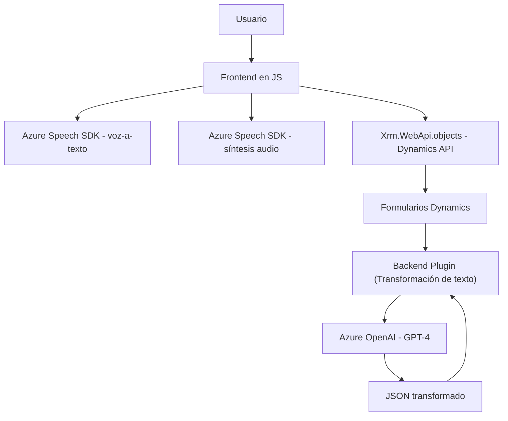

# Análisis técnico detallado

Este repositorio parece ser una solución híbrida enfocada en formularios vinculados a la plataforma Microsoft Dynamics 365. Presenta funcionalidades relacionadas con el reconocimiento de voz, síntesis de texto a audio y generación de datos estructurados mediante IA.

---

## Resumen técnico

### Tipo de solución
La solución contiene los siguiente elementos:
1. **Frontend JavaScript**: Scripts que interactúan con los formularios de Dynamics 365 para recoger datos y conectar servicios como Azure Speech SDK.
2. **Backend Plugin**: Un plugin que extiende la funcionalidad de Dynamics 365 utilizando Azure OpenAI para procesamiento y transformación de datos a un formato JSON estructurado.
3. **Servicios externos (APIs de Azure)**: Interacción con Azure Speech SDK para síntesis/reconocimiento de audio y con Azure OpenAI para transformar texto.

En general, se trata de una **integración cliente-servidor híbrida** (Dynamics 365 + APIs de Azure).

---

### Arquitectura
- **Frontend**:
  - Existencia de múltiples scripts organizados por funcionalidades.
  - Patrones basados en funciones con callbacks y modularidad.
  - Integrado directamente con Dynamics 365, aprovechando los objetos de contexto (`executionContext`).
  - Esta parte **no tiene una arquitectura específica** más allá del desacoplamiento lógico por funciones.
  
- **Backend Plugin**:
  - Se implementa como **monolito modular**, ya que define un único proceso con responsabilidades claras que encapsulan lógica para trabajar con texto y conectarse a Azure OpenAI.
  - Usa **Plugin-based architecture**, un enfoque típico de Microsoft Dynamics 365.

De manera general, la solución sigue una **arquitectura n-capas**, en la que el Frontend interactúa con el usuario y pasa información al Backend Plugin para su procesamiento, utilizando servicios externos (Azure).

---

### Tecnologías usadas
1. **Frontend**:
   - **JavaScript**.
   - **Azure Speech SDK**: Integración con la plataforma de Azure para reconocimiento y síntesis de audio.
   - **Dynamics 365 objects**: Uso extensivo de objetos como `formContext`, `executionContext`, `Xrm.WebApi`.

2. **Backend Plugin**:
   - **.NET Framework**.
   - **Microsoft Dynamics SDK (Microsoft.Xrm.Sdk)**: Para extender las funcionalidades CRM.
   - **Azure OpenAI API**: GPT-4 para normalización de texto.
   - **JSON Processing**: Librerías como `Newtonsoft.Json` y `System.Text.Json`.

---

### Dependencias o componentes externos
- **Azure Speech SDK**: Para reconocimiento y síntesis de voz.
- **Azure OpenAI API**: Para uso del modelo GPT-4 en generación y transformación de texto.
- **Dynamics 365 API**: Contexto de formularios (Frontend) y extensibilidad del plugin (Backend).
- **CDN**: Descarga dinámica del SDK de Azure (`https://aka.ms/csspeech/jsbrowserpackageraw`).

---

### Diagrama Mermaid (válido para GitHub)
El diagrama sintetiza las interacciones entre las partes:

---

## Conclusión final
La solución utiliza un enfoque híbrido para integrar funcionalidades avanzadas, como reconocimiento de voz, lectura de formularios y procesamiento de texto con IA. Está diseñada para trabajar dentro del ecosistema Microsoft Dynamics 365 y aprovechar servicios externos de Azure.  

### Puntos fuertes:
1. Modularidad y separación de responsabilidades.
2. Integración con potentes servicios de Azure para IA y Speech.
3. Enfoque extensible mediante plugins de Dynamics 365.

### Áreas de mejora:
1. El Frontend podría beneficiarse de una arquitectura más definida (ej. MVC).
2. La gestión de credenciales (Azure Key) debería evitar códigos estáticos, usando almacenes seguros como Azure Key Vault.
3. Se podrían implementar mejores prácticas para manejo de errores y logs tanto en Frontend como en Backend. 

En resumen, es una solución bien diseñada para propósitos específicos en el contexto Microsoft Dynamics, aunque podría beneficiarse de una mayor estandarización y seguridad.