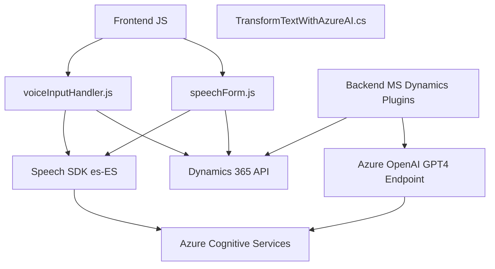

### Breve Resumen Técnico
El repositorio contiene archivos que forman parte de una solución para integrar capacidades de interacción por voz y procesamiento de texto con formularios de Dynamics CRM, utilizando Azure Cognitive Services (Speech SDK y OpenAI API). Los archivos están estructurados de forma modular y se centran en proporcionar soporte para input/output de voz, procesamiento de formularios y análisis avanzado mediante inteligencia artificial.

---

### Descripción de Arquitectura
1. **Tipo de solución:**  
   - API conectada a Dynamics CRM y Servicios Cognitivos de Azure.
   - Complemento para personalización de procesos mediante plugins en Dynamics 365.  
   - Frontend basado en JavaScript para la interacción.

2. **Tipo de arquitectura utilizada:**  
   - **N-capas:** La interacción del usuario está basada en un frontend JavaScript (para la interacción directa con formularios y servicios de audio), y un backend sobre Microsoft Dynamics CRM que gestiona plugins para procesamiento de datos. Azure Cognitive Services y API externas representan integraciones con servicios y recursos externos.

3. **Patrones de diseño identificados:**  
   - **Fachada (Facade):** Estructuración por funciones que hacen que la complejidad de los procesos sea accesible mediante puntos de entrada simplificados (`startVoiceInput`).  
   - **Integración de Servicios Externos:** Uso directo de SDKs de Azure (Speech y OpenAI) para reconocimiento de voz y procesamiento de texto basado en IA.  
   - **Mapping dinámico:** Generación de mapeos entre etiquetas visibles y atributos internos de formularios en CRM.  
   - **Plugin Design Pattern:** Implementación dentro de la arquitectura del CRM utilizando la interfaz `IPlugin`.

---

### Tecnologías utilizadas
1. **Frontend:**
   - Lenguaje: **JavaScript**.
   - Frameworks/DK:
     - **Dynamics 365 SDK**: Interacción con formularios y el sistema.
     - **Azure Cognitive Services Speech SDK**: Reconocimiento y síntesis de voz.
     - **Xrm.WebApi**: Consultas y manipulación de datos en Dynamics 365.

2. **Backend:**
   - Lenguaje: **C#**.
   - Frameworks/DK:
     - **Dynamics CRM SDK**: Manipulación de entidades, ejecución de plugins y consultas.
     - **Newtonsoft.Json / System.Text.Json**: Procesamiento de datos JSON.
     - **Azure SDK para OpenAI**: Llamadas remotas a la API de transformación de texto.

3. **Infraestructura:**
   - Dependencia de **Azure Speech Service** para síntesis y reconocimiento de voz.
   - Dependencia de **Azure OpenAI API** para texto generado por IA y su transformación.

---

### Diagrama Mermaid

---

### Conclusión Final
La solución en este repositorio es una integración personalizada en Microsoft Dynamics CRM que utiliza un frontend basado en JavaScript para interactuar con formularios mediante reconocimiento de voz y síntesis conversacional (Azure Speech SDK). Complementariamente, plugins en el CRM procesan texto con ayuda de capacidades avanzadas de IA proporcionadas por Azure OpenAI API.

La arquitectura es de **n-capas** con una clara separación entre capas de presentación (JavaScript), lógica empresarial (Plugins en C# para Dynamics CRM), y servicios externos (Azure Cognitive Services). Esto promueve la mantenibilidad, escalabilidad y la capacidad de integrar servicios en la nube.

Además, se aplica un diseño modular con patrones como *Fachada*, *API-driven*, *Mapping dinámico*, y *Plugin Design Pattern*. Las dependencias con plataformas de Azure son críticas para el funcionamiento de la solución, lo que exige una conexión estable y un manejo robusto de excepciones para posibles fallos en los servicios externos.