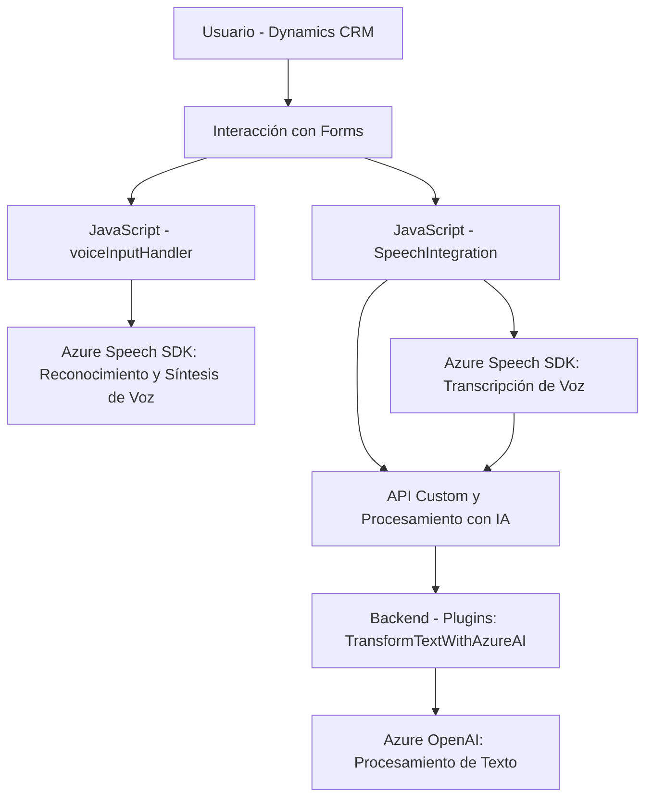

### Breve Resumen Técnico
El repositorio contiene una solución integral que implementa la integración de funcionalidades basadas en voz y procesamiento de texto con la API de Azure Speech SDK y Azure OpenAI. La solución está destinada a interactuar con formularios dentro de Microsoft Dynamics CRM, transformando información mediante IA y generando capacidades avanzadas como entrada y síntesis de voz.

### Descripción de Arquitectura 
La arquitectura de la solución se construye bajo un modelo de **multicapa**:
1. **Frontend/JS**: Scripts JavaScript que implementan la funcionalidad de voz (reconocimiento y síntesis) y manipulación de formularios en Dynamics CRM. Estos scripts actúan como intermediarios entre el usuario y los servicios de reconocimiento y procesamiento proporcionados por Azure.
2. **Plugins en el servidor**: Extensiones personalizadas para Microsoft Dynamics CRM que hacen uso de Azure OpenAI para procesar texto.
3. **Integraciones con servicios externos**: Tanto el cliente (frontend) como los plugins en el servidor usan como dependencia a APIs externas (Azure Speech y OpenAI).

Se identifican las siguientes capas principales:
- **Capa de Presentación (Frontend)**: Scripts para formulación de solicitudes y recogida de datos desde los campos visibles en la UI del Dynamics CRM.
- **Capa de Lógica y Negocio**: Contenida en los plugins, con procesamiento de texto y transformación vía Azure OpenAI.
- **Capa de Integración con Servicios Externos**: Comunicación con Azure Speech SDK y OpenAI a través de API externas.

### Tecnologías Usadas 
1. **Lenguajes**:
   - JavaScript: Desarrollo de funcionalidades frontend para reconocimiento y síntesis de voz.
   - C#: Implementación de plugins personalizados en Dynamics CRM.
2. **Bibliotecas y SDKs**:
   - Microsoft Dynamics SDK (`Microsoft.Xrm.Sdk` y `Xrm.WebApi`).
   - Azure Speech SDK (para reconocimiento y síntesis de voz).
   - Newtonsoft.Json para manejo de JSON en C#.
   - System.Text.Json y System.Net.Http para integración de HTTP en el plugin.
3. **Servicios Externos**:
   - Azure OpenAI: Procesamiento avanzado de texto mediante IA.
   - Azure Speech SDK: Reconocimiento y síntesis de voz.

### Dependencias o Componentes Externos 
La solución depende de varios servicios y bibliotecas externas:
1. **Azure Speech SDK**: Requisitos de API `azureKey` y `azureRegion` para habilitar reconocimiento y síntesis de voz.
2. **Azure OpenAI**: Uso previo de un modelo GPT-4 o similar para procesamiento de texto.
3. **Microsoft Dynamics CRM**: Extensión personalizada para formularios y datos almacenados en el entorno Dynamics.
4. **Xrm.WebApi**: Para integración con APIs personalizadas dentro de Dynamics CRM.
5. **Newtonsoft.Json y System.Net.Http**: Para manejar peticiones y respuestas JSON.

### Diagrama **Mermaid**

### Conclusión Final
Esta solución constituye una arquitectura de **multicapa** que extiende Microsoft Dynamics CRM con potentes capacidades de reconocimiento y procesamiento de voz y texto mediante Azure Speech SDK y Azure OpenAI. La arquitectura destaca por su modularidad (descomponiendo responsabilidades en frontend y backend), integración de servicios externos, y manejo de flujos asincrónicos. Si bien no es una arquitectura de microservicios, es una implementación limpia y escalable para trabajar dentro del contexto de Dynamics CRM.