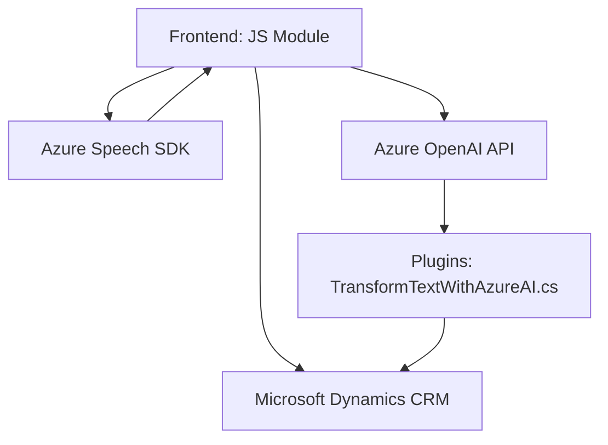

# Breve Resumen Técnico
Esta solución es una arquitectura híbrida que combina componentes front-end en JavaScript y plugins en C# para la integración con Microsoft Dynamics CRM. Se enfoca en interacción con formularios a través de voz y texto, utilizando Azure Speech SDK y Azure OpenAI API como servicios externos.

# Descripción de Arquitectura
La arquitectura adopta un enfoque de **n capas**, dividida en:
1. **Capa de Interfaz (Frontend)**: Implementada en JavaScript, interactúa con el usuario mediante entrada/salida por voz y procesamiento de formularios dinámicos.
2. **Capa de Servicios (Plugins)**: Implementada en C#, extiende la funcionalidad de CRM con la capacidad de utilizar IA basada en Azure OpenAI para procesar texto y manejar operaciones específicas en el contexto CRM.
3. **Capas Externas**: Se integra con servicios de Azure Speech SDK y Azure OpenAI API.

# Tecnologías Usadas
1. **Frontend**:
   - JavaScript.
   - **Azure Speech SDK**: Para síntesis y reconocimiento de voz.
   - **HTML DOM**: Manipulación directa.
   - Dynamics CRM SDK (JS API).

2. **Backend (Plugins)**:
   - C#.
   - **Microsoft Dynamics CRM SDK**: Extensiones de CRM.
   - **Newtonsoft.Json.Linq** y **System.Text.Json**: Manejo de JSON.
   - **System.Net.Http**: Llamadas HTTP hacia Azure APIs.
   - **Azure OpenAI API**: Transformación de texto mediante IA.

# Dependencias o Componentes Externos
1. **Azure Speech SDK**: Integración para reconocimiento y síntesis de voz.
2. **Azure OpenAI API**: Interacción con IA para procesamiento y transformación textual.
3. **Xrm.WebApi**: API propia de Microsoft Dynamics CRM.
4. **Newtonsoft.Json**: Procesamiento de JSON en el backend.
5. **API personalizada**: `trial_TransformTextWithAzureAI`.

# Diagrama Mermaid

# Conclusión Final
La solución implementa una **arquitectura de n capas** diseñada para extender funcionalidades de Microsoft Dynamics CRM, mientras aprovecha capacidades de Azure como servicios de reconocimiento de voz y procesamiento de lenguaje natural. Este enfoque facilita una interacción moderna con CRM mediante entrada y salida de voz, integrando IA para interpretación avanzada de texto estructurado. Las dependencias externas están bien encapsuladas, y la modularidad del código permite fácil mantenimiento y escalabilidad. Sin embargo, podría beneficiarse de optimizaciones en la gestión de claves API para mayor seguridad.