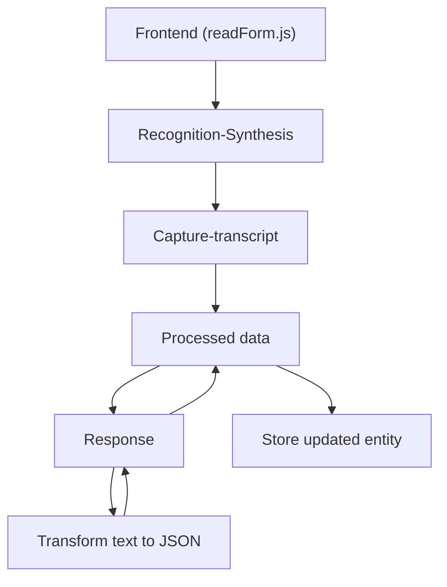

### Resumen técnico

El sistema es una solución híbrida que combina el uso de tecnologías como **Azure Speech SDK**, **Microsoft Dynamics CRM** y la **API de OpenAI** en Azure. Su objetivo principal gira en torno a la integración entre un frontend basado en JavaScript y un servidor CRM extensible mediante plugins para reconocimiento de voz, procesamiento de formularios y transformaciones avanzadas de texto.

---

### Descripción de la arquitectura

La arquitectura del sistema puede clasificarse como **multicapa (n-tier)**, con elementos de integración hacia servicios en la nube. Contiene las siguientes capas específicas:

1. **Capa de presentación (Frontend)**:
   - Archivos `readForm.js` y `speechForm.js`.
   - Se ocupa de la interacción con el usuario y el procesamiento preliminar de los datos.
   - Domina la integración con Azure Speech SDK para reconocimiento y síntesis de voz.

2. **Capa de negocio y lógica empresarial**:
   - Implementada principalmente en el plugin `TransformTextWithAzureAI.cs` en Dynamics CRM.
   - Encapsula la lógica para transformar texto en JSON estructurado utilizando la API de OpenAI.

3. **Capa de integración**:
   - Comunicación entre el frontend y el backend, facilitada por el **Dynamics CRM Web API** (`Xrm.WebApi`).
   - Plugins conectan con servicios adicionales, como Azure OpenAI, para transformar y estructurar los datos.

4. **Capa de datos**:
   - Gestionada por **Microsoft Dynamics CRM**, que almacena y organiza datos en entidades de negocio.

---

### Tecnologías usadas

**Frontend (readForm.js, speechForm.js):**
- **Azure Speech SDK**:
  - Reconocimiento de voz y síntesis de texto a voz para interacción vocal.
- **Browser APIs**:
  - Manipulación del DOM, carga de scripts, tareas asíncronas mediante Promises.
- **JavaScript ES6**:
  - Utilización de características modernas como arrow functions y Promises.
- **REST API**:
  - Comunicación con APIs externas (Dynamics CRM, Azure OpenAI).

**Backend (TransformTextWithAzureAI.cs):**
- **Microsoft Dynamics CRM SDK** (`IPlugin`):
  - Extendiendo funcionalidades del CRM.
- **Azure OpenAI API**:
  - Procesamiento avanzado de texto y su transformación en JSON mediante un servicio remoto.
- **System.Text.Json**:
  - Manipulación moderna de estructuras JSON.
- **HttpClient (System.Net.Http)**:
  - Realización de solicitudes HTTP hacia la API de OpenAI.
- **Newtonsoft.Json**:
  - Procesamiento más avanzado y flexible de JSON.

---

### Diagrama Mermaid

---

### Conclusión final

1. **Tipo de solución:** Este sistema es una aplicación que integra una **frontend basada en JavaScript** y una **capa backend en Microsoft Dynamics CRM** con soporte para plugins extendidos, orientada a la interacción mediante reconocimiento de voz y la modificación automatizada de datos en un formulario CRM.

2. **Arquitectura general:** N-capas con integración a servicios en la nube (Azure Speech SDK y Azure OpenAI). Presenta patrones como **dependency injection**, **callback**, **plugin extension**, y una estructura modular altamente desacoplada, ideal para integrar nuevas funcionalidades.

3. **Principales tecnologías y dependencias:**
   - Azure Speech SDK (Frontend).
   - Dynamics CRM SDK y Web API (Backend).
   - OpenAI Azure API (Procesamiento externo).

Este diseño muestra un excelente uso de integración en línea con microservicios externos, reutilización de componentes y separación de responsabilidades para una arquitectura robusta y extensible.