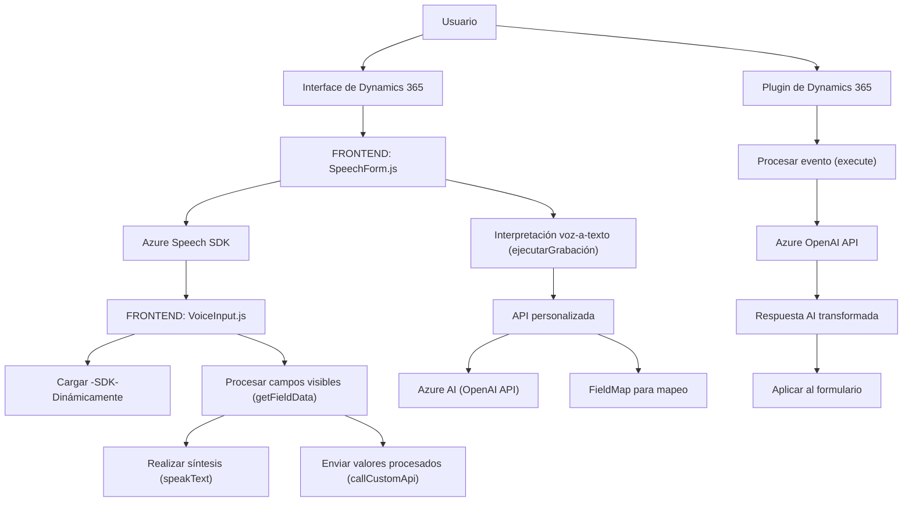

## Análisis detallado

### Breve resumen técnico
El repositorio contiene tres componentes principales que interactúan con tecnologías como **Azure Speech SDK**, **Dynamics 365 SDK**, y **Azure OpenAI**. La solución está orientada al reconocimiento de voz, transformación de texto y procesamiento de datos en formularios de Dynamics 365. Combina implementación en JavaScript y C#, integrándose con servicios y SDK externos.

---

### Descripción de arquitectura
La estructura y los patrones encontrados sugieren un diseño **n capas** con integración de plugins y servicios externos:
1. **Capa de presentación (Frontend)**: Contiene funcionalidades para interpretar entrada de voz, procesamiento de formularios y síntesis de texto.
2. **Capa lógica (Dynamics CRM Plugin)**: Implementa reglas de negocio y lógica específica de transformación de datos mediante servicios externos (Azure OpenAI).
3. **Capa de servicios externos**: Consumidos principalmente mediante SDKs y endpoints REST (Azure Speech SDK y Azure OpenAI).

El Frontend utiliza un enfoque modular con funciones encapsuladas por responsabilidad, mientras que el plugin de Dynamics simplifica la lógica en un único método de ejecución (`Execute`).

---

### Tecnologías usadas
1. **Frontend Technologies**:
   - JavaScript (ES6+).
   - Azure Speech SDK (para reconocimiento de voz y síntesis de texto).
   - Integración con APIs personalizadas.

2. **Backend Technologies**:
   - **C# y Dynamics 365 SDK**:
     - Desarrollo de plugins para responder a eventos específicos.
   - **Azure OpenAI**:
     - Transformaciones avanzadas usando inteligencia artificial.
   - **HTTP Client (`System.Net.Http`)**:
     - Realiza llamadas a la API de Azure OpenAI.

3. **Otros frameworks/utilidades**:
   - Regex y LINQ (procesamiento avanzado de text).
   - Newtonsoft.Json (serialización/deserialización de JSON).

---

### Dependencias y componentes externos
1. **Azure Speech SDK**: 
   - Reconocimiento de voz, síntesis de texto.
2. **Dynamics CRM SDK**: 
   - Extensión del sistema mediante plugins.
3. **Azure OpenAI API**: 
   - Procesamiento y generación avanzada de texto.
4. **API personalizada**: 
   - Indicada como destino de valores procesados en el Frontend.
5. **Formularios de Dynamics 365**: 
   - Interacción con campos en formularios.

---

### Diagrama Mermaid
A continuación, se presenta una descripción visual en formato **Mermaid**, que ejemplifica la interacción entre los componentes del sistema descrito.

---

### Conclusión final
El repositorio representa una solución **n capas** orientada a la integración con servicios cloud y personalizada para Dynamics 365 CRM. Su diseño modular permite la comprensión y fácil mantenibilidad del código. Las tecnologías utilizadas abarcan desde procesamiento natural hasta SDK avanzados de voz, lo que refuerza la noción de ser una solución completa para mejorar la interacción entre usuarios y formularios mediante inteligencia artificial y funcionalidad avanzada de voz.