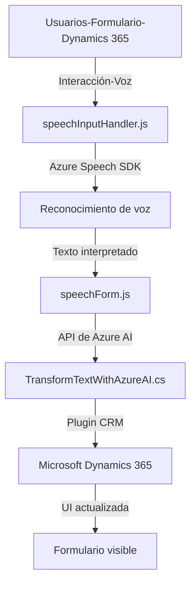

### Breve resumen técnico
El repositorio contiene tres componentes principales usados en una solución empresarial que combina reconocimiento de voz y procesamiento de texto mediante servicios de Azure. Está diseñado para integrarse con formularios dinámicos de Dynamics 365, sintetizar e interpretar inputs de voz en tiempo real (frontend), transformarlos mediante una AI (backend), y aplicar los resultados de manera estructurada.

---

### Descripción de arquitectura
1. **Tipo de solución:**  
   - La solución es **híbrida**, con componentes de frontend (JavaScript para reconocimiento e interacción con formularios) y backend (C# plugin para procesamiento avanzado de texto).
   - Se centra en la integración de servicios de reconocimiento de voz (Azure Speech SDK) y procesamiento lógico con inteligencia artificial (Azure OpenAI), todo vinculado a un entorno CRM empresarial.

2. **Arquitectura:**  
   - La solución sigue una arquitectura tipo **"n capas extendida"**:
     - **Capa de integración** (speechForm.js y speechInputHandler.js): Maneja la interacción de voz y mapeo con formularios dinámicos.
     - **Capa de procesamiento lógico** (TransformTextWithAzureAI.cs): Normaliza y transforma los inputs usando OpenAI API en el backend.
     - **CRM Dynamics plugin layer**: La lógica personalizada se activa al ser vinculada a eventos dentro de Dynamics CRM.
   - En resumen, se conecta comunicación frontend-backend mediante servicios REST y patrones observables asíncronos.

3. **Patrones utilizados:**
   - **Modularidad:** Cada archivo está dividido en funciones encapsuladas con objetivos específicos (por ejemplo, cargar SDK o aplicar datos).
   - **API RESTful:** El backend en C# utiliza una arquitectura basada en API REST para interpretar inputs.
   - **SDK-based:** Uso de SDK externos (Azure Speech SDK y Dynamics web API) facilita la abstracción del comportamiento complejo.
   - **Mediador de dependencias:** El plugin actúa internamente como mediador entre Dynamics CRM y Azure OpenAI.

---

### Tecnologías usadas:
1. **Frontend:**
   - **JavaScript:** Funciones para reconocimiento de voz y manipulación de formularios.
   - **Dynamics Web API (Xrm.WebApi):** API para interactuar con datos y campos de Dynamics 365.
   - **Azure Speech SDK:** Lógica de manejo de voz en el navegador.

2. **Backend:**
   - **C# (Microsoft .NET):** Framework usado en plugins de Dynamics CRM.
   - **Azure OpenAI API:** Para transformación avanzada de texto según reglas definidas.
   - **HTTP client libraries:** Usado para enviar y recibir datos vía REST.

3. **Servicios externos:**
   - Azure Speech SDK: Reconocimiento y síntesis de voz.
   - Azure OpenAI Service: Procesamiento de lenguaje natural y transformación.

---

### Diagrama Mermaid válido para GitHub

---

### Conclusión final
La solución se centra en una arquitectura extensible y modular, diseñada para interactuar con datos dinámicos y sintetizar/interpretar inputs de voz en tiempo real. Combina servicios frontend (Azure Speech SDK) y lógicas backend avanzadas (Azure OpenAI API con Dynamics CRM). El diseño en "n capas extendida" garantiza que cada componente funcione de manera autónoma, pero altamente integrado en el flujo de gestión de información. Usar tecnologías de Microsoft y Azure asegura una alta compatibilidad para entornos empresariales complejos.