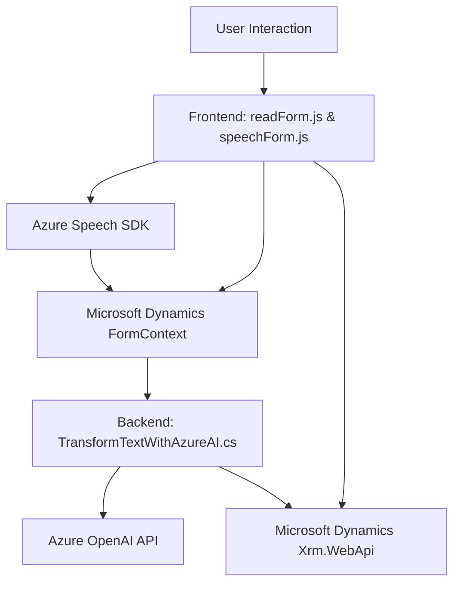

### Breve resumen técnico
El repositorio contiene la implementación de un sistema basado principalmente en la integración de **Azure Speech SDK** y **Azure OpenAI**. Como componente principal, se utilizan funciones en archivos de frontend en **Javascript** junto con un **plugin** en **C#** para Microsoft Dynamics CRM. Los archivos se orientan a dos áreas principales: procesamiento de formularios dinámicos a través de interfaz de voz y transformación avanzada de texto según normas específicas.

---

### Descripción de arquitectura

#### Tipo de solución:
El sistema combina diferentes componentes: 
1. **Frontend específico para Dynamics CRM**: Se utiliza para integrar funcionalidades como generación de voz y reconocimiento de comandos de voz aplicado a formularios dinámicos.
2. **Plugin de servidor**: Una extensión para Microsoft Dynamics CRM que utiliza OpenAI para transformación de texto y conversación con APIs externas.

#### Arquitectura:
El sistema parece implementar una arquitectura **modular de capas**:
1. **Frontend/UI Layer**:
   - Ésta actúa como la capa de presentación integrada con el entorno de Microsoft Dynamics, interactuando con la API para manipulación de formularios y atributos dinámicos.
2. **Business Layer**:
   - Implementada en el plugin de C#, esta capa incorpora lógica empresarial como transformación de texto, validación de atributos y generación de outputs dinámicos.
3. **External Service Layer**:
   - Servicios externos como **Azure Speech SDK** y **Azure OpenAI API**, que encapsulan el procesamiento de voz mediante SDK y enriquecimiento de texto avanzado.

---

### Tecnologías, frameworks y patrones usados  

#### Tecnologías:
1. **Frontend**:
   - **Javascript** con modularización funcional.
   - **Azure Speech SDK** para síntesis y reconocimiento de voz.
   - **Xrm.WebApi** de Microsoft Dynamics.
   
2. **Backend/Servidor**:
   - **C# (.NET Framework)** para plugins de Microsoft Dynamics CRM.
   - **Azure OpenAI API** para transformación de texto.
   - **Newtonsoft.JSON** para manejo de datos estructurados.

#### Patrones empleados:
1. **SDK Wrapper**:
   - En archivos frontend de JS. Los métodos encapsulan y simplifican la interacción directa con Azure Speech SDK.
   
2. **Delegate / Callback**:
   - Uso de funciones de callback en procesos asíncronos (e.g., `ensureSpeechSDKLoaded`).

3. **Facade Pattern**:
   - Métodos como `getVisibleFieldData` (para manipulación de formularios) y `speakText` (para integración con SDK externo) agregan una capa de abstracción.

4. **Dynamic Entity Manipulation**:
   - En el Frontend y el plugin CRM, basado en la configuración dinámica entre etiquetas visibles y los atributos del formulario.

5. **Service Integration**:
   - En el plugin, interacción directa con REST APIs externas como Azure OpenAI.

---

### Dependencias y componentes externos

#### External:
1. **Azure Speech SDK**:
   - Utilizado en el frontend para reconocimiento y síntesis de voz.
   
2. **Azure OpenAI API**:
   - En el backend, para enriquecimiento de texto transformado.

3. **Microsoft Dynamics CRM**:
   - Utiliza el **Xrm.WebApi** para interactuar con las entidades del CRM y extender procesos de ejecución.

#### Internal:
1. **Contexto dinámico de formulario (formContext)**:
   - Representa una abstracción de los formularios en el entorno de Dynamics CRM donde se integran directamente modificaciones y valores procesados.

---

### Diagrama Mermaid válido para GitHub

---

### Conclusión final
El repositorio representa una solución de integración para **Microsoft Dynamics CRM** con funcionalidades avanzadas basadas en servicios de Azure, como síntesis/reconocimiento de voz y procesamiento de texto mediante inteligencia artificial. La arquitectura se centra en una separación clara por capas (frontend/UI, negocio y servicios externos), lo que permite modularidad y escalabilidad. Los patrones y dependencias son estándar y robustos, cumpliendo con principios modernos de diseño de software.