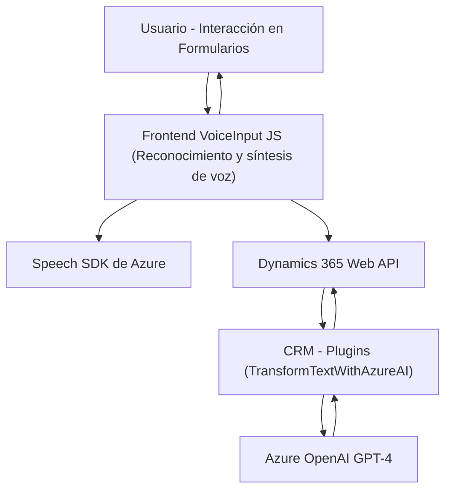

### Breve resumen técnico:
Este conjunto de archivos define una solución basada en integración entre servicios Microsoft Dynamics 365 y Azure. Se implementa una funcionalidad avanzada de reconocimiento y síntesis de voz, junto con un plugin para transformar texto en objetos JSON estructurados usando Azure OpenAI GPT-4.

---

### Descripción de arquitectura:
La solución combina múltiples componentes:
1. **Front-end**: Representado por los archivos en la carpeta `FRONTEND/JS`. Se encargan de la interacción del usuario, extracción de datos de formularios dinámicos y comunicación con servicios externos (Azure Speech SDK y Dynamics 365 Web API).
2. **Back-end**: Representado por el archivo `TransformTextWithAzureAI.cs`, que funciona como un plugin dentro de Dynamics CRM para procesar y estructurar datos mediante la API de Azure OpenAI.
3. **External Services**: Interacción con dos servicios; Azure Speech SDK para servicios de reconocimiento y síntesis de voz, y Azure OpenAI Service para transformación de texto.

La arquitectura sigue principalmente el principio **client-server** y tiene componentes de **arquitectura en capas** con un enfoque modular. No constituye una arquitectura de microservicios ni hexagonal, ya que el core de procesamiento (Dynamics CRM + plugin) es implementado como un monolito que se comunica con los APIs. Sin embargo, la integración con servicios externos introduce una sensación de "desacoplamiento".

---

### Tecnologías usadas:
1. **Para reconocimiento y síntesis de voz**:
   - **Azure Speech SDK**: Llama funciones de reconocimiento de voz e implementa síntesis para crear audio del texto recogido de los formularios.
   - Browser-based execution y reproducción de audio.

2. **Microsoft Dynamics 365 Web API**:
   - Utilizada en el front-end para actualizar formularios dinámicos.
   
3. **Azure OpenAI Service (GPT-4)**:
   - Servicio utilizado por el plugin CRM para transformar texto en datos JSON.

4. **Lenguajes y frameworks**:
   - Frontend: **JavaScript** para operaciones en el navegador.
   - Backend plugin: **C#** con integración en Dynamics CRM.

5. **Patrones de diseño**:
   - **Factory Method** para la creación de objetos de Speech SDK.
   - **Callback Pattern** para gestionar tareas asincrónicas en la carga del SDK y reconocimiento de voz.
   - **Service Locator**: Dynamics CRM inyecta el contexto y servicios necesarios a través `IServiceProvider`.
   - **Adapter Pattern** para transformar datos de voz en valores compatibles con los formularios de Dynamics 365.

---

### Diagrama Mermaid:

---

### Conclusión Final:
La solución presentada conforma una arquitectura híbrida con componentes distribuidos. El front-end es ejecutado en el navegador y convierte formularios dinámicos en texto mediante síntesis/reconocimiento de voz gracias a Azure Speech SDK. Esto se complementa con el back-end integrado en Dynamics 365, el cual al recibir texto realiza transformaciones avanzadas mediante el servicio Azure OpenAI.

Aunque funcional, el diseño podría beneficiarse de mejoras en seguridad (manejo de claves API), desacoplamiento y separación de responsabilidades, como la introducción de capas específicas para gestionar servicios externos. Además, elementos como configuraciones y credenciales están hardcodeados, lo cual genera problemas de escalabilidad y mantenibilidad futura.