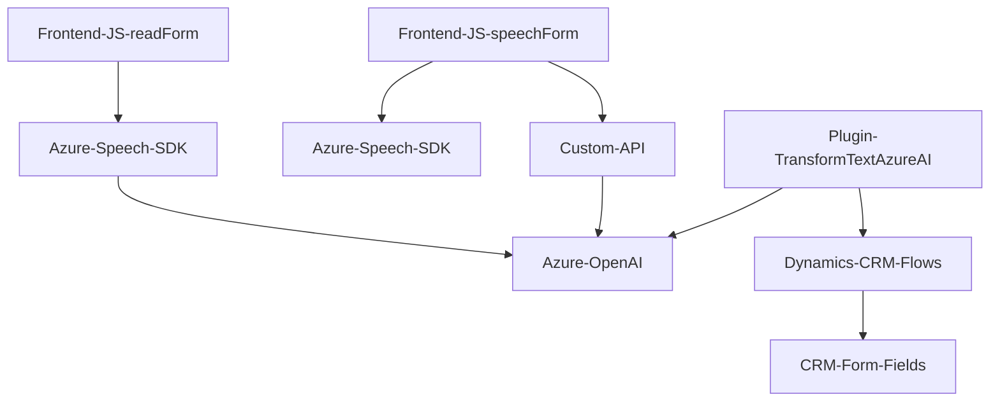

**Resumen técnico**

El repositorio presenta tres archivos que implementan funcionalidades basadas en la integración de tecnologías avanzadas de reconocimiento de voz y procesamiento de texto, dirigidas a manipular datos de formularios principalmente en un entorno Dynamics 365 CRM. Los componentes interactúan con servicios externos de Azure (Speech SDK y OpenAI) y se orientan hacia tareas como síntesis, reconocimiento de voz y transformación automatizada de texto mediante inteligencia artificial.

---

### **Descripción de arquitectura**

Este sistema es parte de un flujo funcional orientado a un entorno Dynamics CRM con soporte externamente a servicios de nube (API) de Azure. La arquitectura puede considerarse como híbrida, con elementos que nazcan de una estructura de **aplicación multicapa** típica (presentación, negocios, integración) y con integración a servicios externos siguiendo principios de una arquitectura de **Microservices/SOA**:

1. **Frontend/JS/readForm.js**: Implementa funciones autónomas para sintetizar datos de formularios y convertirlos en audio mediante Azure Speech SDK. Apoya la interacción en la capa de usuario.
   
2. **Frontend/JS/speechForm.js**: Implementa funciones dedicadas al reconocimiento de voz y la manipulación de formularios en Dynamics 365 por medio del texto reconocido y procesamiento IA. Se conecta con Azure Speech SDK y una API personalizada de procesamiento.
   
3. **Plugins/TransformTextWithAzureAI.cs**: Extiende las capacidades de Dynamics CRM mediante un plugin que transforma texto basado en normas definidas por el usuario usando Azure OpenAI. Se ejecuta en el backend como parte de la arquitectura Dynamics y utiliza patrones SOA.

---

### **Tecnologías usadas**
1. **Frontend:**
   - **JavaScript** para las funciones de reconocimiento de voz y síntesis usando Azure Speech SDK.
   - Azure Speech SDK para funcionalidades de síntesis y reconocimiento de voz.
   - Integración con una **Custom API** (tecnología no especificada, posiblemente desarrollada en algún framework de back-end moderno como Node.js o .NET).

2. **Backend:**
   - **C#** para el plugin transformador de texto.
   - **Microsoft.Xrm.Sdk** para integrar y extender la funcionalidad de Dynamics CRM.
   - HTTP Client para interacción directa con Azure OpenAI API.
   - JSON libraries: Usa `System.Text.Json` y `Newtonsoft.Json.Linq` para gestión avanzada de JSON.

3. **Servicios de Nube:**
   - **Azure Speech SDK**: Sintetización y reconocimiento de voz.
   - **Azure OpenAI**: Transformación avanzada de texto en JSON mediante modelos como GPT.

---

### **Diagrama Mermaid**

---

### **Conclusión final**

El repositorio implementa un sistema que permite la interacción avanzada con un CRM, incluyendo reconocimiento/síntesis de voz, manipulación automatizada de formularios y transformación de datos mediante IA. La arquitectura es **multicapa híbrida** con componentes autónomos que utilizan servicios externos (Azure) bajo principios de integración SOA/microservicios. La elección de tecnologías como Azure Speech SDK y OpenAI muestra una orientación clara hacia soluciones diseñadas para entornos empresariales modernos que dependen altamente de servicios en la nube.