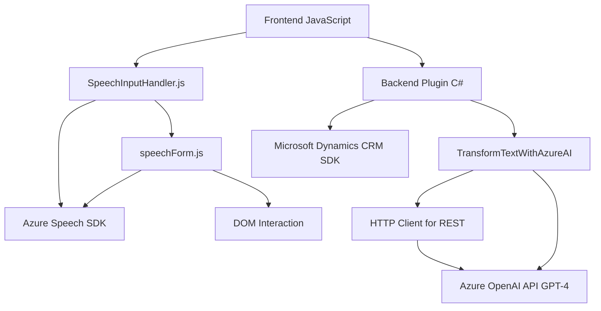

### Breve Resumen Técnico
Este repositorio parece ser un **CRM extendido con voz e inteligencia artificial (IA)** que utiliza integraciones con Microsoft Dynamics CRM, el SDK de Azure Speech, y la API de Azure OpenAI para implementar funcionalidades de síntesis de voz, reconocimiento de voz y transformación de texto. Los scripts permiten que los usuarios interactúen con formularios mediante comandos de voz y obtengan respuestas en formato sintetizado o transformado.

---

### Descripción de Arquitectura
La arquitectura es híbrida y modular, con las siguientes características:
1. **Frontend Modular:** Scripts de JavaScript conforman una lógica de clientes ligeros que se integran con el DOM y servicios externos (Azure Speech SDK y API personalizada).
2. **Plugin-Based Architecture en Dynamics CRM:** La clase `TransformTextWithAzureAI.cs` extiende Microsoft Dynamics CRM usando plugins para eventos específicos.
3. **Integración de Servicios Externos:** Uso de Azure Speech SDK para síntesis y reconocimiento de voz, así como de Azure OpenAI para transformación de texto.
4. **Clientes ligeros + Backend focalizado:** Los módulos en el lado cliente mantienen la lógica independiente para interactuar con servicios externos, mientras el backend se reserva para funcionalidades centradas en el entorno CRM.

---

### Tecnologías Usadas
1. **Frontend (JavaScript):**
   - Interacción con el DOM dinámico.
   - Uso del **Azure Speech SDK** para síntesis y reconocimiento de voz.
   - Procesamiento de datos mediante JSON.
2. **Backend (C# para Plugins en Dynamics CRM):**
   - **Microsoft Dynamics CRM SDK** para manejar eventos y contexto.
   - **Azure OpenAI API** para procesamiento de texto avanzado usando IA.
   - **HTTP Client** para integración con API REST.
   - **Json libraries** como `System.Text.Json` y `Newtonsoft.Json` para manipulación de datos estructurados (JSON).

3. **Servicios Externos:**
   - **Azure Speech SDK & OpenAI:** Para funcionalidades de IA, como reconocimiento de voz y transformación de texto.
   - **Dynamics CRM SDK:** Amplía funcionalidades del CRM con plugins.

---

### Diagrama Mermaid (GitHub Compatible)
Diagrama de flujo que muestra la relación entre las actividades principales y dependencias:

---

### Conclusión Final
El repositorio implementa una solución para **speech-to-text** y **text transformation** utilizando tecnologías avanzadas (AI y SDKs de Azure). Su arquitectura es modular y combina elementos de frontend ligero, comunicación con servicios externos, y extensiones de Dynamics CRM mediante plugins. 

**Fortalezas:**
1. Modularidad: Funcionalidades organizadas en funciones claras y separadas.
2. Scalability: Permite expandir funcionalidades, especialmente en el lado backend con más plugins o integraciones de IA.
3. Uso de servicios externos: Minimiza la complejidad del desarrollo al usar servicios como Azure Speech y OpenAI.

**Consideraciones:**
- La integración externa depende de la estabilidad y rendimiento de servicios como Azure y Dynamics CRM.
- La estructura actual parece funcional para un entorno cerrado de CRM. Sin embargo, podría ser optimizado para manejar casos de uso más extensos como escalabilidad hacia microservicios. Aún así, dada la implementación actual, su foco en modularidad y el uso de plugins adheridos a eventos del sistema lo hace muy adaptado al ecosistema CRM.