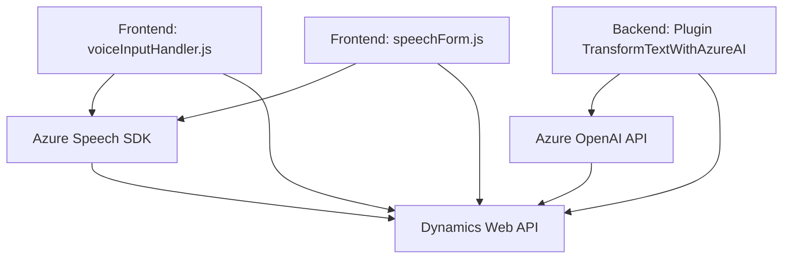

### Breve resumen técnico:
El repositorio contiene una solución híbrida, combinando funcionalidades de **frontend** y **backend**, con interacción entre **Microsoft Dynamics**, **Azure Speech SDK**, y **Azure OpenAI**. La solución está orientada a mejorar la entrada y salida de datos en un sistema CRM mediante procesamiento de voz, síntesis de audio, e inteligencia artificial.

---

### Descripción de arquitectura:
La solución sigue una arquitectura **cliente-servidor** distribuida:
1. **Frontend**: Código JavaScript que procesa interacciones de formularios y gestiona voz a texto, texto a voz, e interacción con APIs remotas. Este utiliza una arquitectura de **n capas** donde cada capa realiza tareas relacionadas:
   - Captura y manejo de datos (vista).
   - Procesamiento y lógica de negocio (controlador).
2. **Backend (Plugins)**: Mediante un plugin de Dynamics CRM basado en .NET, se conecta a Azure OpenAI para transformar datos y proporcionar JSON estructurado a los sistemas cliente. Este componente sigue una arquitectura modular y se integra con Microsoft Dynamics, empleando la **extensibilidad basada en plugins** de Dynamics y servicios externos.

Por su naturaleza, se puede integrar en una arquitectura de **microservicios** si cada componente se separa en unidades independientes administradas individualmente.

---

### Tecnologías usadas:
1. **Frontend**:
   - **JavaScript**: Para la lógica de cliente, con uso extensivo de funciones reutilizables.
   - **Azure Speech SDK**: Procesamiento de entrada de voz, síntesis de voz, y conversión de texto a audio.
   - **Microsoft Dynamics Web API**: Para actualizaciones dinámicas en los formularios.
   
2. **Backend (Plugins)**:
   - **C# y .NET Framework Dynamics Plugins**: Extensiones para manejar interacción de datos con Dynamics CRM.
   - **Azure OpenAI Service**: Procesamiento del lenguaje natural y generación de JSON estructurado.
   - Librerías externas:
     - `Newtonsoft.Json`, `System.Text.Json`: Manejo de JSON.
     - `System.Net.Http`: Comunicación HTTP.

---

### Dependencias o componentes externos:
1. **Externos**:
   - Azure Speech SDK.
   - Azure OpenAI API para servicios cognitivos.
   - Microsoft Dynamics API (Xrm Web API).
   - URLs de servicios remotos necesarios para desplegar funcionalidades (e.g., carga dinámica SDK).

2. **Internos**:
   - Contexto y eventos dentro de Dynamics CRM.
   - Funciones auxiliares desarrolladas para manejar contextos y formularios.

---

### Diagrama Mermaid:

---

### Conclusión Final:
La solución en este repositorio presenta una arquitectura colaborativa entre frontend y backend, aprovechando capacidades de inteligencia artificial y servicios esenciales en la nube. La modularidad en el código permite fácil mantenimiento, mientras que el diseño basado en patrones conocidos garantiza compatibilidad y escalabilidad. Las dependencias y servicios integrados permiten una experiencia rica en funcionalidad, aumentando la eficacia de la interacción entre los usuarios y el sistema CRM.