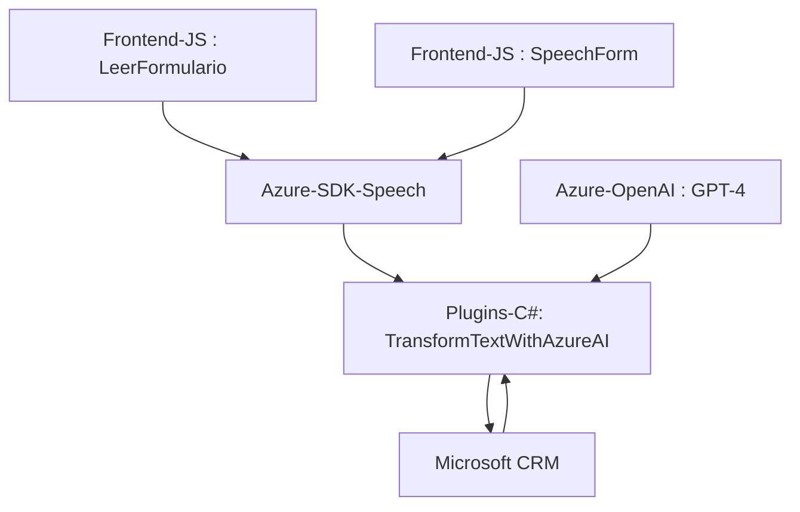

### Análisis técnico completo del repositorio

---

#### **Breve resumen técnico:**
El repositorio contiene tres componentes principales que incluyen funcionalidades de frontend y backend integradas con servicios externos, en particular los de **Azure Speech SDK** y **Azure OpenAI API**. La solución está orientada al procesamiento de voz y texto para su integración en Microsoft Dynamics CRM. Está diseñado para ser modular, extensible y fácil de mantener.

---

#### **1. Tipo de solución:**
La solución es híbrida e incluye:
- **Frontend**: Implementa funcionalidades de interacción con formularios mediante reconocimiento y síntesis de voz.
- **Backend (Plugin)**: Un plugin para Microsoft Dynamics CRM que interactúa con **Azure OpenAI API** para transformar texto según reglas específicas.
  
Por lo tanto, **es una solución de integración entre el cliente (frontend) y el servidor (backend), con soporte para servicios externos**.

---

#### **2. Tecnologías, frameworks y patrones usados:**
**Frontend:**
- **Lenguaje**: JavaScript (ES6).
- **Frameworks**:
  - Microsoft Dataverse para el contexto de los formularios.
- **Librerías externas**:
  - Azure Speech SDK para reconocimiento y síntesis de voz.
- **Patrones observados**:
  - Modularidad: Funciones para identificar, leer y transformar datos de formularios.
  - Lazy Loading: Garantiza que se cargue dinámicamente el SDK de Azure antes de procesar datos.
  - Integración de API (Facade Pattern): Interacción con el Azure Speech SDK y servicios personalizados.
  
**Backend:**
- **Lenguaje**: C# (.NET Framework).
- **Frameworks**:
  - Microsoft Dynamics CRM SDK.
- **Librerías externas**:
  - Newtonsoft.Json (manipulación de JSON).
  - System.Net.Http (llamadas HTTP).
- **Servicios de Microsoft Azure**:
  - **Azure OpenAI API**: Para procesar texto y convertirlo en datos JSON estructurados.
- **Patrones observados**:
  - Plugin Architecture: El backend utiliza `IPlugin` para integrarse con Dynamics CRM.
  - Comunicación API: Uso de servicios REST para interactuar con Azure OpenAI.
  - Separación de responsabilidades: El backend divide la lógica entre transformación de texto y la ejecución del plugin.

---

#### **3. Tipo de arquitectura:**
La arquitectura es **multicapa compuesta**:
- **Frontend Modular**: Separación clara entre la lógica de interacción con el formulario y la síntesis/reconocimiento de voz.
- **Backend Plugin**: La lógica del plugin está desacoplada para permitir un tratamiento separado del texto recibido desde el CRM y su conexión con servicios externos.
- **Integración con servicios externos**: Patrones de Microservicios para interactuar con APIs de Azure Speech SDK y Azure OpenAI API.

Por sus características, esta solución se asemeja a **hexagonal architecture**, ya que define una capa adaptable que interactúa con sistemas externos como Azure y Dataverse. No obstante, la implementación sigue estando centralizada para cubrir las exigencias específicas del CRM.

---

#### **4. Dependencias o componentes externos:**
- **Azure Speech SDK**: Utilizado tanto en la síntesis y reconocimiento de voz como en el procesamiento de audio.
  - Provisto a través del CDN `https://aka.ms/csspeech/jsbrowserpackageraw`.
- **Azure OpenAI API**: Utilizada en el backend para transformar texto en formato estructurado según reglas predefinidas.
- **Microsoft Dataverse**: Sirve como contexto de datos y para la integración del frontend y el backend con formularios de CRM.
- **Newtonsoft.Json**: Manipulación de JSON en el plugin de C#.
- **Microsoft Dynamics CRM SDK**: Se integra con Dataverse y permite ejecutar la base del plugin para CRM.
- **System.Net.Http** en C# para gestionar solicitudes HTTP a los servicios externos.

---

#### **5. Diagrama Mermaid**

---

#### **Conclusión final:**  
La solución ejemplifica un diseño bien organizado para la integración de funcionalidades avanzadas como síntesis y reconocimiento de voz junto con transformación de datos. Utiliza servicios cloud, APIs, y SDK tanto en frontend como en backend para implementar características avanzadas. Sin embargo, hay un margen de mejora en aspectos relacionados con la seguridad (como el manejo de claves de API) y documentación sobre la parte de infraestructura (por ejemplo, características de despliegue en Microsoft Dynamics y gestión de claves). En términos de arquitectura, se presenta como una combinación de multicapa y hexagonal, que favorece la integración fluida de servicios externos con un entorno CRM.