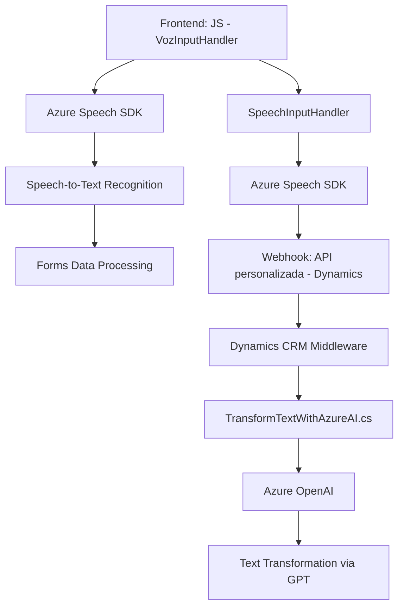

### Breve resumen técnico

El sistema descrito en los archivos incluye funcionalidades clave para procesar voz y texto con integración de servicios externos, como Azure Speech SDK y Azure OpenAI. Estas capacidades están enfocadas en facilitar la interacción mediante entrada y salida de voz, así como en transformar texto en un entorno empresarial como Microsoft Dynamics CRM.

Los archivos muestran:
- **Frontend:** Gestión de la interacción entre formularios dinámicos y servicios de texto y voz.
- **Backend:** Extensiones (plugins) en Dynamics CRM para procesamiento avanzado mediante IA.

---

### Descripción de arquitectura

La arquitectura general mezcla principios de **integración modular** y **event-driven programming**. El sistema se conforma de las siguientes capas:
1. **Frontend interactivo:** escrito en JavaScript, maneja entrada/salida de voz con Azure Speech SDK, mientras interactúa con formularios dinámicos de Dynamics CRM.
2. **Middleware interactivo:** lógica que conecta el frontend con APIs externas o plugins internos (ejemplo: llamadas a APIs customizadas en Dynamics CRM).
3. **Backend:** extensiones mediante plugins en Dynamics CRM usando Azure OpenAI para procesamiento de datos.

El sistema puede ser descrito como una arquitectura **híbrida entre monolito extendido y módulos conectados mediante servicios REST**, donde el frontend actúa como un cliente consumidor de APIs y servicios habilitados en el sistema CRM.

---

### Tecnologías usadas

1. **Frontend:**
   - **JavaScript:** para lógica del usuario.
   - **Azure Speech SDK:** para conversión texto-voz y reconocimiento de voz.
   - **Microsoft Dynamics CRM SDK:** interacción con formularios dinámicos.

2. **Backend:**
   - **Microsoft Dynamics CRM Plugin:** permite extender la funcionalidad del CRM.
   - **Azure OpenAI API:** para transformar texto mediante GPT (procesamiento avanzado de lenguaje natural).
   - **C#:** Lenguaje principal para las extensiones backend.

3. **Herramientas adicionales:**
   - `HttpClient`: para solicitudes API en el plugin.
   - `Newtonsoft.Json`: manejo de JSON en el backend.
   - `System.Text.Json`: operaciones en JSON nativo de .NET.

---

### Diagrama Mermaid (estructura del sistema)

---

### Conclusión final

Este sistema está diseñado como una solución de **automatización e interacción asistida por tecnologías de voz e inteligencia artificial**, principalmente orientada al ecosistema de **Microsoft Dynamics CRM**. Utiliza una arquitectura modular donde el frontend se conecta mediante eventos y APIs al backend gestionado por plugins y servicios externos.

La implementación demuestra la aplicación de patrones como **facade**, **event-driven architecture**, y **SDK Loader**, garantizando una interacción robusta con servicios avanzados como Azure Speech SDK y Azure OpenAI. Sin embargo, algunas áreas podrían mejorar, como el manejo de credenciales (actualmente estático) y optimización para garantizar alta escalabilidad en ambientes empresariales.