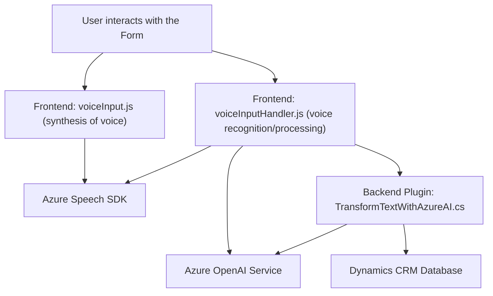

### Breve resumen técnico
Este repositorio presenta una solución que combina funcionalidades de integración con servicios de inteligencia artificial (Azure OpenAI, Azure Speech SDK) y personalización para Dynamics CRM. Incluye archivos organizados en frontend (JavaScript) y backend (C# plugin). Cada archivo presenta funciones específicas, bien separadas y orientadas a tareas concretas, como la síntesis y reconocimiento de voz, la interacción con un servicio de OpenAI, y la actualización de formularios en Dynamics CRM.

---

### Descripción de arquitectura
La solución utiliza una **arquitectura multicapa**, separando responsabilidades claramente entre las capas de presentación (frontend), lógica de negocio (plugins en Dynamics CRM) e integración con servicios externos (Azure Speech SDK y Azure OpenAI API). En el frontend, se implementa el procesamiento de voz y la interacción con los formularios, mientras que el backend actúa como una capa lógica personalizada en Dynamics CRM que interactúa con el servicio de IA para el procesamiento avanzado de texto.

---

### Tecnologías usadas
1. **Frontend (JavaScript)**:
   - Azure Speech SDK: Para síntesis y reconocimiento de voz.
   - Dynamics 365 Client API (`Xrm.WebApi`): Para la integración directa con formularios y datos en Dynamics CRM.
   - Promises y Async/Await: Para manejar tareas asíncronas.

2. **Backend (C# Dynamics Plugin)**:
   - Microsoft Dynamics CRM SDK: Para la extensión de funcionalidades nativas mediante plugins.
   - Azure OpenAI API (GPT-4): Para transformación textual usando inteligencia artificial.
   - HttpClient y JSON Libraries (Newtonsoft/`System.Text.Json`): Para el manejo de solicitudes HTTP y manipulación de datos JSON.

3. **Patrones usados**:
   - **Integración de Servicios Externos**: Comunicación con APIs de Azure para síntesis de voz, reconocimiento de texto y transformación por IA.
   - **Modularidad y Descomposición**: Uso de funciones especializadas y separadas para cada tarea, facilitando la mantenibilidad.
   - **Event-driven Architecture**: Acciones desencadenadas por eventos, como el inicio de entradas de voz o la ejecución de plugins en el contexto CRM.
   - **DTO (Data Transfer Object)**: Uso de objetos estructurados para transferir datos entre capas y sistemas.

---

### Diagrama Mermaid válido para GitHub

---

### Conclusión final
Esta solución se caracteriza por su integración con servicios avanzados como **Azure Speech SDK** y **Azure OpenAI**, aprovechando capacidades de inteligencia artificial para enriquecer la experiencia y funcionalidad en Dynamics CRM. La arquitectura está bien definida, separando la lógica de presentación (frontend) de la lógica empresarial (backend plugin), siguiendo una **multicapa estructurada** con principios de desacoplamiento y especialización. La elección de tecnologías modernas y el patrón de integración con servicios externos la hacen ideal para entornos empresariales que requieren procesamiento en tiempo real y personalización robusta.