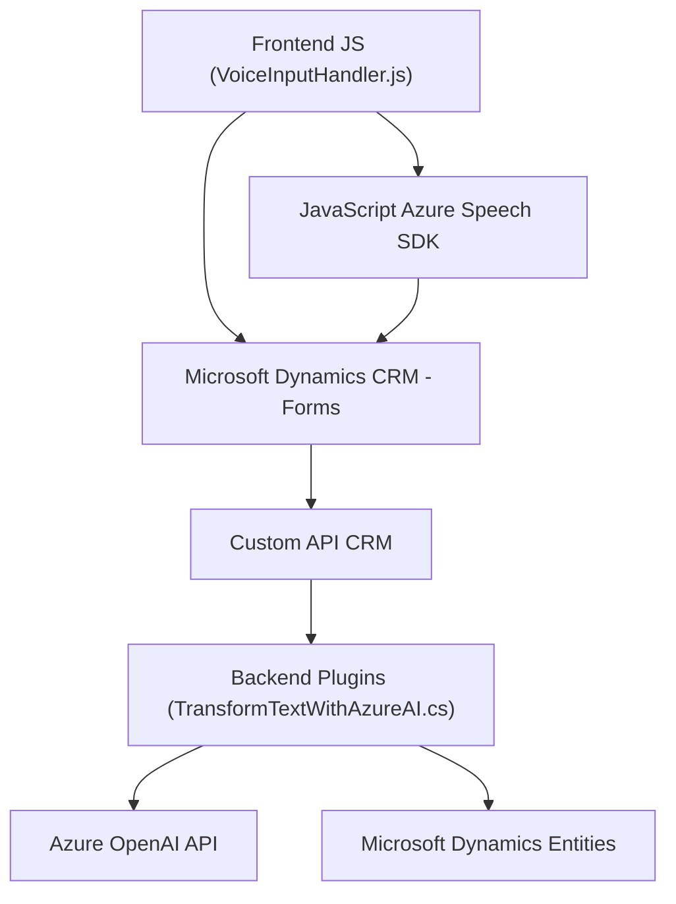

### Análisis Técnico

#### Breve Resumen Técnico:
El repositorio en cuestión integra funcionalidades de voz y procesamiento de texto mediante APIs externas (Azure Speech SDK y Azure OpenAI), además de plugins en Microsoft Dynamics CRM. Su propósito es habilitar la interacción por voz y convertir datos en estructuras definidas dentro de entornos CRM. Los diversos archivos representan una solución modular que mezcla frontend JavaScript con backend implementado como plugins en C#.

---

#### Descripción de Arquitectura:
- **Arquitectura:** 
  - La solución tiene características de una arquitectura **n-capas**, con una diferenciación entre el frontend (JavaScript) que interactúa con el usuario (entrada/salida de voz, formularios) y un backend (C#) que gestiona transformaciones adicionales y lógica de negocio mediante plugins de Dynamics CRM.
  - También implementa conceptos de **integración de servicios externos** en múltiples puntos (Speech-to-Text y OpenAI).
- **Capas Identificadas:**
  - **Frontend:** manejo de la interacción del usuario (formulario dinámico y reconocimiento de voz) utilizando Azure Speech SDK en JavaScript.
  - **Backend:** procesamiento de datos, transformación de texto mediante Azure OpenAI, y manipulación robusta de entidades en Dynamics CRM.
  
---

#### Tecnologías Usadas:
1. **Frontend (JavaScript)**:
   - **Azure Speech SDK**: Reconocimiento y síntesis de voz.
   - **DOM manipulation**: Manejo dinámico de formularios y etiquetas visibles.
   - **Xrm.WebApi**: Interacción directa con los servicios de Microsoft Dynamics.
   - **Custom API CRM**: Llamada de APIs dinámicas extendiendo funcionalidades CRM.

2. **Backend (C# Plugin)**:
   - **Microsoft Dynamics CRM SDK**: Gestión del contexto, datos y eventos dentro del CRM.
   - **Azure OpenAI API**: Procesamiento de texto mediante inteligencia artificial.
   - **JSON Libraries (Newtonsoft.Json)**: Serialización y deserialización avanzada de datos JSON.

---

#### Dependencias y Componentes Externos:
- **Dependencias principales:**
  - **Azure Speech SDK**: Reconocimiento y síntesis de voz.
  - **Azure OpenAI API**: Transformación de texto con IA.
  - **Microsoft Dynamics CRM SDK**: Acceso y manipulación de entidades CRM.
  - **Custom API for Dynamics CRM**: Extensión de funcionalidades predefinidas.
  
- **Componentes externos posibles:**
  - Servicios Azure (por ejemplo, Speech y OpenAI).
  - API propias del CRM o de terceros que se integran con Dynamics mediante `Xrm.WebApi`.

---

#### Diagrama Mermaid:

---

#### Conclusión Final:
La solución representa un **sistema híbrido frontend-backend** enfocado en la interacción dinámica entre voz, formularios, y procesamiento de datos mediante inteligencia artificial. El diseño utiliza una arquitectura **n-capas** con especial énfasis en la modularidad y extensibilidad mediante servicios externos. Integrar plugins en Microsoft Dynamics y APIs externas asegura flexibilidad y potencia tanto en el procesamiento como en la interacción con el usuario final.