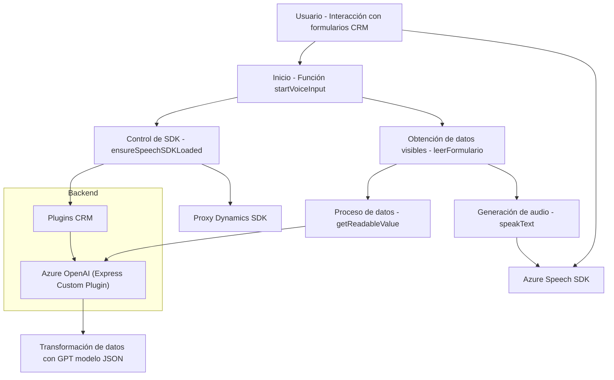

### Breve resumen técnico

El repositorio contiene archivos que integran funcionalidades avanzadas para un sistema CRM, específicamente Microsoft Dynamics, utilizando el Azure Speech SDK y Azure OpenAI GPT. La solución está diseñada para la automatización de datos por entrada y salida de voz, procesamiento de formularios, y transformación de texto estructurado como JSON.

---

### Descripción de arquitectura

La solución tiene una arquitectura de tipo **n capas** orientada a servicios. Cada funcionalidad está claramente segmentada:
- **Frontend/JavaScript**: Gestiona interacciones con el usuario dentro del sistema CRM. Modela procesamiento de datos visibles, transcripción de voz, y llamadas a servicios externos.
- **Backend/Dynamics Plugins**: Ejecuta transformaciones más complejas con OpenAI GPT y trabaja directamente con servicios CRM.

Utiliza patrones como `Modularidad Funcional`, `Facade` y `Repository`. El diseño asegura una separación de responsabilidades y promueve la extensibilidad mediante la integración modular de SDKs y APIs externas.

---

### Tecnologías usadas

1. **Frameworks y tecnologías principales**:
   - **Microsoft Dynamics CRM SDK**: Para gestionar la capa de servicios backend del sistema CRM.
   - **Azure Speech SDK**: Para sintetización de texto a voz y transcripción de voz a texto en el frontend.
   - **Azure OpenAI GPT**: Para procesamiento de texto complejos y creación de estructuras JSON.
   - **JavaScript ES6**: Para gestión de lógica en el cliente/formulario.

2. **Patrones de diseño implementados**:
   - Modularidad y separación de responsabilidades por archivo y función.
   - Procesamiento asíncrono en funciones críticas del frontend y backend.
   - Dynamic SDK Loading Pattern: Carga bajo demanda del Azure Speech SDK.
   - Integración Microservicios: Llamadas externas a Azure OpenAI y APIs personalizadas.

3. **Dependencias externas**:
   - **Azure Services**: OpenAI (GPT), Speech SDK.
   - **Newtonsoft.Json** y `System.Text.Json` para manejo y estructuración de datos en el backend.

---

### Diagrama Mermaid

---

### Conclusión final

La solución está diseñada para un sistema CRM centrado en el procesamiento de datos en tiempo real mediante voz y texto utilizando herramientas modernas de Azure. Implementa una arquitectura **n capas** con un enfoque de modularidad y extensibilidad, lo cual facilita su mantenimiento y el desarrollo de funcionalidades adicionales. La integración con servicios externos como Azure Speech y OpenAI representa una apuesta por mejorar la experiencia del usuario mediante procesamiento de datos con IA, simplificando tareas y optimizando tiempos de interacción con la plataforma.