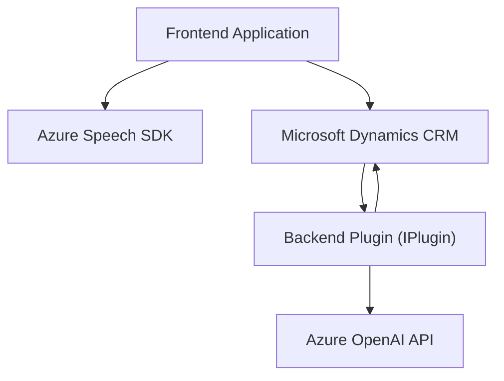

### Breve resumen técnico

El repositorio contiene componentes para un software que integra tecnologías de voz e inteligencia artificial con Microsoft Dynamics CRM. La solución incluye:

1. **Frontend (JavaScript)**:
   - Facilita la interacción con formularios mediante reconocimiento de voz y síntesis de voz, integrándose con Azure Speech SDK.
   - Permite manipular dinámicamente los campos de formulario basándose en estructuras de comandos de voz procesados.

2. **Backend (C# Plugin)**:
   - Realiza transformaciones basadas en normas sobre textos proporcionados, utilizando la API de Azure OpenAI. Funciona como plugin de Dynamics CRM.

---

### Descripción de arquitectura

La solución tiene una arquitectura **cliente-servidor** con dos niveles clave:
1. **Frontend basado en JavaScript**:
   - Proporciona la interfaz y funcionalidad de automatización mediante voz usando Azure Speech SDK.
2. **Backend como plugin en Dynamics CRM**:
   - Extiende las funcionalidades de Dynamics, utilizando un plugin de la plataforma que interactúa con una API externa basada en Azure OpenAI para realizar transformaciones avanzadas.

Además, se maneja la **integración con servicios externos**, donde las operaciones críticas de voz y texto son delegadas a APIs de Azure (Azure Speech y Azure OpenAI). No se encuentran elementos adicionales que sugieran una arquitectura de microservicios, siendo más cercana a una estructura de "n capas".

---

### Tecnologías usadas

1. **Lenguajes utilizados**:
   - **JavaScript**: Para el frontend (voice-to-text interactions).
   - **C#**: Para el plugin backend que extiende Dynamics CRM.

2. **Framework/Otras**:
   - **Microsoft Dynamics CRM SDK**: Para manipular datos y eventos de formularios de Dynamics.
   - **Azure Speech SDK** (JavaScript): Para síntesis y reconocimiento de voz.
   - **Azure OpenAI API** (C#): Procesamiento avanzado de lenguaje con modelos GPT.
   - **Newtonsoft.Json** y **System.Text.Json**: Para manejar datos en formato JSON.

3. **Patrones**:
   - Modularidad: Se utiliza enfoque basado en funciones y métodos para encapsular tareas específicas.
   - Carga dinámica: En el frontend, el Azure Speech SDK se carga dinámicamente mediante un método dedicado.
   - Plug-and-Play: El backend utiliza una arquitectura basada en plugins típica de Dynamics CRM.
   - Delegación: Métodos son responsables de tareas precisas (como `EnsureSpeechSDKLoaded`, `GetOpenAIResponse`).
   - Uso de Servicios: Delegar funcionalidades complejas a APIs externas como Azure.

---

### Posibles dependencias o componentes externos

- **Azure Speech Services**:
  - Sintetizador de voz para un frontend voz-a-texto interactivo.
  - Requiere un token de autenticación y región.
- **Azure OpenAI API**:
  - Servicio externo para generación y transformación avanzada de lenguaje.
  - Funciona con claves de acceso y normas definidas por el usuario.
- **Microsoft Xrm.SDK**:
  - Para trabajar con Microsoft Dynamics CRM en el plugin.
- **JSON handling libraries**:
  - `Newtonsoft.Json` y/o `System.Text.Json` para la manipulación de JSON.
- **CRM APIs y estructuras internas**:
  - Interacción con `Xrm.WebApi` y mapeo de datos.

Otros elementos importantes:
- Script dinámico desde `https://aka.ms/csspeech/jsbrowserpackageraw`.
- Dependencias propias del entorno CRM (como objetos `attributes`, `controls`, etc.).

---

### Mermaid Diagram

---

### Conclusión final

Este repositorio contiene una solución especializada que extiende Microsoft Dynamics CRM con funcionalidades de voz e inteligencia artificial. Utiliza un diseño modular en combinación con arquitecturas previamente definidas por Dynamics CRM. 

El **Frontend** interactúa directamente con el usuario mediante un enfoque accesible basado en voz (captura y síntesis), mientras que el **Backend Plugin** realiza operaciones asincrónicas utilizando APIs externas para transformar texto según necesidades empresariales específicas. La arquitectura es una combinación de **n capas** adaptada a un ecosistema CRM.