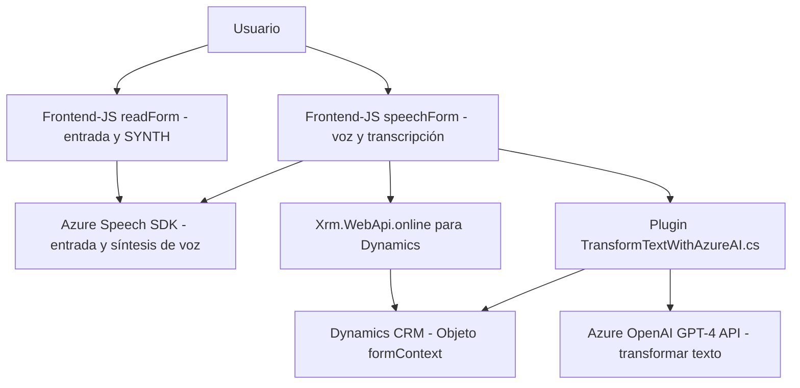

## Breve resumen técnico:
El repositorio contiene múltiples archivos que colaboran en una solución orientada a capacidades de procesamiento de entrada de voz, síntesis de texto a voz y transformación de texto mediante IA con integraciones a servicios de **Azure Speech SDK**, **Azure OpenAI GPT-4 API** y **Microsoft Dynamics 365 CRM API**. Incluye componentes frontend (Javascript) y backend (C# plugin) para cumplir las necesidades de un sistema enriquecido.

---

## Descripción de arquitectura:
La arquitectura general de esta solución puede clasificarse como **arquitectura de n capas**, dado que los componentes están definidos y separados según el contexto de su funcionalidad (frontend, backend y plataformas externas). Además, surgieron elementos de integración de API que acercan este sistema a un modelo híbrido de cliente-servidor en su interacción con servicios en la nube.

### Capas identificadas:
1. **Capa frontend**:
   - Componentes como `readForm.js` y `speechForm.js` que interactúan con el usuario para realizar entradas de voz, síntesis de texto a voz y procesamiento local de datos.
   - Modular en diseño: cada responsabilidad está asignada a funciones específicas.
   - Comunicación con APIs externas: **Azure Speech API**, **Dynamics CRM API**.

2. **Capa backend**:
   - Plugins escritos en C# (`TransformTextWithAzureAI.cs`) que efectúan operaciones específicas como la transformación de texto usando **Azure OpenAI GPT-4**.
   - Funciona como un microservicio enfocado en procesamiento de datos en la nube, utilizando un patrón de integración basado en API.

### Estilo arquitectónico:
- **Multicapas**: Separación clara entre frontend, API integración y backend.
- **Service-Oriented Architecture (SOA)**: Servicios de Azure trabajan de manera independiente para realizar operaciones específicas.
- **Modular**: Uso de funciones bien estructuradas, con responsabilidades delimitadas.
- **SDK Handling Pattern**: Manejo dinámico de cargas condicionales de SDK en el frontend.

---

## Tecnologías usadas:
1. **Frontend**:
   - **JavaScript** para interactuar con formularios, procesar texto y manejar la integración con Azure Speech SDK.
   - **Azure Speech SDK** para la entrada de voz, síntesis de texto a voz y transcripción.

2. **Backend**:
   - **C#**: Desarrollo del plugin para Microsoft Dynamics.
   - **Azure OpenAI GPT-4 API**: Transformación de texto en un formato procesable.
   - **Microsoft Dynamics CRM**: Integración con los formularios y datos organizacionales mediante **IOrganizationService**.

3. **Dependencias y Librerías**:
   - `System.Net.Http` y `Newtonsoft.Json`: Para el manejo de solicitudes HTTP y manipulación JSON.
   - `IPluginExecutionContext`: Manipulación del contexto del CRM.
   - `Xrm.WebApi.online`: Facilitador para las interacciones con APIs de Dynamics 365.

---

## Diagrama **Mermaid**:

---

## Conclusión final:
Los archivos analizados forman parte de una solución que implementa una arquitectura de **n capas** y permite la integración con servicios de Microsoft Dynamics CRM y Azure. Utiliza **Azure Speech SDK** para habilitar la funcionalidad de entrada y síntesis de voz, mientras que un plugin backend en **C#** usa el servicio **Azure OpenAI** para transformar texto en JSON estructurado. La modularidad y separación entre frontend, backend y APIs externas facilitan su mantenimiento y escalabilidad, aunque deberían considerarse mejoras en la gestión de credenciales (para el acceso a APIs) y seguridad ante posibles vulnerabilidades.