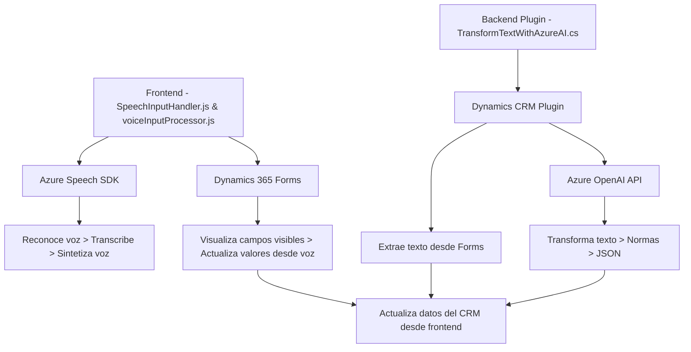

### Breve Resumen Técnico
El repositorio se centra en funcionalidades integradas con Microsoft Dynamics 365 y servicios de Azure, principalmente para entrada y procesamiento de datos mediante voz y texto. Los archivos analizados implementan lógica para interactuar con formularios en Dynamics 365, integrar reconocimiento de voz con **Azure Speech SDK**, y realizar transformaciones de texto utilizando **Azure OpenAI API**. La solución es un ejemplo de integración de SaaS y SDK para extender las capacidades de plataformas empresariales como Dynamics.

---

### Descripción de Arquitectura
La arquitectura combina varios elementos:
1. **Frontend Modular**: Archivos `SpeechInputHandler.js` y `voiceInputProcessor.js` manejan eventos de formularios y reconocimiento de voz con integración dinámica de Azure Speech SDK.
2. **Backend Plugin**: `TransformTextWithAzureAI.cs` encapsula lógica empresarial en un plugin que se integra con Dynamics CRM mediante el uso de patrones estándar como `IPlugin`.
3. **Arquitectura de N Capas**:
   - **Capa de Integración**: Los servicios externos (p. ej., Azure Speech y OpenAI).
   - **Capa de Aplicación**: Funciones y plugin que sirven como controladores para el procesamiento de datos.
   - **Capa de Persistencia**: Dynamics CRM provee el contexto y almacenamiento para los datos procesados.

La solución no es estrictamente monolítica, ya que la separación entre frontend y backend junto con integración de SDK sitúa su diseño más hacia un sistema distribuido con componentes especializados.

---

### Tecnologías Usadas
1. **Frontend:**
   - JavaScript.
   - **Azure Speech SDK**: Para reconocimiento y síntesis de voz.
   - Framework NO especificado explícitamente (basado en JavaScript Vanilla).

2. **Backend (Plugin):**
   - C#.
   - **Dynamics CRM SDK**: Para la interacción con datos y servicios internos de la plataforma.
   - **Azure OpenAI API**: Usada para transformar texto.
   - **System.Net.Http** y JSON serialization: Para llamadas HTTP y manejo de datos.
   
3. **Servicios Externos:**
   - Azure Speech.
   - Azure OpenAI.

---

### Diagrama Mermaid Válido para GitHub

---

### Conclusión Final
El análisis del código y los archivos del repositorio sugiere que esta solución se diseñó como una extensión híbrida de Dynamics 365, que utiliza tanto un frontend para reconocimiento y procesamiento de datos como un backend para transformar texto usando inteligencia artificial (Azure OpenAI).

Estos puntos principales resumen la solución:
1. **Tipo:** Extensión de Dynamics 365 con integración SaaS (Azure Speech y OpenAI).
2. **Arquitectura:** N capas con composición modular y separación en frontend/backend.
3. **Tecnología:** JavaScript y C#, combinados con SDK y APIs de Azure.

La metodología de desarrollo modular y la integración de servicios SaaS la hacen flexible y preparada para escalar en escenarios empresariales.