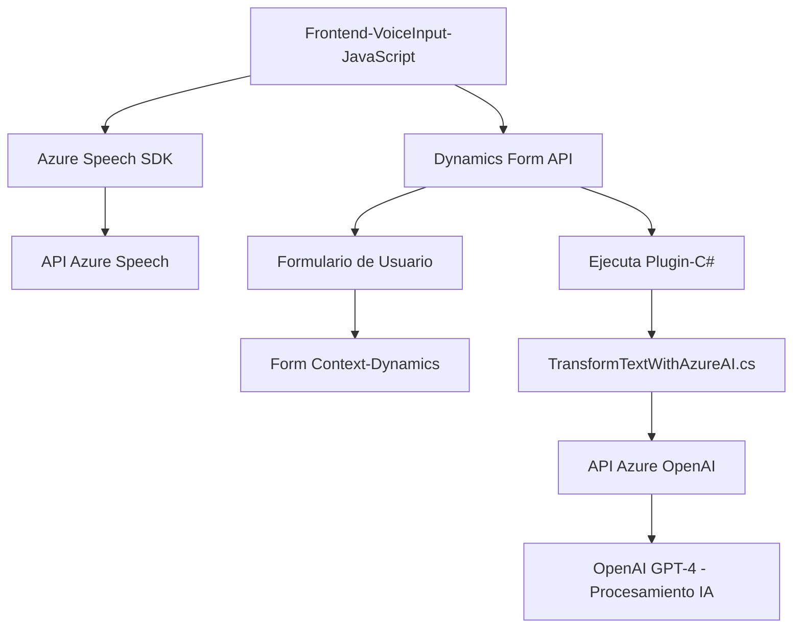

### Resumen técnico
La solución analizada dentro del repositorio es, en términos generales, un conjunto de componentes que integran funcionalidad de reconocimiento y síntesis de voz mediante Azure Speech SDK, así como transformaciones avanzadas de texto utilizando la API de Azure OpenAI en Microsoft Dynamics CRM.

---

### Descripción de arquitectura y solución
1. **Tipo de solución**:
   - **Híbrida**: Se compone de varios frentes: 
     - Un **frontend** con JavaScript que proporciona reconocimiento y síntesis de voz.
     - Un **backend** que incluye un plugin C# para Microsoft Dynamics CRM, el cual procesa datos mediante Azure OpenAI API.

2. **Patrón de arquitectura**:
   - **N capas**: Con separación clara entre las capas de presentación (frontend), lógica/sistema (backend para Dynamics), e integración de servicios externos (Azure Speech SDK y Azure OpenAI).
   - El frontend actúa como una capa cliente que utiliza servicios de Azure Speech SDK y el backend se basa en plugins del modelo de extensibilidad de Dynamics CRM.
   - El diseño favorece principios de **modularidad**, **responsabilidad única** y **encapsulación funcional**.

3. **Componentes y dependencias externas**:
   - **Frontend**:
     - **Azure Speech SDK (JavaScript)**: Usado para síntesis y reconocimiento de voz.
     - **Microsoft Dynamics Form API** (Xrm.Page): Para acceder y manipular datos en los formularios de CRM.
   - **Backend**:
     - **Microsoft Dynamics CRM SDK (.NET)**: Gestión de datos y lógica de negocio.
     - **Azure OpenAI** (GPT-4): Transformación avanzada de texto mediante aprendizaje automático.
     - **Newtonsoft.JSON**: Manipulación de datos JSON estructurados dentro de la API de Dynamics.
     - **HTTP Client (C#)**: Comunicación con APIs REST, como Azure OpenAI.

4. **Patrones de diseño identificados**:
   - **Carga dinámica de dependencias**: En el frontend, el SDK de Azure Speech se carga dinámicamente según necesidad.
   - **Gestión de estado en formularios**: Uso de `formContext` y `executionContext` para acceder y modificar datos en los formularios de Dynamics CRM.
   - **Integración RESTful**: La API externa de Azure OpenAI se consume mediante el patrón cliente-servidor con HTTP POST y JSON estructurado.
   - **Invocación asincrónica**: Uso de `Promise` en JavaScript y métodos `async/await` en C# para gestionar aspectos no bloqueantes en llamadas externas.

---

### Tecnologías usadas
1. **Frontend**:
   - **JavaScript Vanilla**: Sin frameworks. Todo se desarrolla con funciones JavaScript clásicas.
   - **Azure Speech SDK**: Para interacción con servicios de Azure relacionados con reconocimiento y síntesis de voz.
   - **Microsoft Dynamics Form API (Xrm.Page)**: Para manipulación de datos del CRM en el cliente.

2. **Backend**:
   - **Microsoft Dynamics CRM Plugin Framework**: Para añadir comportamiento personalizado a eventos del CRM.
   - **C# (.NET)**: Usado para implementar plugins.
   - **Azure OpenAI SDK**: Con interacción directa usando HTTP Requests y JSON para procesamiento de datos.

3. **Integración de servicios externos**:
   - **Azure Speech SDK**: Síntesis y reconocimiento de voz.
   - **Azure OpenAI API**: Procesamiento de texto basado en IA generativa.

---

### Diagrama Mermaid

---

### Conclusión final
La solución combina tecnologías frontend (JavaScript y Azure Speech SDK) y backend (Dynamics CRM Plugin en C# junto con Azure OpenAI API) para ofrecer funcionalidades de reconocimiento, síntesis y transformación de texto basado en IA. La arquitectura sigue un enfoque **n capas** gracias a su separación entre lógica del cliente, servidor, y servicios externos. Está altamente enfocado en la integración con servicios de Azure y en la modularidad funcional, lo que permite mantener una clara responsabilidad en cada capa o componente. Este diseño es flexible, escalable y adecuado para un entorno empresarial utilizando Dynamics CRM.