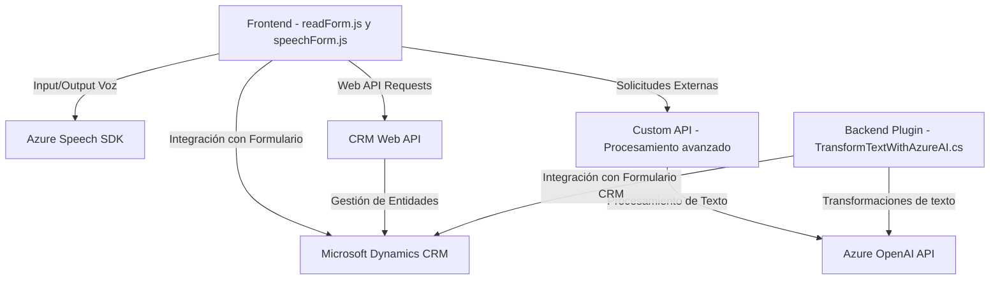

### Breve Resumen Técnico

Este repositorio representa los componentes de una solución tecnológica enfocada en la integración de entrada/salida de voz, automatización de formularios y procesamiento avanzado de datos mediante inteligencia artificial. La solución, compuesta por archivos JavaScript (frontend) y plugins en .NET para Microsoft Dynamics CRM, utiliza una combinación de tecnologías modernas que potencian la experiencia del usuario y optimizan el flujo de datos en un sistema CRM empresarial.

---

### Descripción de Arquitectura

1. **Tipo de solución:**  
   La solución está diseñada parcialmente como una extensión para un sistema existente (presumiblemente una plataforma CRM). Los archivos en el directorio `FRONTEND/JS` se orientan al frontend y a proveer interacciones avanzadas (datos de entrada y salida mediante voz). El archivo `Plugins/TransformTextWithAzureAI.cs` es parte del backend del sistema CRM, representando un plugin que se integra directamente con Microsoft Dynamics CRM para realizar transformaciones y automatización mediante Azure OpenAI.

2. **Tipo de arquitectura:**  
   - La solución implementa una **arquitectura orientada a servicios** debido a la fuerte integración con servicios externos como Azure Speech SDK y Azure OpenAI API.  
   - Además, la estructura del repositorio refleja una separación lógica entre una capa de **presentación (frontend)** y una capa de **lógica del backend** (plugins del CRM).
   - El plugin del backend utiliza el patrón de **plugin architecture** específico de Microsoft Dynamics CRM.

---

### Tecnologías utilizadas

- **Backend:**  
  - **Microsoft Dynamics CRM SDK:** Aprovecha el sistema de plugins para extender la funcionalidad del CRM.  
  - **Azure OpenAI API (GPT-4):** Transformación avanzada de texto mediante modelos de IA.  
  - **C#:** Bases del desarrollo del plugin CRM.  
  - **System.Net.Http:** Para llamadas HTTP.  
  - **Json.NET (Newtonsoft.Json):** Para manejar la conversión y manipulación de datos JSON.

- **Frontend:**  
  - **Azure Speech SDK (JavaScript):** Para procesamiento de entrada y síntesis de voz.  
  - **JavaScript (vanilla):** Manipulación de DOM y lógica de cliente.  
  - **CRM API (Xrm.WebApi.online):** Para interactuar directamente con entidades del CRM desde el frontend.

---

### Dependencias o componentes externos

- **Dependencias y servicios:**  
  - Azure Speech SDK: Para entrada de voz y síntesis de texto hacia voz.  
  - Azure OpenAI API: Provee transformación de texto a JSON estructurado utilizando GPT.  
  - Microsoft Dynamics CRM API: Se integra como capa de backend para persistencia y lógica en formularios.  
  - JS Browser APIs: Acceso a los datos del formulario e interacción con la interfaz del usuario.

- **Componentes externos:** 
  - **Custom API:** Un servicio personalizado de terceros que procesa texto antes de aplicarlo en los formularios utilizando CRM's Web API.  
  - **Azure API Management:** (posiblemente involucrado) para gestionar seguridad y escalabilidad de las solicitudes a Azure OpenAI y Speech SDK.

---

### Diagrama Mermaid válido para GitHub Markdown

---

### Conclusión Final

El repositorio representa una solución híbrida entre front/back que amplía las capacidades de un sistema CRM. El frontend mejora la accesibilidad mediante entrada/salida de voz usando Azure Speech SDK y automatización del formulario sin fricción para el usuario. El backend utiliza plugins en C# para manipular texto avanzado mediante Azure OpenAI, implementando una arquitectura orientada a servicios.

La combinación de modularidad en el frontend y la integración con servicios cloud (Azure Speech, Azure OpenAI) sugiere una arquitectura moderna que enfatiza la interoperabilidad entre aplicaciones y servicios.