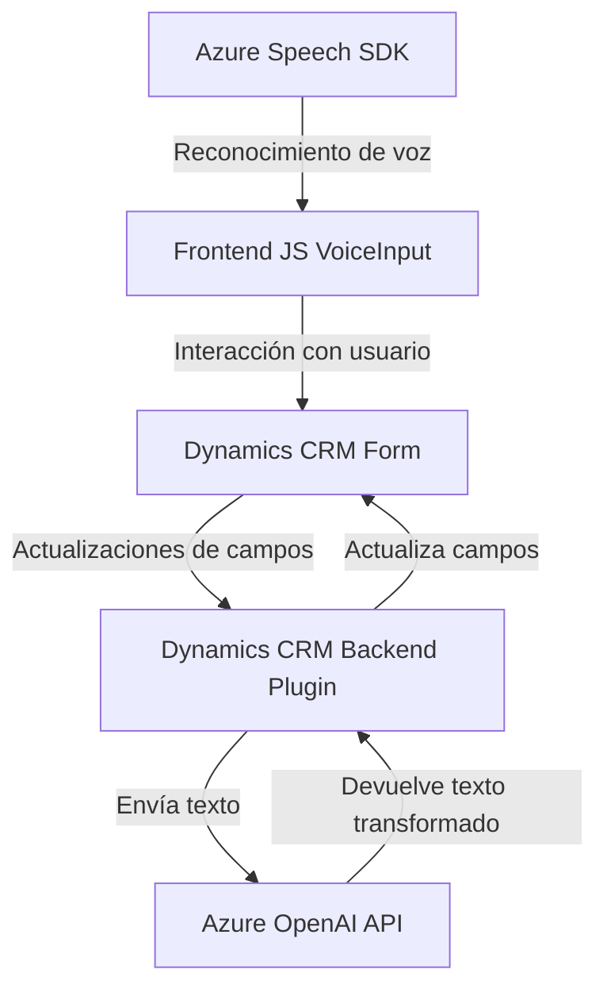

### Análisis técnico detallado

---

#### **Breve resumen técnico**
La solución analizada en el repositorio es un sistema híbrido que integra la funcionalidad de un frontend basado en JavaScript (que interactúa con formularios de Dynamics 365) y un backend mediante plugins de Dynamics CRM. Además, utiliza servicios avanzados de Inteligencia Artificial y reconocimiento de voz de Azure, como Azure Speech SDK y Azure OpenAI. El objetivo general es permitir la interacción natural por voz con formularios y procesar texto hablado mediante la integración con inteligencia artificial.

---

#### **Descripción de arquitectura**
Este sistema sigue una arquitectura de capas que integra elementos del modelo **"Hexagonal Architecture"** y divide las responsabilidades entre las siguientes capas:
1. **Interfaces (Frontend JS)**: Contiene la lógica de usuario para integrar el Azure Speech SDK, captar datos del formulario (front), transformar los datos con AI y realizar transcripción por voz.
2. **Aplicación CRM (Backend Plugin)**: Sirve como una capa para procesar datos enviados por el frontend, interactuar con Microsoft Dynamics CRM, y enviar solicitudes al servicio Azure OpenAI.
3. **Servicios Externos**: Comprende dos APIs de Microsoft Azure (Speech SDK para voz y OpenAI para procesamiento avanzado de texto mediante IA).

El sistema está diseñado para facilitar la interacción entre el usuario (mediante voz), Microsoft Dynamics CRM y servicios de Inteligencia Artificial, basado en un enfoque modular. También utiliza el patrón **Service Gateway** para la integración con Azure Speech/AI. En el backend, el plugin en C# adopta patrones como **Adapter** y **Proxy**, que abstraen el detalle de la interacción con los servicios externos.

---

#### **Tecnologías usadas**
1. **Frontend**:
   - **JavaScript**: Implementa la lógica de interacción con Dynamics CRM, el SDK de Speech y Azure APIs.
   - **Azure Speech SDK**: Para el reconocimiento de voz, transcripción y síntesis de texto en voz.
   - **Dynamics CRM (XRM)**: Para la manipulación de datos dentro de formularios CRM.
   
2. **Backend**:
   - **C# (Microsoft XRM SDK)**: Implementación del plugin de Dynamics CRM integrado con Azure OpenAI.
   - **Azure OpenAI API**: Realiza transformación avanzada del texto.

3. **Pattern highlights**:
   - **Hexagonal Architecture**: Claro uso de interfaces y desacoplamiento con servicios externos.
   - **Service Gateway** y **Adapter pattern**: Para comunicarse con Azure APIs y adaptar datos para la infraestructura de Dynamics CRM.
   - **Event-driven Architecture**: Uso de controladores activados por eventos (como el procesamiento de voz y entrada de usuario).

---

#### **Dependencias o componentes externos**
1. **Azure Speech SDK**: Utilizado para transcribir y sintetizar voz.
2. **Azure OpenAI API**: Implementada en el plugin de Dynamics CRM, se utiliza para realizar transformaciones avanzadas de texto por inteligencia artificial.
3. **Dynamics CRM SDK**: (Microsoft.Xrm.Sdk) para interactuar y manipular datos del sistema de CRM.
4. **API personalizada**: Referencia a una API desarrollada con el método `trial_TransformTextWithAzureAI`.
5. **HTTP Client y JSON Serialization/Deserialization**: Manejo de los datos y comunicación con servicios externos.

---

#### **Diagrama Mermaid válido para GitHub**

---

#### **Conclusión final**
Esta solución representa una arquitectura moderna y multifuncional adecuada para escenarios en los que se desee enriquecer la interacción entre usuario y plataformas CRM utilizando reconocimiento de voz e inteligencia artificial. Se trata de una arquitectura basada tanto en la interoperabilidad de servicios como en la modularidad.

Al ser una solución acoplada directamente a Microsoft Dynamics CRM y dependiente de servicios de Azure, puede surgir una limitación para integrarla con otros sistemas o proveedores. Se recomienda revisar la administración de las claves API y valorar la posibilidad de desacoplar ciertos elementos para mejorar la agilidad de migración y ampliar el rango de compatibilidad.