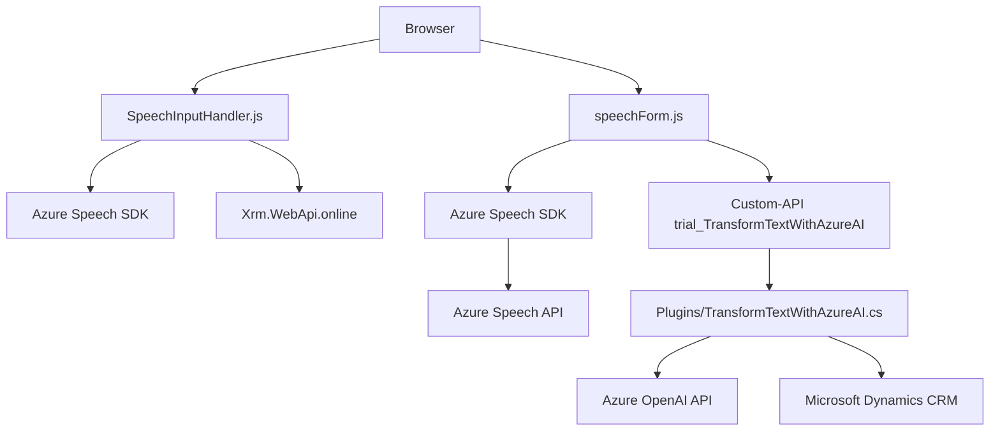

### Resumen Técnico
El repositorio parece centrarse en la integración de un sistema CRM (Microsoft Dynamics) con tecnologías de Azure, particularmente en el manejo de entrada y salida de voz, reconocimiento y síntesis de texto, y procesamiento avanzado mediante inteligencia artificial (AI). Los archivos analizados conforman una solución con frontend basado en JavaScript para interactuar con formularios y plugins .NET que integran funcionalidad avanzada mediante Azure OpenAI.

---

### Descripción de Arquitectura
1. **Frontend**: Una serie de módulos JavaScript para interactuar directamente con el navegador y gestionar entrada por voz, así como comunicación con APIs externas.
   - Este componente puede ser considerado un **monolito frontend**, con funcionalidades segregadas en archivos modulares y dependiente del contexto de los formularios CRM.

2. **Backend Plugin**: Código .NET que implementa la arquitectura de **plugins** en Dynamics CRM.
   - Este componente sigue la arquitectura de **n capas** al utilizar Microsoft.Xrm.Sdk para interactuar con servicios internos del CRM y la API Azure OpenAI para el procesamiento de texto en tiempo de ejecución.

3. **Integración**:
   - La solución presenta un enfoque **modular** de integración con servicios externos como Azure Speech SDK y Azure OpenAI, utilizando patrones como **Observador** y comunicación basada en API.

---

### Tecnologías Usadas
1. **Frontend**:
   - **JavaScript ES6**: Programación modular y operaciones asincrónicas.
   - **Azure Speech SDK**: Para reconocimiento de voz y sintetización texto-a-voz.
   - **CRM SDK**: Extensión específica para Microsoft Dynamics CRM.

2. **Backend**:
   - **C# (.NET Framework)**: Lógica de negocio integrada con Microsoft Dynamics CRM.
   - **Newtonsoft.Json**: Para manipular objetos JSON.
   - **System.Net.Http**: Interacción con servicios REST API.
   - **Azure OpenAI**: Procesamiento avanzado de texto con GPT.

3. **Patrones de diseño**:
   - **Observador**: Procesamiento de eventos en Azure Speech SDK.
   - **Modularización**: Funciones JavaScript y métodos en C# suficientemente desacoplados.
   - **Component-based Architecture**: Uso de plugins y API para funcionalidad incremental en Dynamics CRM.

---

### Diagrama Mermaid

---

### Conclusión Final
El repositorio forma parte de una solución tecnológica que integra un sistema CRM con capacidades de procesamiento de voz y texto avanzadas proporcionadas por Azure. Con un frontend basado en JavaScript y un backend basado en plugins de Dynamics CRM, sigue principios de modularización y extensibilidad. Además, aprovecha servicios externos como Azure Speech SDK y Azure OpenAI para enriquecer las capacidades del sistema mediante transformación y síntesis de datos.

La arquitectura está diseñada para ser eficiente, aunque tiene dependencia significativa en tecnologías de Azure y Dynamics. Las decisiones de diseño son adecuadas para sistemas basados en CRM y de interacción humano-computadora, como aquellos que optimizan procesos empresariales con interfaces naturales.