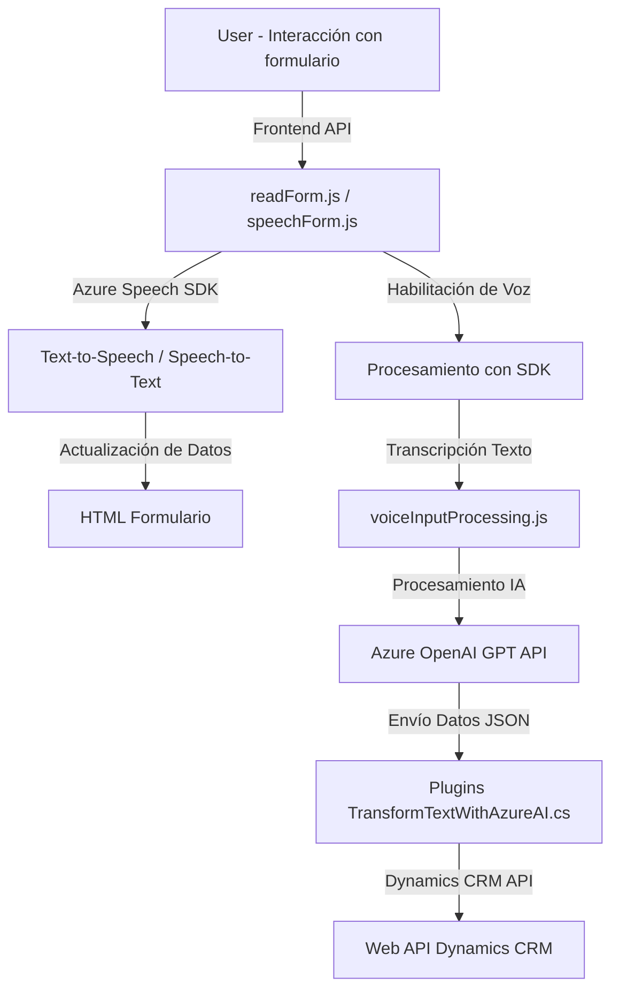

### Breve resumen técnico

El repositorio parece estar diseñado para ofrecer integraciones avanzadas en una solución orientada a aplicaciones web y servicios backend, con una implementación significativa de capacidades de interacción por voz y procesamiento de lenguaje natural mediante el uso del **Azure Speech SDK** y **Azure OpenAI GPT**. La solución en su conjunto tiene componentes de frontend (control de formularios y funcionalidades de voz) y extensiones backend (plugins para Dynamics CRM).

---

### Descripción de arquitectura

La arquitectura del sistema es **modular** y se puede considerar como una solución n capas debido a sus componentes claramente diferenciados: frontend, servicios complementarios y integración con un backend basado en Dynamics CRM. Además:
- **Frontend**: Permite la interacción directa con los usuarios, proporcionando funcionalidades como lectura de formularios y reconocimiento de voz.
- **Backend**:
  - Uso de **plugins** para extender funcionalidades directamente dentro del contexto de Dynamics CRM, lo que indica una **plugin-based architecture** específica.
  - Interacción con servicios de IA mediante APIs (**Azure Speech SDK** y **Azure OpenAI GPT**) para implementar tanto reconocimiento de comandos como transformación avanzada de datos.

---

### Tecnologías usadas

1. **Frontend**:
   - **JavaScript** (manejo de DOM, interacción con API).
   - **Azure Speech SDK** (carga dinámica y síntesis/interpretación de voz).

2. **Backend**:
   - **C#** (desarrollo de plugins con Dynamics CRM).
   - **Microsoft.Xrm.Sdk** (integración y operación con datos de CRM).
   - **Newtonsoft.Json.Linq** y **System.Text.Json** (manejo de datos JSON).
   - **Azure OpenAI GPT API** (para procesamiento y transformación avanzada de datos).

---

### Diagrama Mermaid válido para GitHub Markdown

---

### Conclusión final

El análisis del repositorio sugiere que esta solución está orientada a proveer funcionalidades avanzadas mediante la integración de tecnologías modernas, como el reconocimiento de voz y el procesamiento de lenguaje natural, con aplicaciones de cliente y CRM. Su arquitectura modular basada en n capas facilita el desarrollo y escalabilidad, mientras los componentes pequeños y bien definidos permiten la extensibilidad y el acoplamiento con servicios externos como **Azure Speech SDK** y **Azure OpenAI GPT API**. Por lo tanto, esta solución es adecuada para entornos empresariales donde la interacción por voz y la automatización de flujos de trabajo son cruciales.