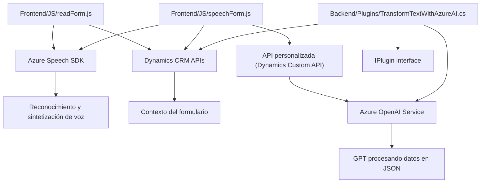

### Breve resumen técnico
El repositorio analiza cómo interactúan tres componentes principales:
1. **Frontend**: Scripts en JavaScript especializados en la entrada de voz y procesamiento de datos visibles en un formulario dinámico basado en Dynamics 365 CRM.
2. **Backend**: Un plugin de Dynamics CRM que utiliza servicios de Azure OpenAI para transformar texto según una lógica definida y devolver un JSON estructurado.
3. **Integración externa**: Dependencia explícita de Azure Speech SDK y Azure OpenAI para inteligencia artificial.

### Descripción de arquitectura
La solución implementa una arquitectura **híbrida**:
- **Frontend**: Modular, diseñado para capturar y procesar entradas de voz que son mapeadas a formularios CRM.
- **Integración externa**: Dependencias directas de servicios externos (Azure Speech SDK y Azure AI).
- **Backend**: Plugin de Dynamics CRM que actúa como un microservicio que delega a Azure OpenAI la transformación de texto.
- **Patrones específicos**: API personalizada para la transcripción de voz y generación de prompt en OpenAI conforman la integración con sistemas distribuidos.

### Tecnologías usadas
- **Frontend**:
  - JavaScript.
  - Dynamics 365 JavaScript API (`Xrm.WebApi`).
  - **Azure Speech SDK**: Procesamiento para la entrada, salida y transcripción de voz.
- **Backend**:
  - C# con Dynamics CRM SDK (`Microsoft.Xrm.Sdk`).
  - **Azure OpenAI Service**: Consumiendo el modelo GPT-4 para transformar texto.
- **Servicios externos**:
  - Azure Speech SDK.
  - Azure OpenAI.

### Diagrama Mermaid

### Conclusión final
El sistema tiene componentes claros que operan como piezas colaborativas en una arquitectura híbrida:
1. **Frontend**: Permite funcionalidades avanzadas como entrada y salida de voz, especialmente diseñada para ser usada en formularios de Dynamics CRM. Se conecta a Azure Speech SDK para la transcripción y sintetización.
2. **Backend**: Implementa un microservicio con Azure OpenAI para procesamiento mediante IA, funcionando sobre la interface de Dynamics CRM (IPlugin).
3. **Servicios externos**: Los dos principales, Azure Speech SDK y Azure OpenAI, son altamente integrados en la lógica de negocio.

Aunque la solución no utiliza microservicios aislados, su modularidad e integración con otros servicios externos cumple con patrones de arquitectura distribuidos.