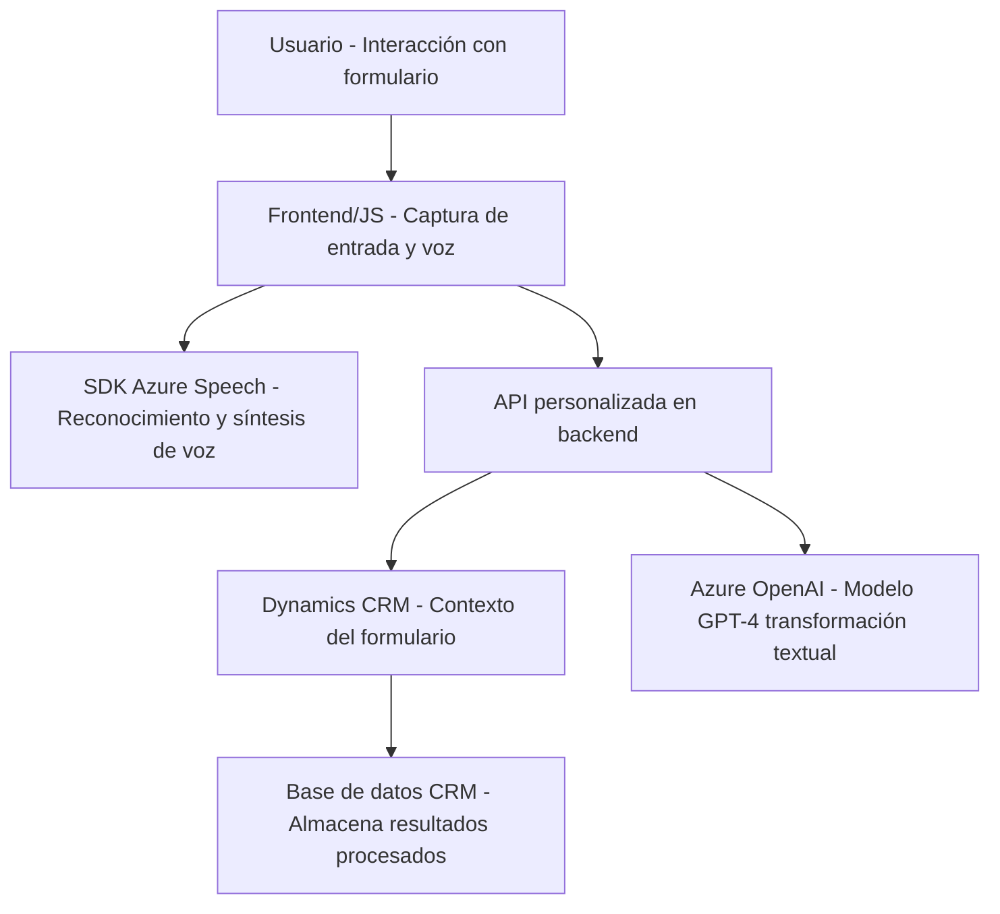

### Breve resumen técnico:
Este repositorio forma parte de un sistema software que utiliza tecnologías modernas para integrar una solución interactiva basada en formularios, accesibilidad mediante voz y procesamiento de datos con inteligencia artificial. Aprovecha el reconocimiento de voz, síntesis de texto y el servicio Azure OpenAI para transformar y garantizar un procesamiento avanzado de los datos introducidos en Dynamics CRM.

---

### Descripción de arquitectura:
La arquitectura combina un enfoque híbrido de capas y microservicios. Los componentes incluyen un frontend (en JavaScript) responsable de la interacción con el usuario (visión y voz) y el backend (en C# mediante Plugins), que maneja la lógica de negocio central en el contexto de Dynamics CRM. Adicionalmente, se integra con servicios externos, como el SDK de Azure Speech y Azure OpenAI, para reconocimiento y síntesis de voz y transformación avanzada de los datos.

1. **Tipo de solución:** Combina una API basada en Dynamics CRM, un frontend interactivo y servicios externos (Azure).
2. **Capas identificadas:**
   - Frontend/JS: Interacción con el usuario y el reconocimiento/síntesis de voz.
   - Backend Plugins: Lógica central, transformaciones y conexión con Azure AI.
   - Servicios externos: Azure Speech SDK y Azure OpenAI.
3. **Interacción basada en eventos:** Funciones clave reaccionan a eventos, como entradas de voz o cambios en el formulario.

---

### Tecnologías, frameworks y patrones observados:
1. **Tecnologías & frameworks:**
   - Frontend: JavaScript/ES6 para lógica en navegador.
   - Backend: C# (.NET Framework/Core) utilizando el ecosistema Dynamics CRM.
2. **Servicios externos:**
   - **Azure Speech SDK**: Reconocimiento y síntesis de voz; interactúa directamente con formularios y DOM.
   - **Azure OpenAI**: Transformación avanzada de datos textual mediante el modelo GPT-4.
3. **Patrones:**
   - **Modularización funcional:** Código dividido en funciones reutilizables para tareas específicas.
   - **Facade:** Abstracción de la complejidad de los servicios externos mediante funciones envolventes como `applyValueToField` y `callCustomApi`.
   - **Asynchronous Interaction:** Gestiona múltiples operaciones con promesas y callbacks.
   - **Plugin-Based Architecture:** Integración directa con el flujo de Dynamics CRM mediante la implementación de `IPlugin`.
   - **API Gateway:** Uso controlado del servicio remoto Azure OpenAI como gateway principal.

---

### Dependencias y componentes externos:
1. **Dependencias internas:**
   - `Xrm.WebApi` y API web personalizada para operar con los datos del formulario y enviar solicitudes a servicios de Azure.
   - Form handling y data extraction en el navegador para procesar datos visibles.
2. **Componentes externos:**
   - **Azure Speech SDK** para funcionalidades relacionadas con voz.
   - **Azure OpenAI (GPT-4)** para transformación textual avanzada.
   - **HTTP Client API** para comunicación externa en C# (en plugins).

---

### Diagrama Mermaid:

---

### Conclusión final:
El repositorio implementa una solución interactiva e inteligente que utiliza tecnologías avanzadas para lograr una experiencia de usuario accesible y eficiente. Combina un frontend modular en JavaScript y un backend basado en Plugins de Dynamics CRM. Se apoya en servicios externos como Azure Speech SDK para la interacción de voz y Azure OpenAI para la transformación de datos textual avanzada. La arquitectura es híbrida, con elementos de capas y microservicios, diseñada para integración óptima y alta personalización en entornos corporativos.