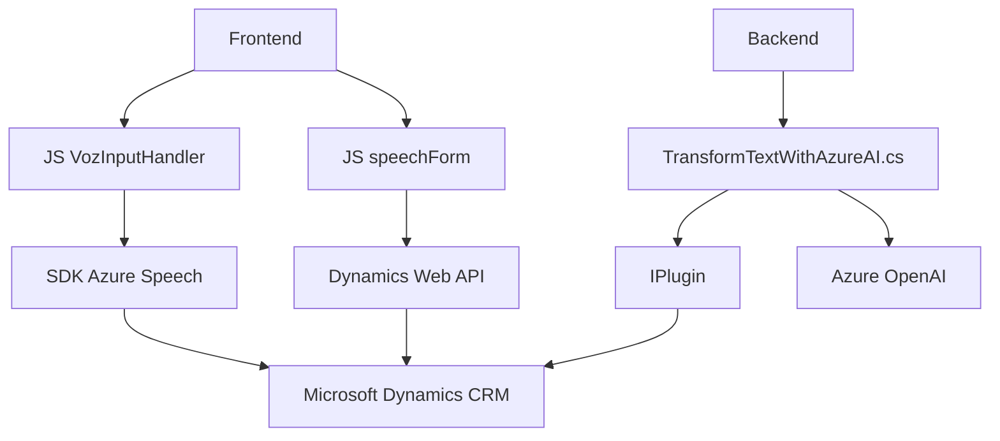

### Breve resumen técnico
El repositorio contiene implementación de soluciones orientadas a la interacción entre usuarios y aplicaciones a través de reconocimiento de voz y síntesis de datos textual-auditivo. A la vez, incluye un componente para transformar texto mediante Azure OpenAI dentro de Microsoft Dynamics CRM. Las piezas analizadas cubren funcionalidad de frontend (procesamiento de voz y síntesis de audio) y backend (plugins CRM que integran Azure AI).

---

### Descripción de arquitectura
El sistema tiene una arquitectura híbrida, con un frontend modular y un backend basado en eventos de plugins para CRM. La dependencia del SDK de Azure Speech y Azure OpenAI sugiere un diseño centrado en integración de servicios externos. Aunque los elementos del frontend siguen un enfoque bien estructurado, el backend adopta paradigmas de eventos y lógica por plugins. Es una arquitectura de capas con alta cohesión en el frontend y una separación clara de responsabilidades en el módulo de backend.

---

### Tecnologías usadas
1. **Frontend:**
   - JavaScript como lenguaje principal.
   - SDK de Azure Speech como dependencia para reconocimiento de voz y síntesis.
   - Dynamics 365 Web API para comunicación con el CRM desde el frontend (usando `Xrm.WebApi.online.execute`).

2. **Backend:**
   - .NET Framework y C#.
   - Microsoft Dynamics SDK (`IPlugin`) para interactuar con el CRM.
   - Azure OpenAI para procesamiento avanzado de texto.
   - Librería `System.Net.Http` para comunicaciones HTTP.
   - JSON (via `System.Text.Json` y `Newtonsoft.Json.Linq`) para manejar estructuras de datos serializados.

3. **Patrones de diseño:**
   - **Modularidad**: Frontend segmenta funciones; backend separa interacción por eventos y lógica AI.
   - **Facade Pattern** para simplificar interacción con múltiples APIs.
   - **Plug-in Design Pattern** en el backend.
   - **Event-driven architecture** para respuesta a acciones disparadas en Dynamics CRM.
   
---

### Diagrama Mermaid (válido en GitHub Markdown)

---

### Conclusión final
El proyecto combina procesamiento de voz en el frontend y transformación avanzada de texto en el backend, con fuerte dependencia en servicios de Azure (Speech SDK y OpenAI). El diseño del frontend modula funciones para mantener orden en el procesamiento de eventos relacionados con el input/output de voz y su asociación al CRM. Por otro lado, el backend sigue patrones de eventos y carga dinámica en Microsoft Dynamics CRM para proporcionar integración transparente y extensibilidad. La arquitectura híbrida adherente a principios de modularidad e integración hace que el sistema sea ideal para aplicaciones empresariales que busquen soportar interacciones de voz e inteligencia artificial sobre datos estructurados.