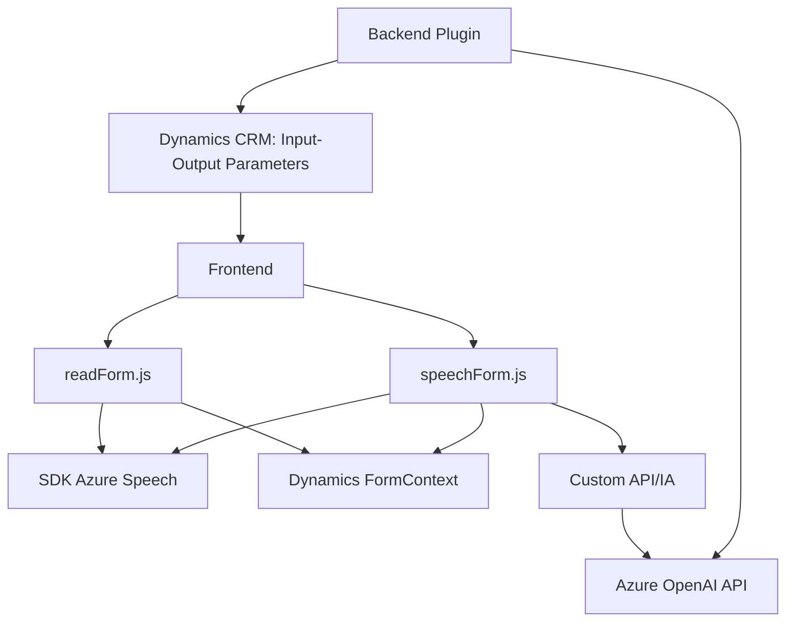

### Breve Resumen Técnico

El repositorio descrito contiene implementaciones para formularios de Dynamics CRM integrados con servicios basados en Azure, específicamente Azure Speech SDK y Azure OpenAI. Estas funcionalidades se enfocan en la captura, procesamiento y presentación de datos mediante interacción por voz y transformación de texto. Existen archivos JavaScript diseñados para el frontend de la aplicación Dynamics CRM y un plugin backend implementado en C#.

### Descripción de Arquitectura

La solución utiliza una arquitectura híbrida basada en **n-capas** con principios de **Service-Oriented Architecture (SOA)**. Los componentes del sistema se dividen claramente en:

1. **Frontend JavaScript**: Se encarga de interactuar con los usuarios mediante formularios de Dynamics CRM, procesar datos en tiempo real y realizar llamadas asíncronas a servicios externos como APIs (Azure Speech SDK para procesamiento de voz y una API personalizada para manipulación basada en IA).
   
2. **Backend Plugin (C#)**: La implementación del plugin en Dynamics CRM actúa como un servicio centralizado que extrae, transforma y devuelve datos mediante integración con Azure OpenAI, siguiendo patrones de encapsulación y modularidad.

### Tecnologías Usadas

1. **Frontend (JavaScript)**:
   - **Azure Speech SDK**: Para reconocimiento y síntesis de voz.
   - **Microsoft Dynamics 365 APIs**: Para manipular formularios y entidades (contextos de ejecución `formContext` y `executionContext`).
   - **Callback pattern**: Para cargar de forma dinámica el Speech SDK y ejecutar procesos.
   - **Facade Pattern**: Centralización de las interacciones con SDKs externos.
   - **Asynchronous JavaScript (Promises)**: Para llamadas a APIs y procesos internos.

2. **Backend (C#)**:
   - **Microsoft.Xrm.Sdk**: Framework para desarrollar soluciones de Dynamics CRM.
   - **Azure OpenAI**: Procesamiento avanzado de texto con inteligencia artificial.
   - **HTTP Client Libraries**: Para realizar solicitudes HTTP a la API de Azure OpenAI.
   - **Newtonsoft.Json**: Para manipular datos JSON.
   - **Encapsulación**: Separación de lógica de transformación (`GetOpenAIResponse`) y ejecución (`Execute`).

### Dependencias

- **Externa**:
  - **Azure Speech SDK**: Dinámicamente cargado desde un endpoint oficial de Azure.
  - **Azure OpenAI**: Dependencia clave en el procesamiento del texto transformado (usada en el plugin C#).
  - **APIs de Dynamics CRM**: Integración directa con formulaciones (`formContext` y `executionContext`) y acceso a datos en entidades.

- **Interna**:
  - Manipulación de formularios y campos (`formContext`).
  - Mapas de datos entre formularios y entidades propias del entorno Dynamics.

---

### Diagrama Mermaid

---

### Conclusión Final

1. **Tipo de Solución**: La solución está compuesta por un **frontend** basado en JavaScript y un **backend** implementado como plugins sobre Dynamics CRM. Es una integración extendida que interactúa con servicios externos (Azure Speech SDK y Azure OpenAI).
   
2. **Tecnologías**: La solución utiliza tecnologías como Azure Speech SDK, Azure OpenAI API, Microsoft Dynamics APIs, y diferentes patrones de diseño como fachada, callback, y encapsulación.

3. **Arquitectura**: La arquitectura general sigue la estructura de **n-capas** con un enfoque claro hacia **Service-Oriented Architecture (SOA)** al integrar servicios de Azure como dependencias externas.

4. **Dependencias Externas**: Dos dependencias clave son el SDK de Azure Speech y la API de Azure OpenAI. También se utilizan las APIs internas de Dynamics CRM para manipular formularios y entidades.

Esta solución es sólida para integrar capacidades avanzadas de reconocimiento de voz y transformación de texto en formularios de Dynamics CRM, destacándose por su adaptabilidad y modularidad.