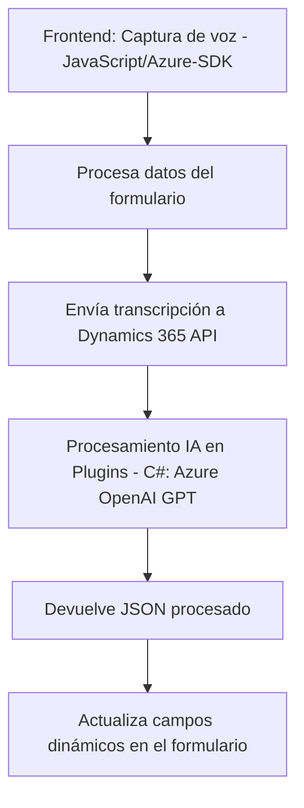

### Breve resumen técnico:
La solución presentada es un sistema extendido para integrar interacción por voz, procesamiento de formularios y transformación de datos mediante servicios de Azure, Dynamics 365 y OpenAI. Tiene componentes para frontend (JavaScript) que procesan voz y manipulan formularios, así como un backend basado en plugins que interactúan con Dynamics CRM y Azure OpenAI para transformar texto utilizando IA.

---

### Descripción de arquitectura:
1. **Multicapa (n capas)**: La solución tiene una separación clara entre capas:
   - **Frontend**: Procesamiento y entrada de formularios mediante voz.
   - **Backend**: Plugins para lógica empresarial en Dynamics CRM y llamadas a Azure OpenAI.
   - **Servicios externos**: Azure (Speech SDK, OpenAI) y Dynamics 365 API para procesamiento avanzado.
2. **Integración en la nube**: Conexión directa a servicios como Azure Speech SDK y Azure OpenAI para síntesis y procesamiento de datos.
3. **Modularidad**: Los archivos están organizados en funciones reutilizables que ejecutan tareas específicas como la generación de texto por voz o transformación de datos con IA.
4. **Composición Cliente/Servidor**: Comunicación entre cliente (frontend) para captura de voz y backend (plugins) para transformación de texto.

---

### Tecnologías usadas:
1. **Frontend**:
   - **JavaScript (Vanilla)**: Modular, orientado a funciones, para formulación de lógica en el navegador.
   - **Azure Speech SDK**: Reconocimiento y síntesis de voz.
   - **Dynamics 365 Web API**: Usada para manipulación de formularios y datos desde JavaScript.

2. **Backend**:
   - **C#/.NET**: Desarrollo de plugins con alta integración en Dynamics CRM.
   - **Azure OpenAI (GPT)**: Procesamiento de texto para transformar datos.
   - **JSON Manipulation**: Librerías como Newtonsoft.Json para trabajar con datos JSON.

3. **Patrones**:
   - Lazy Loading (Speech SDK).
   - Plugin Pattern (Dynamics CRM).
   - Modular Composition (JavaScript y C#).
   - Integration Pattern (API externas).

---

### Diagrama Mermaid:

---

### Conclusión final:
La solución combina un frontend basado en JavaScript y Azure Speech SDK con un backend extendido mediante plugins en Dynamics CRM que integran servicios de IA en la nube. La arquitectura multicapa garantiza escalabilidad y modularidad, permitiendo una interacción fluida entre voz, datos del sistema CRM y servicios avanzados de transformación textual en la nube. Es ideal para automatización empresarial en escenarios que requieran una experiencia de usuario asistida por voz y, simultáneamente, enriquecimiento dinámico de datos mediante IA basada en modelos como GPT.