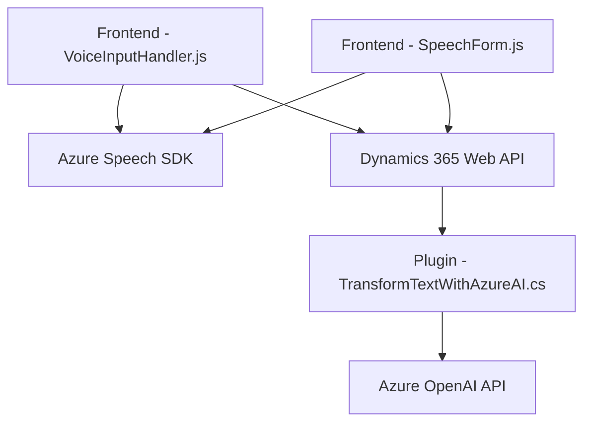

### Breve resumen técnico
El repositorio combina funciones en JavaScript y C# destinadas a la interacción dinámica de formularios dentro de un entorno Microsoft Dynamics 365, con integración avanzada de APIs externas como Azure Speech SDK y Azure OpenAI. Las funcionalidades incluyen síntesis de voz, reconocimiento de voz, procesamiento de datos de formularios, y transformación de texto mediante inteligencia artificial. La arquitectura muestra una integración modular y asincrónica con servicios distribuidos.

---

### Descripción de arquitectura
La solución utiliza una **arquitectura de capas distribuida** donde distintas partes cumplen roles específicos:
1. **Frontend basado en JavaScript**: Maneja lógica del cliente para síntesis de voz y reconocimiento mediante el SDK de Azure.
2. **Backend (Dynamics 365 Plugins)**: Ejecuta plugins específicos que integran AI y APIs externas para procesamiento de datos enviados por el frontend.
3. **Servicios externos**: Integra componentes distribuidos como Azure Speech SDK y Azure OpenAI.

Aunque presenta separación de capas, la arquitectura sigue el enfoque tradicional de capas con integración directa a servicios externos. Algunos patrones asociados son:
- **Modularización funcional**: Separación de responsabilidades por función/clase.
- **Cargador dinámico de dependencias**: La carga del SDK de Azure usa el patrón de lazy-loading.
- **Integración API-first**: Llamadas extensivas a APIs como Dynamics 365 y Azure OpenAI.

---

### Tecnologías usadas
1. **JavaScript**:
   - Azure Speech SDK.
   - Módulos para interacción con formularios Dynamics.
2. **C#**:
   - Construcción de plugins Dynamics 365.
   - Manejo de reglas IA con Azure OpenAI utilizando `HttpClient` y JSON libraries (`System.Text.Json`, `Newtonsoft.Json.Linq`).
3. **APIs externas**:
   - **Azure Speech SDK**: Para síntesis y reconocimiento de voz.
   - **Azure OpenAI**: Para transformación avanzada de texto utilizando AI.
   - **Dynamics 365 Web API**: Para acceso y manipulación de formularios y entidades.

---

### Diagrama Mermaid válido para GitHub

---

### Conclusión final
El repositorio implementa una solución distribuida con un enfoque híbrido entre una **arquitectura multicapa** y la interacción con servicios externos en la nube. Utiliza patrones de diseño centrados en modularidad y procesamiento asincrónico, lo que facilita la escalabilidad y reutilización. A nivel tecnológico, la elección de Azure Speech SDK y Azure OpenAI permite ofrecer funcionalidades avanzadas en el entorno Dynamics 365, como entrada/síntesis de voz y transformación de texto con inteligencia artificial. La integración directa con Dynamics 365 plantea la necesidad de trabajar dentro de un ecosistema altamente especializado.