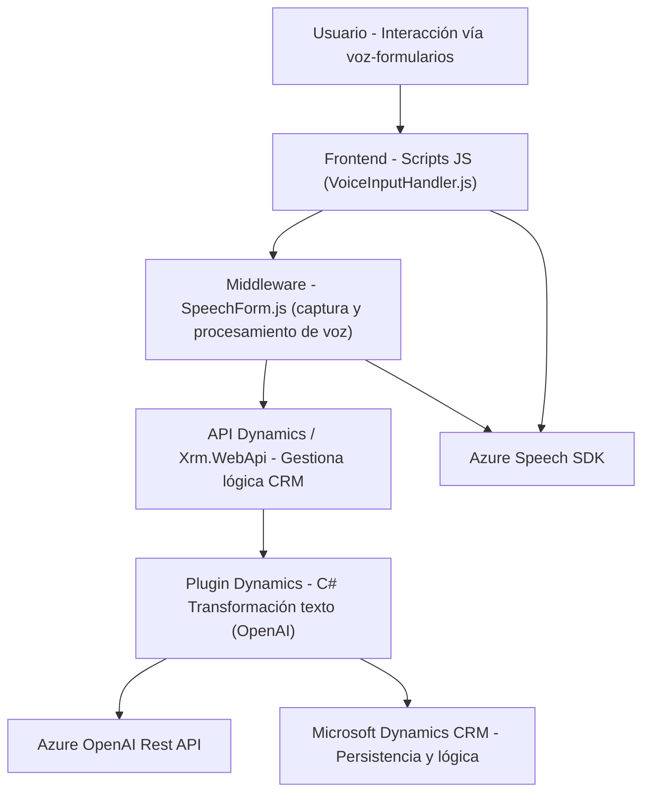

### **Breve resumen técnico**
El repositorio implementa servicios de interacción con formularios y usuarios en entornos como **Microsoft Dynamics CRM**, integrando funcionalidades avanzadas de voz y texto. Utiliza tecnologías como el **Azure Speech SDK** para síntesis y reconocimiento de voz, y el servicio **Azure OpenAI** para procesamiento de texto avanzado. La solución está formada por tres componentes principales: uno orientado a **frontend**, otro a la **gestión de voz** como middleware, y un **plugin** que ejecuta lógica avanzada en Dynamics CRM.

---

### **Descripción de arquitectura**
La solución utiliza una arquitectura híbrida y modular:
1. **Frontend modular**: Scripts en JavaScript interactúan directamente con formularios visibles, realizan procesamiento en cliente, y cargan dinámicamente dependencias (ej. **Azure Speech SDK**).
2. **Middleware de voz**: Funciones en JavaScript actúan como un middleware entre los datos del usuario (vía entrada de voz) y el backend de Dynamics CRM, con integración a APIs personalizadas.
3. **Backend extensible**: Implementa un plugin basado en **C# y Dynamics SDK** que ejecuta lógica avanzada de procesamiento de texto en conexión con **Azure OpenAI API** mediante HTTP.

El diseño promueve una arquitectura de **n-capas**:
- **Capa de presentación**: Scripts de frontend interactúan con formularios.
- **Capa de negocio**: Funciones de middleware procesan datos, mapean valores y trabajan con servicios externos como el SDK de Azure Speech.
- **Capa de datos**: Plugin en C# usa Dynamics CRM para persistir y gestionar la lógica mediante **IPlugin**.

Podría alinearse parcialmente con principios **hexagonales** al usar adaptadores de servicios (ej. SDK dinámico y API HTTP). Sin embargo, muestra características más cercanas a **n-capas** debido a su división por responsabilidades relacionada al entorno de CRM.

---

### **Tecnologías usadas**
1. **Frontend**:
   - **HTML5 + JavaScript**: Para manipulación de formularios interactivos.
   - **Azure Speech SDK**: Para procesamiento de voz (reconocimiento y síntesis).
   - **Xrm.WebApi**: Interacción directa con APIs de Dynamics CRM.

2. **Backend**:
   - **Microsoft Dynamics CRM SDK**: Extensión del sistema CRM basada en **IPlugin**.
   - **Azure OpenAI API**: Utilizada en el plugin para transformar texto.
   - **C# (.NET SDK)**: Lenguaje para el plugin.
   - **HTTP + JSON**: Comunicación con Azure mediante REST.

3. **Patrones de diseño**:
   - **Carga dinámica**: para SDK del Speech en frontend.
   - **Interactor Pattern**: Funciones de middleware que gestionan entrada/salida entre usuario y backend.
   - **DTO (Data Transfer Object)**: Datos JSON estructurados para comunicación entre CRM y OpenAI.

---

### **Diagrama Mermaid**
Aquí tienes un diagrama **Mermaid** que representa la solución describiendo los principales componentes:

---

### **Conclusión final**
Esta solución representa una integración avanzada que conecta un **frontend modular**, middleware de interacción con voz, y un **plugin backend** que extiende las funciones de Microsoft Dynamics CRM. El diseño facilita la conexión entre herramientas cloud como el **Azure Speech SDK** y servicios avanzados de **Azure OpenAI**. Aunque se ubica principalmente en una arquitectura **n-capas**, se muestran señales de principios **hexagonales** en el uso de adaptadores externos (APIs y SDKs). Las áreas claves a mejorar incluyen la gestión segura de las claves y parámetros de configuración de servicios externos.

La división en tres componentes principales logra un enfoque modular, lo que simplifica el mantenimiento y amplía posibilidades de extensión futura en entornos de CRM empresariales.