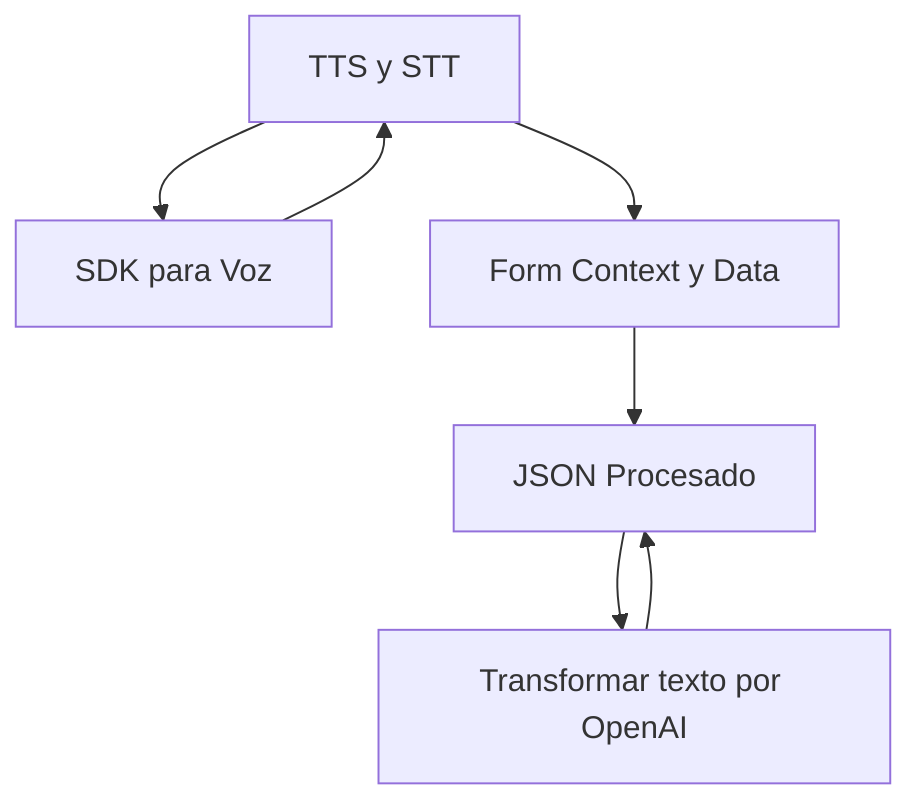

### Análisis Comprensivo del Repositorio

#### Breve Resumen Técnico
El repositorio contiene componentes de software interrelacionados en el dominio de procesamiento de voz y texto, integrados dentro de un entorno de CRM (Dynamics 365). Incluye dos scripts de frontend (para interacción con Azure Speech SDK y procesamiento de formularios) y un plugin backend (.NET/C#) que utiliza servicios de Azure OpenAI para transformación avanzada de textos.

---

#### Descripción de Arquitectura
La arquitectura subyacente es de *microservicios* integrada con *servicios cloud* (Azure Speech y OpenAI). Se estructura alrededor de acciones específicas: procesamiento de voz, interacción con formularios dinámicos en Dynamics 365, y delegación de tareas avanzadas a servicios externos de Azure. Aunque los módulos tienen alta cohesión en sus tareas específicas, dependen sustancialmente de SDKs y APIs.

---

#### Tecnologías Usadas
1. **Frontend**:
   - **Lenguaje**: JavaScript.
   - **Frameworks y SDKs**: Azure Speech SDK.
   - **Entorno**: Dynamics 365 (interacción directa con formularios).
   - **Patrones**:
     - Modularidad en funciones.
     - Callbacks para carga dinámica del SDK.
     - Integración directa con APIs y eventos de interacción del formulario.

2. **Backend**:
   - **Lenguaje**: C#.
   - **Frameworks y SDKs**:
     - Dynamics CRM SDK (`Microsoft.Xrm.Sdk`).
     - Azure OpenAI API (via `System.Net.Http`).
     - Serialización con `Newtonsoft.Json.Linq`.
   - **Patrones**:
     - *Plugin architecture* para extender funcionalidades en Dynamics CRM.
     - Delegación de tareas a microservicios a través de APIs.

---

#### Dependencias o Componentes Externos
1. **Azure Cloud Services**:
   - Azure Speech SDK (procesamiento de voz).
   - Azure OpenAI Service (GPT-4o) para transformación avanzada de texto.
   - Azure Resource Management para autenticación y configuración.
   
2. **Dynamics CRM API**:
   - `Xrm.WebApi.online.execute()` para integración dinámica y manipulación de formularios.

3. **Bibliotecas de Serialización**:
   - `Newtonsoft.Json` y `System.Text.Json`.

---

#### Diagrama Mermaid

A continuación, el diagrama muestra la interacción entre los componentes principales del sistema:

---

#### Conclusión Final
El repositorio implementa una solución moderna y altamente extensible para procesamiento avanzado de voz y texto, integrada en Dynamics 365. Está estructurada como una arquitectura de microservicios donde los scripts del frontend interactúan con Azure Speech SDK para procesamiento de voz en tiempo real, mientras el backend delega tareas más complejas, como transformación de texto, a servicios como Azure OpenAI. La solución sigue prácticas sólidas de modularidad y uso de patrones estándar, pero se basa considerablemente en dependencias externas que forman el núcleo de su operación.