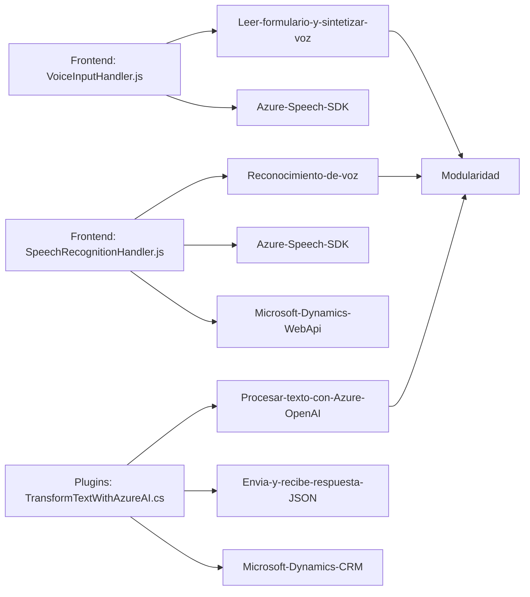

### Breve resumen técnico
El repositorio implementa una solución destinada a interactuar con sistemas CRM, como Microsoft Dynamics, aprovechando servicios cognitivos de Azure (Speech SDK y Azure OpenAI API). La solución está organizada en:
- **Frontend**: Archivos JavaScript encargados de la interacción con formularios del CRM, lectura y síntesis de voz, y mapeo de datos para su procesamiento.
- **Backend/Plugins**: C# plugin que utiliza Azure OpenAI para transformar textos y procesar respuestas JSON dentro del entorno CRM.

---

### Descripción de arquitectura
La arquitectura de la solución es **modular, basada en N-capas dentro de una estructura híbrida**:
1. **Presentación**: Los archivos del frontend en JavaScript gestionan la interfaz de los formularios, lectura de voz y manipulación de datos del usuario.
2. **Lógica de negocio**: El código del plugin en C# centraliza la lógica avanzada, como la transformación y procesamiento de datos utilizando servicios como Azure OpenAI.
3. **Integración con servicios externos**: Se emplean SDKs de Microsoft, como Speech SDK y XRM WebApi, además de llamadas API al servicio Azure OpenAI para procesamiento cognitivo.

---

### Tecnologías utilizadas
1. **Frontend**:
   - **Azure Speech SDK**: Para síntesis de voz y reconocimiento de voz.
   - **JavaScript DOM API**: Para manipulación de elementos HTML dinámicamente.
   - **Promise y Asincronismo**: Lógica basada en eventos y manejo de datos con programación asíncrona.

2. **Backend (Plugins)**:
   - **Microsoft Dynamics CRM SDK (Xrm.Sdk)**: Para extender capacidades del entorno CRM.
   - **Azure OpenAI API**: Integra procesamiento cognitivo del lenguaje natural.
   - **HTTP Client & Serialización JSON**: Interacción con APIs y tratamiento de datos estructurados.

3. **Patrones**:
   - **Gateway**: Simplifica el acceso a servicios externos.
   - **Command pattern**: Encapsula acciones específicas (e.g., transformación de texto).
   - **Plugin pattern**: Personalización de Microsoft Dynamics CRM.

---

### Tecnología y dependencias externas
1. **Azure Speech SDK**: Para voz interactiva (frontend).
2. **Azure OpenAI API**: Procesamiento NLP (backend).
3. **Dynamics CRM API**:
   - Interacción con formularios y manejo de datos directamente desde CRM.
4. **JSON Serialización**: Tanto para integraciones del backend como en el procesamiento en frontend.
5. **DOM en JavaScript**: Manipulación en tiempo de ejecución para cargar scripts o manejar eventos.

---

### Diagrama Mermaid válido para GitHub

---

### Conclusión final
La solución implementa una arquitectura modular basada en capas, con una integración sólida de servicios cognitivos como Azure Speech SDK para síntesis de voz en el frontend y Azure OpenAI API para procesamiento NLP en el backend. Es ideal para personalizar entornos CRM como Microsoft Dynamics, proporcionando capacidades avanzadas de interacción por voz y análisis de datos. La estructura se beneficia de patrones como Plugin y Gateway para mantener un diseño desacoplado y flexible.