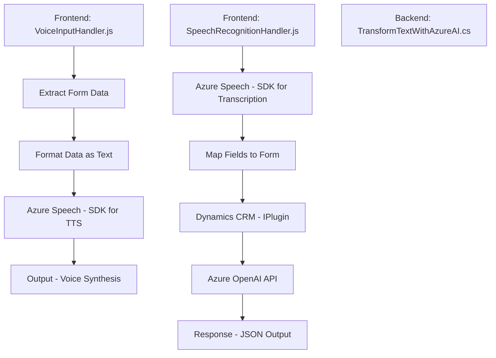

## Análisis técnico basado en los archivos proporcionados

### Breve resumen técnico
El repositorio está compuesto por archivos orientados al frontend (interacción de voz, procesamiento de formularios), además de un plugin en backend enfocado en Dynamics CRM. Utiliza tecnologías como Azure Speech SDK y Azure OpenAI API para reconocimiento de voz, síntesis de texto y transformación avanzada de datos.

---

### Descripción de arquitectura
La solución muestra una arquitectura híbrida:
1. **Cliente (frontend)**:
   - Incluye código JavaScript que interactúa directamente con formularios de Dynamics CRM mediante el contexto del formulario y servicios web.
   - Modularidad definida mediante funciones específicas como extracción de datos (input), transformación (procesamiento del texto) y mapeo (asignación de datos al formulario).
   
2. **Backend (plugin)**:
   - Implementa una extensión basada en la interfaz `IPlugin` para Dynamics CRM.
   - Ejecuta llamadas a la **Azure OpenAI API**, procesando y transformando el input textual directamente en el servidor.

3. **Comunicación**:
   - Dependencias externas:
     - Azure Speech SDK para transcripción y síntesis de texto.
     - Azure OpenAI API para transformación.
   - Interacción con Microsoft Dynamics CRM para formularios y datos.

Se observa una arquitectura **n-capas**, donde el backend sirve como capa de lógica empresarial y procesamiento avanzado, mientras que el frontend gestiona la interacción de datos.

---

### Tecnologías usadas
1. **Frontend:**
   - **JavaScript**: Lenguaje principal para la manipulación de formularios y comunicación con APIs.
   - **Azure Speech SDK**: Llamadas para habilitar transcripción, síntesis de voz y entrada de voz.
   - **Dynamics 365 Web API**: Gestión de datos y servicios relacionados con los formularios.

2. **Backend:**
   - **Microsoft Dynamics CRM SDK**: Librerías para la ampliación mediante plugins.
   - **Azure OpenAI API**: Para transformar texto según reglas específicas.
   - **Newtonsoft.Json**, `System.Text.Json`: Manejo y generación de JSON.
   - `HttpClient`: Para comunicación con servicios web y APIs externas.

3. **Patrones:** 
   - Modularidad basada en propósito (frontend y backend).
   - Uso eficiente de servicios externos (Azure Speech y Azure OpenAI).
   - Validación dinámica: La lógica carga elementos externos solo si son necesarios, reduciendo el impacto en la ejecución.

---

### Diagrama Mermaid válido para GitHub Markdown

---

### Conclusión final
La solución presentada combina una interfaz frontend para interacción con los usuarios y un plugin backend que provee funcionalidad avanzada utilizando servicios cloud de Microsoft Azure (Speech SDK y OpenAI). La arquitectura basada en capas permite agregar extensiones en frontend y backend sin afectar las responsabilidades de cada módulo. El diseño refleja un claro enfoque en la modularidad y la integración óptima con servicios externos, asegurando relevancia para aplicaciones empresariales como Dynamics CRM.