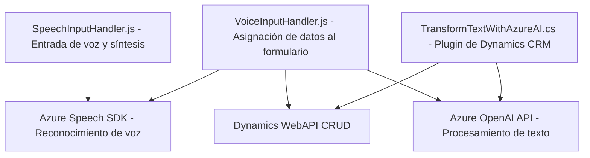

### Breve resumen técnico

La solución analizada consta de varios archivos con diferentes responsabilidades y módulos que juntos crean una integración entre servicios de entrada por voz (con el SDK de Speech de Azure), transformación de texto con herramientas IA (Azure OpenAI API) y sistemas CRM como Microsoft Dynamics 365. Los archivos muestran una implementación específica basada en tecnologías modernas (Azure SDKs y Dynamics 365) orientada a los flujos de interacción con usuarios en aplicaciones empresariales.

---

### Descripción de arquitectura

La arquitectura general parece seguir el estilo de **Service-Oriented Architecture (SOA)**. Cada componente o módulo implementa una funcionalidad específica, como entrada de voz, síntesis de texto y comunicación con APIs externas para el reconocimiento de voz y procesamiento IA. El sistema puede ser considerado como una integración entre servicios externos y una plataforma CRM (Dynamics 365).

Además, los archivos para manejo de voz y formularios en el frontend utilizan patrones comunes de diseño como **Event-driven Architecture**, **External API Integration**, y **Helper/Facade**, mientras que el plugin para Dynamics CRM sigue el **Plugin Pattern** y utiliza el **Service Gateway Pattern** para interactuar directamente con la API externa.

Aunque los diversos módulos trabajan coordinadamente, la arquitectura en general puede ser descrita como una mezcla entre un **monolito empresarial** y **microservicios**, debido a la estrecha integración con servicios externos como Azure Speech y Azure OpenAI.

---

### Tecnologías usadas

1. **Frontend (JavaScript)**:  
   - **Main Technology**: JavaScript.
   - **External APIs**:
     - **Azure Speech SDK** (para reconocimiento de voz y síntesis de texto).
   - **Framework/Platform**: Dynamics 365.
   - **Other Dependencies**:
     - `WebAPI` de Dynamics 365 para operaciones CRUD.

2. **Backend (C# Plugin)**:
   - **Main Technology**: C#.
   - **External APIs**:
     - **Azure OpenAI API** (para transformación de texto).
   - **Framework**: Microsoft Dynamics CRM SDK.
   - **Other Dependencies**:
     - `Newtonsoft.Json`, `HttpClient`.

---

### Diagrama Mermaid válido para GitHub

---

### Conclusión final

La solución combina servicios inteligentes (Azure Speech SDK para reconocimiento de voz y OpenAI API para procesamiento de texto) con un sistema CRM empresarial (Dynamics 365). Sigue una arquitectura **Service-Oriented Architecture (SOA)** con integración de APIs externas y patrones específicos como **Plugin Pattern** y **Event-driven architecture** en los módulos frontend y backend.

Fortalezas:
- Uso de servicios de Azure permite capacidades avanzadas como IA y reconocimiento de voz.
- La arquitectura descompuesta permite modularidad y facilidad de mantenimiento en cada capa.

Oportunidades de mejora:
- Encapsular las llamadas HTTP en clases reutilizables para facilitar pruebas unitarias y desacoplar la lógica de negocio del cliente HTTP.
- Centralizar la definición de reglas (normas) en un repositorio externo o variable configurable para facilitar ajustes dinámicos sin alterar el código.
