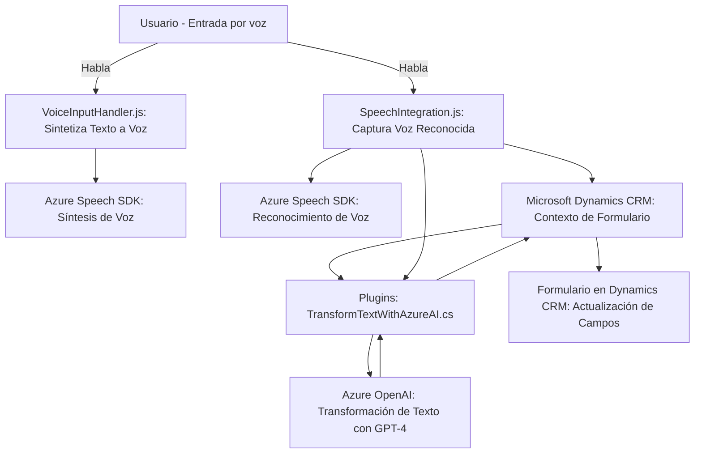

### Breve resumen técnico:

El repositorio contiene implementaciones que integran Microsoft Dynamics CRM con **Azure Speech SDK** y **Azure OpenAI**, utilizando JavaScript y C# como lenguajes principales. Las soluciones desarrollan capacidades de entrada por voz, reconocimiento de texto hablado, síntesis de texto en voz y transformación de texto mediante modelos de IA.  

Estas funcionalidades trabajan como módulos independientes relacionados:  
1. **Frontend:** Manejo de la comunicación y entradas por voz en formularios de Dynamics utilizando JavaScript.  
2. **Backend:** Plugin en C# que procesa texto mediante **Azure OpenAI API** para su transformación.  

---

### Descripción de arquitectura:

La solución utiliza una arquitectura de **n capas**, con una clara distinción de responsabilidades:  
- **Capa de presentación:** Archivos como `VoiceInputHandler.js` o `SpeechIntegration.js` actúan en los formularios del frontend de Dynamics, manejando la interacción directa del usuario.  
- **Capa de lógica de negocio:** El archivo `TransformTextWithAzureAI.cs` actúa como un plugin en Dynamics, procesando texto mediante llamadas a la API de Azure.  
- **Capa de integración/datos:** Utilización de dependencias de Azure Cognitive Services, Dynamics SDK, y API externas como **Azure OpenAI**.  

---

### Tecnologías usadas:
1. **Lenguajes de programación:**  
   - JavaScript para el frontend.  
   - C# para los plugins del backend.  
2. **SDKs y servicios externos:**  
   - **Azure Speech SDK:** Reconocimiento y síntesis de voz.  
   - **Azure OpenAI API:** Procesamiento avanzado de texto basado en IA.  
3. **Frameworks y plataformas:**  
   - **Microsoft Dynamics CRM SDK:** Manipulación de elementos del formulario y de datos en el sistema.  
   - **Newtonsoft.Json:** Procesamiento de JSON en el backend.  
4. **Patrones de diseño:**  
   - **Callback Pattern:** Gestión asíncrona en JavaScript.  
   - **Plugin Pattern:** Extensión de funcionalidad en Dynamics CRM.  
   - **Integración API externa.**

---

### Dependencias o componentes externos:
1. **Azure Speech SDK:** Cargado desde un CDN para reconocimiento y síntesis de voz.  
2. **Azure OpenAI API:** Utilizada por el backend para ejecutar transformaciones lingüísticas, por ejemplo, mediante la tecnología de GPT-4.  
3. **Dynamics CRM Web API:** Permite manipular formularios y campos en Dynamics como parte de las funcionalidades del frontend y backend.  
4. **External libraries:**  
   - **Newtonsoft.Json:** Para la gestión de objetos JSON.  
   - Posible dependencia de **HTTP client libraries** para realizar peticiones al servicio Azure OpenAI.

---

### Diagrama Mermaid:

---

### Conclusión final:

Esta solución es un sistema de integración de voz e inteligencia artificial en Microsoft Dynamics CRM. Utiliza una **arquitectura de n capas** por su organización estructural entre frontend, lógica de negocio y APIs externas. Las tecnologías empleadas incluyen herramientas líderes como **Azure Speech SDK** y **Azure OpenAI**, que combinan el reconocimiento y procesamiento de voz con capacidades avanzadas de IA.

El diseño es modular, reutilizable y fácilmente adaptable a otros escenarios que requieran integración entre plataformas externas (Azure IA) y entornos empresariales (Dynamics).