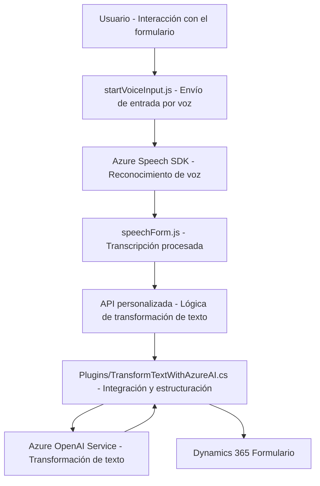

### Breve resumen técnico
La solución presentada implementa una combinación de integración entre Microsoft Dynamics 365, servicios de voz de Azure Speech SDK y capacidades de análisis de texto con Azure OpenAI. Está destinada a interactuar con formularios y transformar texto hablado en datos estructurados, aplicados automáticamente a los campos del sistema CRM. Incluye scripts frontend en JavaScript para gestionar dinámicamente datos de voz e interacción con formularios, junto con un backend en C# que extiende el sistema CRM usando plugins.

---

### Descripción de arquitectura
Este sistema utiliza una arquitectura **multicapa híbrida**:
1. **Capa de presentación**: Scripts JavaScript ejecutados en el navegador, que interactúan con formularios de Dynamics 365. Implementa entrada de datos por voz mediante Azure Speech SDK.
2. **Capa de negocio**: Plugins desarrollados en C#, que ejecutan lógica específica mediante integración con Azure OpenAI para transformar texto reconocido.
3. **Capa de persistencia y servicios externos**:
   - Integración con Azure Speech SDK para el reconocimiento y síntesis de voz, comunicándose con un servicio externo configurable mediante claves de acceso y regiones.
   - Integración con Azure OpenAI para estructuración de texto en JSON en el contexto del plugin `TransformTextWithAzureAI`.
4. **Modelo basado en eventos**: Tanto los scripts frontend como los plugins backend están diseñados para ejecutarse en respuesta a eventos específicos en el sistema Dynamics 365 (interacción con formularios o ejecución de eventos en servidores CRM).

---

### Tecnologías usadas
1. **Frontend**:
   - **JavaScript**: Implementación de scripts interactivos para gestión de formularios y voz.
   - **Azure Speech SDK (JavaScript)**: Usado para reconocimiento y síntesis de voz.
   - **Dynamics 365 Web API**: Integración directa con servicios del CRM, lectura/escritura de datos y ejecución de APIs.
2. **Backend**:
   - **Microsoft C#**: Implementación de lógica en plugins para el CRM.
   - **Microsoft.Xrm.Sdk**: SDK oficial para la interacción con Dynamics CRM.
   - **Azure OpenAI API**: Servicios REST para transformación de texto (usando `System.Net.Http` para las llamadas HTTP).
3. **Otros**:
   - **Newtonsoft.Json.Linq** y **System.Text.Json**: Manejo de objetos JSON para integrar con el servicio Azure OpenAI.
   - **Dependency Injection (DI)**: Usado en el contexto del plugin para acceder a servicios organizativos.

---

### Diagrama Mermaid válido para GitHub Markdown

---

### Conclusión final
La solución analizada implementa una arquitectura **híbrida de múltiples capas** que fusiona capacidades de servicios **backend** (Dynamics CRM), **frontend dinámicos** (JavaScript) e integración con APIs externas (Azure Speech SDK y Azure OpenAI). Los patrones de modularidad funcional, inicialización dinámica y uso de adaptadores permiten mantener un diseño flexible y reutilizable.

Este sistema es ideal para contextos empresariales que buscan automatizar la conversión de entrada de voz en datos estructurados dentro de formularios del CRM, mejorando la productividad y reduciendo errores manuales. La arquitectura puede escalar fácilmente, lo que permite la adición de servicios externos relacionados con inteligencia artificial y reconocimiento de voz en el futuro.