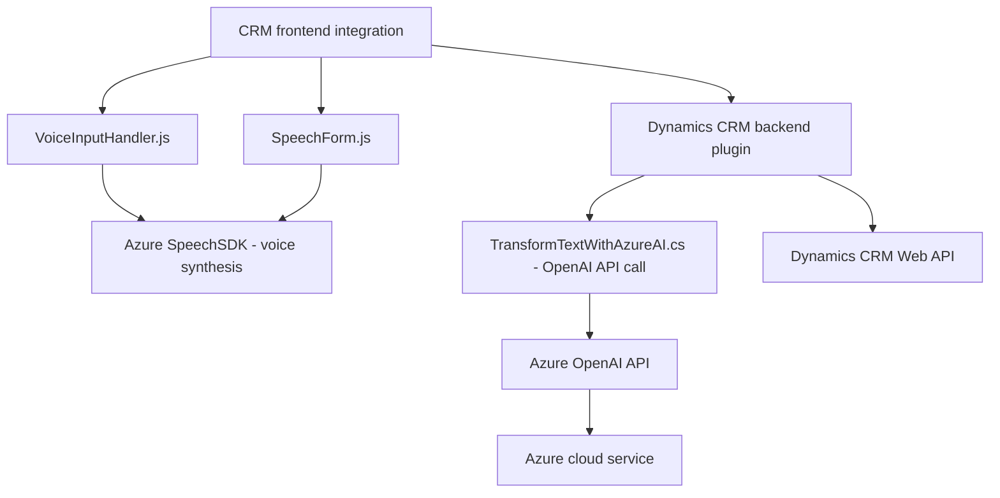

### Análisis técnico completo

#### 1. Resumen técnico
El repositorio parece contener una solución orientada principalmente al **procesamiento de formularios dinámicos de Dynamics CRM**, integrando servicios externos de reconocimiento y síntesis de voz mediante el **Azure Speech SDK** y capacidades avanzadas de inteligencia artificial usando la **API Azure OpenAI**. El objetivo principal es aumentar las capacidades interactivas y analíticas del sistema CRM, automatiando tareas relacionadas con captura y transformación de datos.

---

#### 2. Descripción de arquitectura
Este sistema tiene elementos de una arquitectura **n-capas**, enfocada en la separación de responsabilidades. Por ejemplo:
- La capa frontend: Maneja la integración de formularios del CRM con servicios de habla y voz (almacenada en la carpeta `FRONTEND/JS`).
- La capa backend: Representada por el plugin (`TransformTextWithAzureAI.cs`), que realiza interacciones con la API de Azure OpenAI y transforma datos.
- Un componente de comunicación con APIs externas (como el Azure Speech SDK y el servicio OpenAI) utiliza un patrón de integración API para manejar solicitudes dinámicas.

Notablemente, se emplea un patrón **gateway** en la capa de negocio del CRM para interactuar con servicios externos. Este diseño, aunque proporciona modularidad, se implementa como un **monolito extendido**, ya que no hay evidencia directa de partición en microservicios a nivel de diseño global.

---

#### 3. Tecnologías y patrones
##### Tecnologías:
1. **Frontend (JavaScript)**:
   - Azure Speech SDK: Para manejar reconocimiento y síntesis de voz (`https://aka.ms/csspeech/jsbrowserpackageraw`).
   - Dynamics CRM Form Context: Para interactuar con formularios dinámicos de CRM.

2. **Backend (.NET)**:
   - Microsoft Dynamics CRM SDK: Manejo de plugins y contexto organizacional.
   - Azure OpenAI (REST API): Uso de IA para transformar texto basado en normas específicas.

3. **Dependencias externas**:
   - Newtonsoft.Json: Procesamiento de JSON.
   - System.Net.Http: Integración con APIs vía HTTP.

##### Patrones arquitectónicos:
1. Modularidad: Separación lógica de funciones y responsabilidades entre extracción de datos, procesamiento textual y comunicación con servicios externos.
2. Gateway: Aislamiento de comunicación externa (OpenAI API y reconocimiento/síntesis de voz), con abstractización para la reutilización en contexto CRM.
3. Carga dinámica de dependencias: Uso de funciones como `ensureSpeechSDKLoaded()` muestra un manejo flexible de dependencias externas.
4. Event-driven programming: Reconocimiento de voz asíncrono que desencadena acciones basadas en eventos (p.ej., `recognizeOnceAsync()`).

---

#### 4. Dependencias o componentes externos
El diseño de la solución requiere los siguientes componentes externos:
1. **Azure Speech SDK**: Para manejo de reconocimiento de voz y síntesis de texto a audio.
2. **Azure OpenAI API**: Utilizada para procesar y transformar texto según normas específicas.
3. **Dynamics CRM SDK**:
   - Contexto de formulario (`executionContext`) para gestion de datos visibles en formularios CRM.
4. **Xrm.WebApi**: Para la comunicación con APIs externas y CRUD de las entidades del sistema CRM.
5. **Newtonsoft.Json** y **System.Text.Json**: Librerías para manejo de datos JSON.
6. **System.Net.Http**: Para solicitudes HTTP hacia servicios externos.

---

#### 5. Diagrama Mermaid

---

### Conclusión final
La solución es un **CRM extension** modularmente diseñada bajo el enfoque de **n-capas arquitectónicas**, orientada al reconocimiento y síntesis de voz en integración con los formularios de Dynamics CRM. Además, incluye una capa de conectividad a APIs externas (Azure OpenAI), mostrando capacidades avanzadas de procesamiento IA para interacción humana.

El diseño emplea buenas prácticas como la modularidad, el aislamiento de dependencias externas, y la carga dinámica de SDKs contribuyendo a la flexibilidad y mantenibilidad del código. Sin embargo, la solución podría beneficiar de un enfoque más explícito a microservicios o hexagonal para mejorar la distribución de responsabilidades y robustez en escenarios de escala.