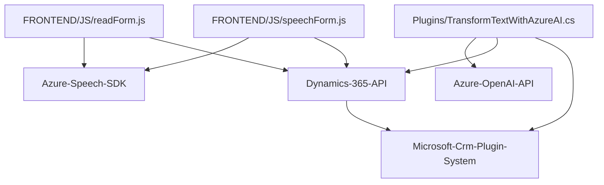

### Breve resumen técnico
La solución presentada es un proyecto que integra una funcionalidad de reconocimiento de voz y sintetización de texto a voz, implementada para plataformas de Dynamics 365. Utiliza servicios y SDK proporcionados por Azure, específicamente Azure Speech SDK y Azure OpenAI, para procesar formularios con entrada de voz en Dynamics CRM.

---

### Descripción de arquitectura
La arquitectura de este proyecto está basada en un enfoque modular con una combinación de patrones de programación, como orientación a servicios y desacoplamiento lógico entre módulos. El proyecto se extiende en tres partes:

1. **Frontend**:
   - Implementado en JavaScript para interactuar con formularios de Dynamics 365.
   - Utiliza el navegador para acceder al SDK de Azure Speech y la API de Dynamics para la manipulación de datos y formularios.
   - Utiliza patrones como invocación dinámica, servicio y mapeo de datos.

2. **Backend plugins**:
   - El archivo `TransformTextWithAzureAI.cs` es un plugin que extiende la funcionalidad de Dynamics CRM, transformando texto en JSON utilizando servicios de Azure OpenAI.
   - Aprovecha patrones comunes de desarrollo de plugins, como el patrón Builder para construir solicitudes API y el patrón extensible de Dynamics CRM para ejecutar lógica personalizada.

3. **Azure Services**:
   - El proyecto aprovecha Azure Speech SDK para la transcripción de voz y la sintetización de texto, así como Azure OpenAI para análisis avanzado de texto basado en reglas y generación de JSON.

### Tecnologías y frameworks usados
1. **Azure Speech SDK**:
   - Realiza tareas relacionadas con sintetización de voz y transcripción de voz a texto.
2. **Azure OpenAI (API)**:
   - Utiliza inteligencia artificial para transformar texto en JSON según reglas predefinidas.
3. **Dynamics 365 SDK**:
   - Manipula contexto y datos de formularios de Dynamics CRM mediante `IPlugin` y APIs como `Xrm`.
4. **Librerías JSON**:
   - `Newtonsoft.Json` y `System.Text.Json` para parseo y manejo de objetos en formato JSON.
5. **JavaScript**:
   - Para la implementación del frontend, que interactúa dinámicamente con formularios y SDK navegadores.
6. **C# Plugin Architecture**:
   - Para la lógica del backend que se ejecuta en el servidor bajo los eventos del sistema Dynamics CRM.

### Qué tipo de arquitectura tiene
La arquitectura combina un enfoque de **N capas** (Frontend, Backend, y servicios externos) con elementos de **Extensibilidad** para Dynamics CRM. Puede considerarse una solución híbrida, utilizando:
1. **Desacoplamiento modular**: Backend y frontend están diseñados como componentes independientes que interactúan vía Dynamics API y Azure Cloud.
2. **Basado en eventos** (para los plugins en Dynamics CRM): Los plugins se ejecutan en respuesta a eventos internos.
3. **Capacidades distribuidas**: La integración con servicios externos (speech-to-text y AI API) refleja un enfoque cercano a microservicios.

### Dependencias o componentes externos
1. **Azure Speech SDK**: Para reconocimiento de voz y sintetización de texto.
2. **Azure OpenAI API**: Para transformar texto a formato JSON según las reglas de negocio configuradas.
3. **Dynamics 365 SDK**: Extensión específica para manipular datos y eventos en el contexto del CRM.
4. **JSON libraries (Newtonsoft.Json y System.Text.Json)**: Manejo de JSON para transformar objetos y datos estructurados.
5. **HTTP client libraries (System.Net.Http)**: Comunicación con servicios externos mediante APIs REST.

---

### Diagrama Mermaid 100% compatible con GitHub Markdown

---

### Conclusión final
La solución es una integración avanzada entre tecnologías web, servicios de inteligencia artificial, y plugins de Dynamics CRM, extendiendo la funcionalidad y experiencia del usuario de formularios con capacidades de reconocimiento de voz y síntesis de texto a voz. La arquitectura, siendo modular y basada en capas con servicios externos, facilita la escalabilidad y mantenimiento de la aplicación.

Aunque el diseño implementa estructuras y patrones eficientes, la seguridad del código requiere revisión adicional, en especial para manejar los secretos en la configuración de servicios Azure (como claves y regiones).