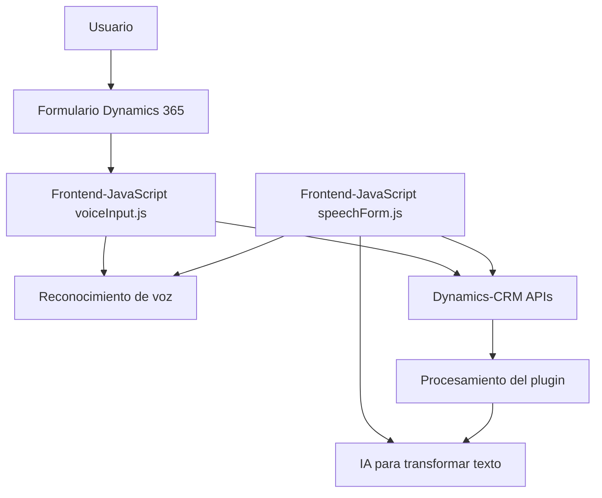

# Análisis técnico del repositorio

## Breve resumen técnico
El repositorio describe una solución que integra capacidades de reconocimiento de voz, síntesis de voz y procesamiento de texto mediante el uso de **Azure Speech SDK** y **Azure OpenAI**, orientada a Microsoft Dynamics 365. La solución cuenta con componentes en **JavaScript** para el frontend interactivo y un plugin en **C#** para manejar procesos especializados en el backend (Dynamics CRM).

---

## Descripción de arquitectura
La arquitectura de esta solución combina un enfoque de **arquitectura en capas** y **microservicios**. Estas son sus principales características:
1. **Capas**:
   - **Presentación/Frontend**: Implementada con JavaScript. Permite interactuar con los formularios en Dynamics 365, captura datos del usuario mediante voz y los convierte en texto para aplicaciones concretas.
   - **Lógica de Negocio/Backend**: Un plugin en C# actúa como mediador entre Dynamics CRM y el servicio de inteligencia artificial Azure OpenAI.
   - **Integración/Servicios Externos**: Se consumen dos APIs externas: **Azure Speech SDK** para síntesis y reconocimiento de voz, y una **API personalizada** en Dynamics 365 que corresponde a un servicio de procesamiento IA utilizando Azure OpenAI.

2. **Microservicios**:
   - La API personalizada de Dynamics CRM implementada en el plugin (`TransformTextWithAzureAI`) interactúa directamente con el servicio **Azure OpenAI**. Esto es un ejemplo de integración con microservicios para delegar el manejo de operaciones complejas.

3. **Patrones presentes**:
   - **Event-Driven**: La solución reacciona a eventos como la carga de un SDK y las interacciones del usuario.
   - **Modularización funcional**: Capacidad de distribuir las diferentes funciones relacionadas con la voz: entrada, captura, síntesis y aplicación de datos transcritos.
   - **Facade Pattern**: Proporciona interfaces amigables (capas de abstracción) para invocar funcionalidades de reconocimiento de voz y texto hacia servicios externos.

---

## Tecnologías usadas
### **Frontend (JavaScript)**:
- **Azure Speech SDK**: Permite realizar reconocimiento de voz y síntesis hablada de texto.
- **Dynamics 365 API (Xrm.WebApi.online)**: Para interactuar con datos de los formularios de Dynamics 365.
- **Vanilla JavaScript**: Sin aparente uso de frameworks más avanzados como React, Angular, etc.

### **Backend (C#)**:
- **Microsoft Dynamics CRM (IPlugin)**: Para la integración directa en el ecosistema de Dynamics CRM.
- **Azure OpenAI**: Para procesar texto mediante inteligencia artificial.
- **Newtonsoft.Json y System.Text.Json**: Para manejar datos JSON generados por el modelo de OpenAI.
- **HttpClient**: Para consumir el servicio externo de OpenAI.

### **APIs externas**
- **Azure Speech SDK**: Para reconocimiento y síntesis de voz.
- **Azure OpenAI**: Para transformar texto con algoritmos IA.
- **Dynamic 365 APIs**: Para mapeo de atributos, búsqueda de registros y gestión de formularios.

---

## Diagrama **Mermaid** válido para GitHub Markdown

---

## Conclusión final
La solución presentada es una mezcla de integraciones **n-capas** y servicios externos orientados a microservicios, especialmente en el backend. Combina tecnologías avanzadas como **Azure Speech SDK** y **Azure OpenAI** para crear una experiencia robusta de reconocimiento, síntesis y procesamiento de datos de voz, aprovechando la potencia de Dynamics 365 para la gestión de formularios.

Sin embargo, ciertas áreas requieren optimización:
- Fortalecer la seguridad, evitando la exposición de claves API directamente en los archivos de configuración o código.
- Agregar manejo de errores más detallado en interacciones REST (e.g., validación de respuestas de OpenAI, caídas de servicios, etc.).
- Vincular las funcionalidades de frontend y backend mediante endpoints más explícitos u organizar la solución en un enfoque más sólido centrado en la modularidad.

En general, esta solución muestra buenas prácticas de integración, la aplicación de patrones como **event-driven**, **facade** y **mapper**, además de aprovechar la capacidad de procesamiento de servidores externos en un ecosistema cloud-first.