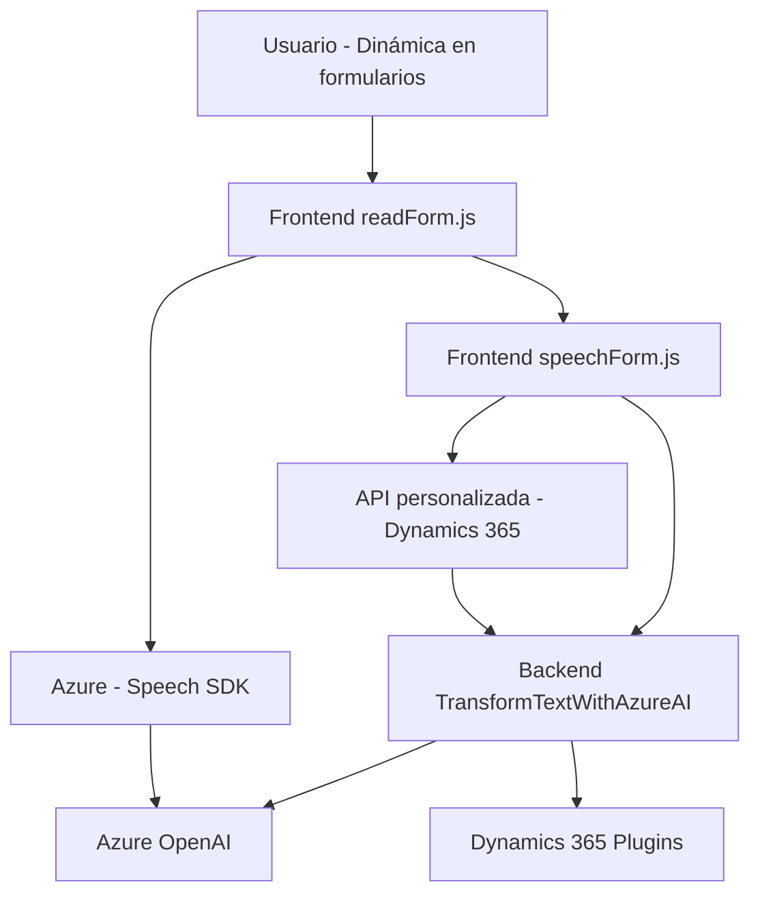

## Breve resumen técnico:
El repositorio contiene tres archivos distintos que se integran para resolver la interacción entre un CRM (Dynamics 365) y funcionalidades avanzadas de IA y reconocimiento de voz. La solución se centra en leer, procesar, y actualizar formularios utilizando input de datos visuales, voz y procesamiento IA, implementando integración con servicios externos como Azure Speech SDK y Azure OpenAI.

---

## Descripción de arquitectura:
La solución sigue un patrón **n capas**, donde cada componente tiene asignada una responsabilidad específica:
1. **Frontend**: Archivos JavaScript (`readForm.js`, `speechForm.js`) para interacción directa con usuarios mediante la capa de presentación (formulario del CRM) y servicios como Azure Speech SDK.
2. **Plugins backend**: Archivo `.cs` (`TransformTextWithAzureAI`) como lógica de negocios que actúa como un plugin del CRM para transformar texto de entrada gracias a Azure OpenAI.
3. **Integración externa**: Uso de APIs y SDKs como Azure Speech y Azure OpenAI forman la capa de integración.

Se presentan las siguientes características arquitectónicas:
- Modularidad: Todo el sistema está dividido en múltiples capas/fases que abstraen funcionalidad.
- Cliente-lógica-servidor: El frontend actúa como cliente directo interactuando con el SDK de Azure y se conecta indirectamente con funciones del backend.
- Desacoplamiento: Las responsabilidades de frontend y backend están separadas, donde el backend maneja procesamiento IA y JSON estructurado.

---

## Tecnologías usadas:
### Frontend:
- **JavaScript**: Para la interacción con formularios y servicios Azure Speech.
- **Azure Speech SDK**: Reconocimiento y síntesis de voz desde un SDK externo cargado dinámicamente.
- **Dynamics 365 APIs** (`Xrm.WebApi.online`): Integración directa con el CRM.

### Backend:
- **C#**: Lógica de negocio implementada como plugin de Dynamics 365.
- **Microsoft Dynamics CRM**: Framework y servicios para manejo de formularios.
- **Azure OpenAI**: Procesamiento de texto utilizando IA avanzada como GPT.

### Patrón destacado:
- **Microservicios** (Azure Speech y Azure OpenAI): Servicios externos para resolver tareas específicas de síntesis o reconocimiento de texto/voz.
- **Carga dinámica**: Carga condicional del SDK en JavaScript.

---

## Diagrama **Mermaid** compatible con GitHub Markdown:

---

### Conclusión final:
Este repositorio implementa una solución híbrida **frontend-backend** centrada en la interacción entre usuarios y un CRM (Dynamics 365), que utiliza múltiples SDKs y microservicios externos (Azure Speech y Azure OpenAI). La arquitectura sigue estructuración por capas y destaca por su modularidad y desacoplamiento. Es apta para entornos donde la interacción entre voz, formularios y sistemas IA son esenciales para automatizar tareas transaccionales y/o dinámicas.