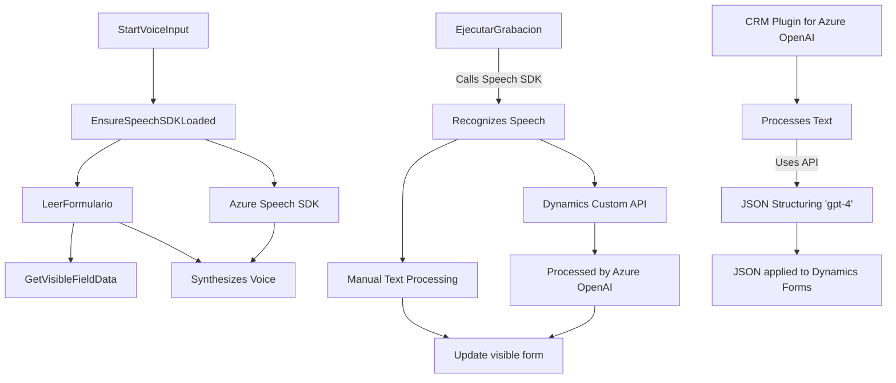

### Resumen técnico

Este repositorio contiene una solución híbrida orientada a la interacción y procesamiento de datos en formularios dinámicos, combinando reconocimiento de voz, síntesis de voz y transformaciones de texto en el contexto de aplicaciones CRM (Dynamics 365). Utiliza componentes **frontend (JavaScript)**, lógica de servicios en **plugins de Dynamics 365 (.NET/C#)** y APIs externas como **Azure Speech SDK** y **Azure OpenAI**.

---

### Descripción de arquitectura

La solución tiene una arquitectura distribuida basada en una combinación de tres capas principales:

1. **Frontend dinámico**:
   - Implementada con JavaScript (Visualización y lógica del cliente).
   - Manejo de datos del formulario con APIs de Dynamics 365.
   - Interacción con SDK dinámico para reconocimiento y síntesis de voz.

2. **Backend como Plugin Dynamics CRM**:
   - Implementado en C#.
   - Utilización de Azure OpenAI para transformar texto en JSON estructurado, como parte de una arquitectura **plugin-based** en Dynamics 365.

3. **Servicios API externos**:
   - Azure Speech SDK se carga dinámicamente para servicios de voz (reconocimiento y síntesis).
   - Comunicación directa con una "Custom API" de Dynamics 365 integrada con Azure OpenAI.

### Tecnologías utilizadas

1. **Tecnologías principales**:
   - **Frontend JavaScript**:
     - Azure Speech SDK para manipulación de voz y audio.
     - Interacciones dinámicas con el DOM y actualización de formularios.
     - Manejo dinámico de dependencias (SDK en tiempo de ejecución vía URL).
   - **Backend**:
     - Microsoft Dynamics CRM Plugin Framework.
     - Azure OpenAI API para procesamiento IA.

2. **Frameworks y librerías**:
   - `System.Net.Http`, `Newtonsoft.Json` en C#.
   - Dynamics 365 SDK (`Microsoft.Xrm.Sdk`, `Xrm.WebApi`).

3. **Patrones utilizados**:
   - Modularidad:
     - Divisiones claras de funcionalidad (`leerFormulario`, `processTranscriptIA`, etc.).
   - Plug-in Pattern:
     - Extensión del CRM con la funcionalidad como un plugin independiente.
   - Orientación a eventos:
     - Acciones basadas en controladores de reconocimiento de voz o entrada de texto.
   - Integración con servicios externos:
     - Dependencias dinámicas (Azure Speech y OpenAI).

---

### Diagrama **Mermaid** para GitHub Markdown

---

### Conclusión final

Este repositorio representa una solución integrada con enfoque en **procesamiento de voz** y **transformación de textos asistida por inteligencia artificial**, centrada en aplicaciones CRM sobre Dynamics 365. Su arquitectura combina modularidad en el frontend, plugin-based logic como backend y servicios Azure en una aproximación **Service-Oriented Architecture (SOA)**. El diseño busca maximizar la reutilización, adaptabilidad y escalabilidad frente a sistemas dependientes de datos dinámicos y funcionalidades modernas como el reconocimiento/entrada por voz e integración con IA.