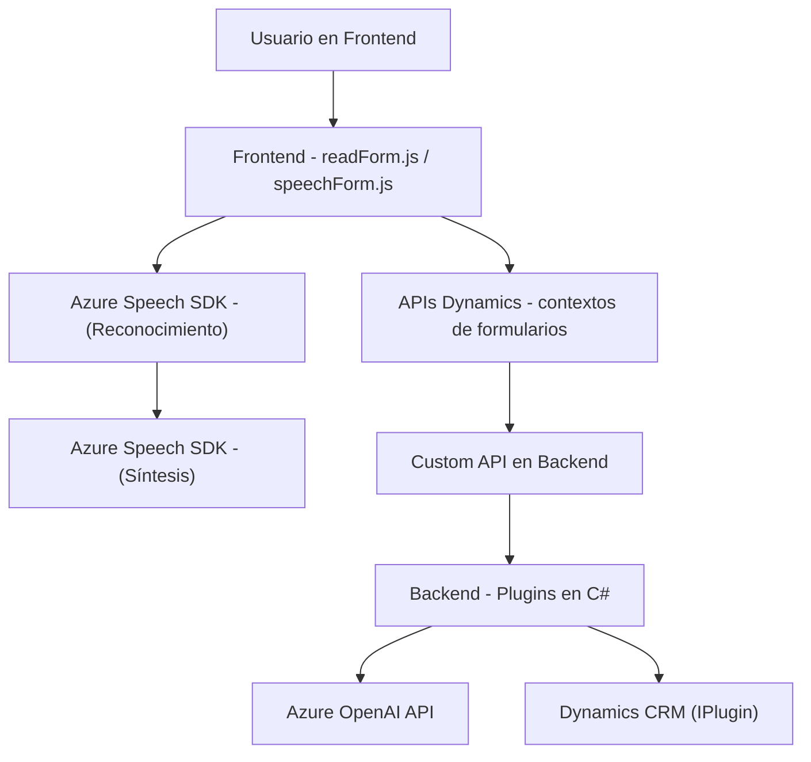

# Análisis Técnico y Arquitectónico del Repositorio

### Breve Resumen Técnico
El repositorio contiene tres módulos principales:
1. **Frontend**: Archivos JavaScript para interacción de usuarios mediante voz, integrados con formularios basados en Dynamics CRM.
2. **Backend (Plugins)**: Lógica complementaria en C#, utilizada para transformar texto mediante Azure OpenAI y procesar eventos en Dynamics CRM.
3. **Dependencias externas**: Uso de servicios y SDKs externos como Azure Speech SDK y Azure OpenAI.

### Descripción de Arquitectura
La solución sigue una arquitectura **modular** con separación de responsabilidades entre frontend y backend:
- **Frontend**: Implementa un cliente ligero de interacción con formularios. Utiliza el patrón **infraestructura ligera + comunicación API**, interactuando con Azure Speech SDK.
- **Backend**: Los plugins para Dynamics CRM usan un patrón **extensibilidad (IPlugin)** y delegan lógica avanzada hacia la API REST de Azure OpenAI.

De manera general, se observa una **arquitectura híbrida**:
- **Microservicios**: El backend delega transformaciones de texto y relación de datos hacia servicios externos como Azure OpenAI.
- **N capas**: En el frontend, la estructura se adapta bien al patrón "infraestructura de cliente + capa SDK".

### Tecnologías Usadas
1. **Frontend**:
   - **JavaScript**: Lógica para formularios y manejo del SDK de Azure Speech.
   - **Azure Speech SDK**: Conversión de texto a audio y reconocimiento de voz.
   - Comunicación con APIs de Dynamics CRM mediante `formContext`.

2. **Backend**:
   - **C#**: Lógica de plugins personalizada en Dynamics CRM.
   - **Azure OpenAI**: Transformación de texto mediante un modelo GPT.
   - **Newtonsoft.Json**: Manipulación de JSON.
   - **HttpClient**: Envío de solicitudes HTTP.

### Dependencias o Componentes Externos
1. **Azure Speech SDK**:
    - Conversión de texto a audio y transcripción de voz.
    - SDK cargado dinámicamente desde CDN.
2. **Azure OpenAI API**:
    - Transformación de texto utilizando GPT-4 o similares mediante peticiones REST.
3. **Dynamics CRM (Microsoft.Xrm.Sdk)**:
    - Extensión sobre el contexto del CRM para manejo de datos.
4. **Plugins/Frameworks**:
    - `Newtonsoft.Json` para serialización de datos JSON en C#.
    - `HttpClient` para comunicación REST con Azure OpenAI.

### Diagrama Mermaid
A continuación se presenta un diagrama que resume las interacciones de los componentes principales:

### Conclusión Final
La solución presenta una interacción bien definida entre cliente, servidor y servicios externos, con las siguientes características:
- **Frontend modular** y acoplado con SDKs de Azure para reconocimiento y síntesis de voz.
- **Backend desacoplado** que delega transformaciones avanzadas a servicios como Azure OpenAI mediante REST API.
- Uso de patrones adecuados para la extensibilidad, infraestructura ligera y módulos bien segmentados, aunque depende completamente de servicios externos para producción.

Es una arquitectura moderna que combina lo mejor de **microservicios** y **n capas** con una orientación basada en SDKs y APIs.