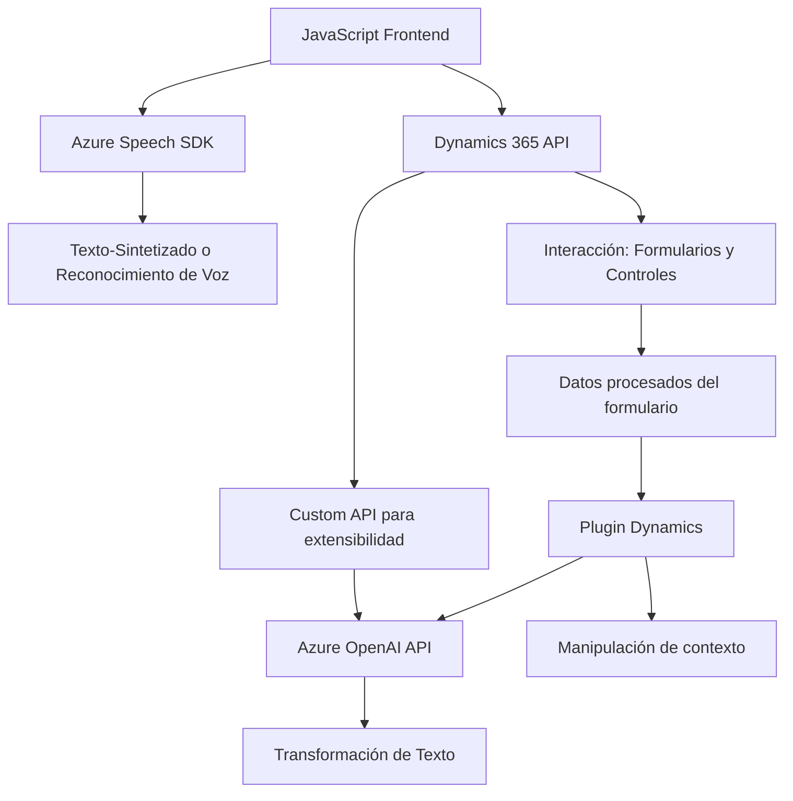

## Análisis del Repositorio

### **Breve Resumen Técnico**
Este repositorio parece ser parte de una solución diseñada para un entorno de **Microsoft Dynamics 365**, donde se combinan el procesamiento de voz y texto con inteligencia artificial, específicamente utilizando **Azure Speech SDK** y **Azure OpenAI**. Los archivos se centran en dos componentes principales: **Frontend interactivo basado en reconocimiento de voz y procesamiento de formularios**, y **Plugins backend para transformación y recuperación de datos mediante APIs externas**.

---

### **Descripción de Arquitectura**
La arquitectura sigue un enfoque **modular**, en donde los diferentes componentes están divididos en dos capas:
- **Capa de Presentación/Frontend**: Contiene scripts de JavaScript para funcionalidades de reconocimiento de voz y síntesis de texto, interactuando con formularios en el entorno Dynamics 365.
- **Capa de Aplicación o Backend**: Plugins diseñados para procesamiento avanzado de datos utilizando **Microsoft Dynamics SDK y Azure OpenAI**.

La estructura sugiere un patrón de arquitectura **orientado a servicios** debido a la integración de APIs externas (Azure Speech SDK y Azure OpenAI) y el enfoque explícito en desacoplar la lógica de negocio en diferentes funciones modulares.

### **Arquitectura Global Identificada**
1. **Frontend (Scripts en JavaScript)**:
   - Recibe la voz o entrada textual del usuario.
   - Interactúa con elementos dinámicos del formulario.
   - Llama servicios externos (Azure Speech SDK y posiblemente APIs personalizadas).

2. **Backend (Plugins en `.cs`)**:
   - A través de Microsoft Dynamics CRM, procesa datos ingresados (texto) mediante reglas específicas.
   - Utiliza Azure OpenAI para transformar datos en estructuras JSON semánticas.

Esto sugiere una **arquitectura de servicios distribuida**, donde los componentes frontend y backend interactúan mediante APIs como Azure o Dynamics Web API, y donde, posiblemente, tanto la comunicación como el despliegue están descentralizados.

---

### **Tecnologías, Frameworks y Patrones Utilizados**
#### **Tecnologías y Frameworks:**
- **Frontend**
  - JavaScript, ejecutado en el contexto del navegador (Dynamics 365).
  - Azure Speech SDK: Para sintetizar voz y traducir de texto a voz.
  - Manipulación del DOM para interactuar con formularios en tiempo real.
  
- **Backend**
  - **Microsoft Dynamics SDK (IPlugin interfaces)**: Estructura de extensibilidad basada en plugins.
  - **Azure OpenAI API**: Modelo GPT para la transformación de texto.
  - **HttpClient** (para llamadas REST hacia OpenAI).
  - **Newtonsoft.Json/Json.NET**: Para el manejo más eficiente de JSON.
  - **.NET Framework o .NET Core:** Base del plugin para Dynamics CRM.

#### **Patrones Arquitectónicos:**
1. **Plug-in Architecture**:
   - Debido a la integración en Dynamics 365.
   - Cumplimiento del principio de responsabilidad única (SRP) en métodos del backend.
   
2. **Service-Oriented Architecture (SOA)**:
   - Uso de servicios externos (Azure SDK, Azure OpenAI).
   - API personalizada como capa intermedia entre Dynamics 365 y otros servicios.

3. **Lazy Loading (Frontend)**:
   - Carga dinámica en tiempo real del **Azure Speech SDK** solo si es necesario.
   
4. **Context-Based Logic**:
   - Procesamiento en función del `executionContext` en Dynamics 365. Esto permite trabajar sobre formularios específicos.

5. **RESTful/HTTP Integration**:
   - En el backend, se hace uso de integración RESTful con Azure OpenAI API.

---

### **Dependencias Presentes**
1. **Azure Speech SDK**:
   - Carga dinámica del SDK desde su CDN (`https://aka.ms/csspeech/jsbrowserpackageraw`) en el frontend.
   - Utilización para reconocimiento de voz y síntesis de texto en el navegador.

2. **Microsoft Dynamics SDK (Xrm.WebApi y IPlugin)**:
   - En frontend y backend, para manipulación de formularios y datos específicos en Dynamics CRM.

3. **Azure OpenAI**:
   - Se integra para transformaciones con modelos GPT y genera respuestas estructuradas.

4. **Newtonsoft.Json o System.Text.Json**:
   - Serialización/deserialización de JSON en la capa del plugin.

5. **API Custom** (Dynamics 365):
   - Exposición de APIs personalizadas para extender la funcionalidad del CRM y conectar con servicios externos.

---

### **Mermaid Diagram**

---

### **Conclusión Final**
El repositorio presenta una solución **orientada a servicios** que combina reconocimiento de voz, síntesis de texto y transformación de datos en el contexto de **Microsoft Dynamics 365 y Azure**. La arquitectura es **modular**, desacoplada y basada en servicios externos (Azure Speech SDK y OpenAI). Esto permite un diseño escalable y flexible, ideal para entornos empresariales donde el procesamiento dinámico de datos y formularios es clave.

El diagrama refleja los componentes principales y sus conexiones destacadas. La solución está habilitada para soportar la automatización basada en voz, pero también para el uso de inteligencia artificial en la transformación de información.