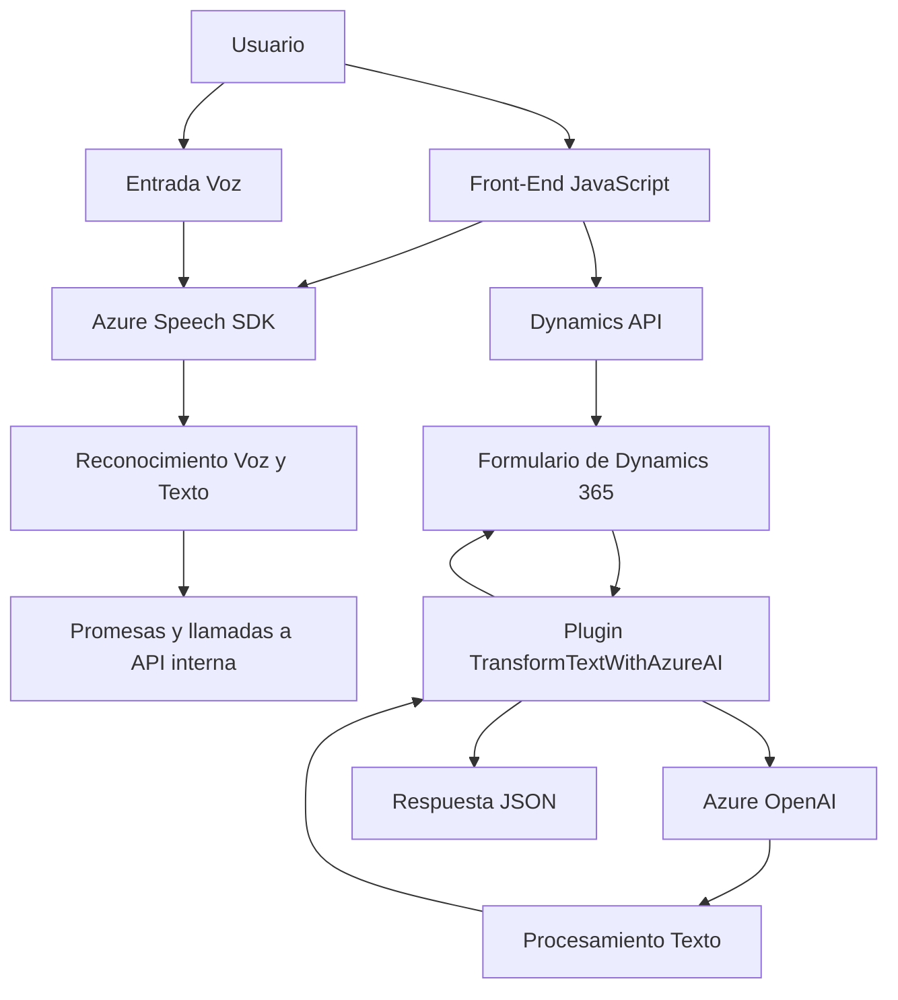

### Breve Resumen Técnico
Este repositorio contiene tres principales archivos: dos relacionados con la gestión de entrada y salida de voz bajo un enfoque front-end (utilizando Azure Speech SDK) y uno orientado a procesamiento de texto con un plugin desarrollado en C# para Dynamics 365 que interactúa con el servicio Azure OpenAI. La solución se centra en accesibilidad y automatización empresarial.

---

### Descripción de Arquitectura

1. **Tipo de Solución**:  
   - Es una solución híbrida que combina:
     - **Front-End**: Procesamiento de formularios y entrada/salida de voz en cliente.
     - **Back-End**: Plugins para Dynamics 365 y APIs externas como Azure OpenAI.

2. **Tipo de Arquitectura**:  
   - **Arquitectura distribuida basada en integración cliente-servidor**, donde los módulos del frontend interactúan directamente con servicios externos como Azure Speech SDK, mientras que el backend implementa un **plugin de Dynamics 365** que interactúa con otras API externas como Azure OpenAI.

3. **Patrones de Diseño Observados**:  
   - **Modularidad**: Separación de funciones independientes para manejo de dependencias y lógica tanto en el frontend como backend.
   - **Integración de Servicios Externos**: Uso del Azure Speech SDK y OpenAI mediante HTTP/REST.
   - **Asincronismo y Promesas**: En el front-end la lógica utiliza promesas para gestionar operaciones con servicios externos.
   - **Encapsulación** (Backend): Métodos en el plugin como `GetOpenAIResponse` encapsulan la lógica para interactuar con APIs externas.
   - **Event-Driven Architecture** (Dynamics Plugins): El archivo en C# sigue el diseño típico de Dynamics 365, que basa su ejecución en eventos dentro del contexto CRM.

---

### Tecnologías Usadas

1. **Frontend**:
   - **JavaScript**: Para la lógica de entrada/salida mediante voz y la interacción con formularios.
   - **Azure Speech SDK**: Reconocimiento y síntesis de voz.
   - **Dynamics 365 API**: Para la interacción con formularios y datos empresariales.

2. **Backend/Plugins**:
   - **C#**: Lenguaje principal del plugin de Dynamics 365.
   - **Azure OpenAI**: Procesamiento de texto bajo normas específicas.
   - **Dynamics 365 SDK**: Framework para la creación de plugins CRM.
   - **HTTP Client Libraries**: Para comunicación con APIs externas.

---

### Dependencias y Componentes Externos

1. **Front-End**:
   - Azure Speech SDK: Proporciona capacidades avanzadas de voz.
   - Dynamics CRM Forms API: Interactúa con formularios de Dynamics 365.
   - Custom API: Método opcional para datos procesados mediante IA.

2. **Back-End**:
   - Azure OpenAI: Servicio externo especializado en procesamiento de lenguaje natural.
   - Dynamics CRM SDK: Encapsula toda la funcionalidad en eventos y ejecución del plugin.
   - HTTP Requests: Maneja la conexión explícita con APIs externas.

---

### Diagrama Mermaid (100% compatible con GitHub Markdown)

---

### Conclusión Final

Este repositorio presenta una solución robusta orientada a mejorar la accesibilidad y automatización en ecosistemas empresariales como Dynamics 365. La combinación del Azure Speech SDK en el frontend y plugins en el backend para interacción con Azure OpenAI permite el procesamiento de voz a texto, gestión dinámica de formularios y transformación avanzada mediante IA.  
La arquitectura está bien estructurada para soportar modularidad, integración de servicios externos, adaptabilidad al cliente y escalabilidad en flujos empresariales sofisticados. Además, los patrones observados favorecen el mantenimiento y la extensibilidad en todas las capas de la solución.