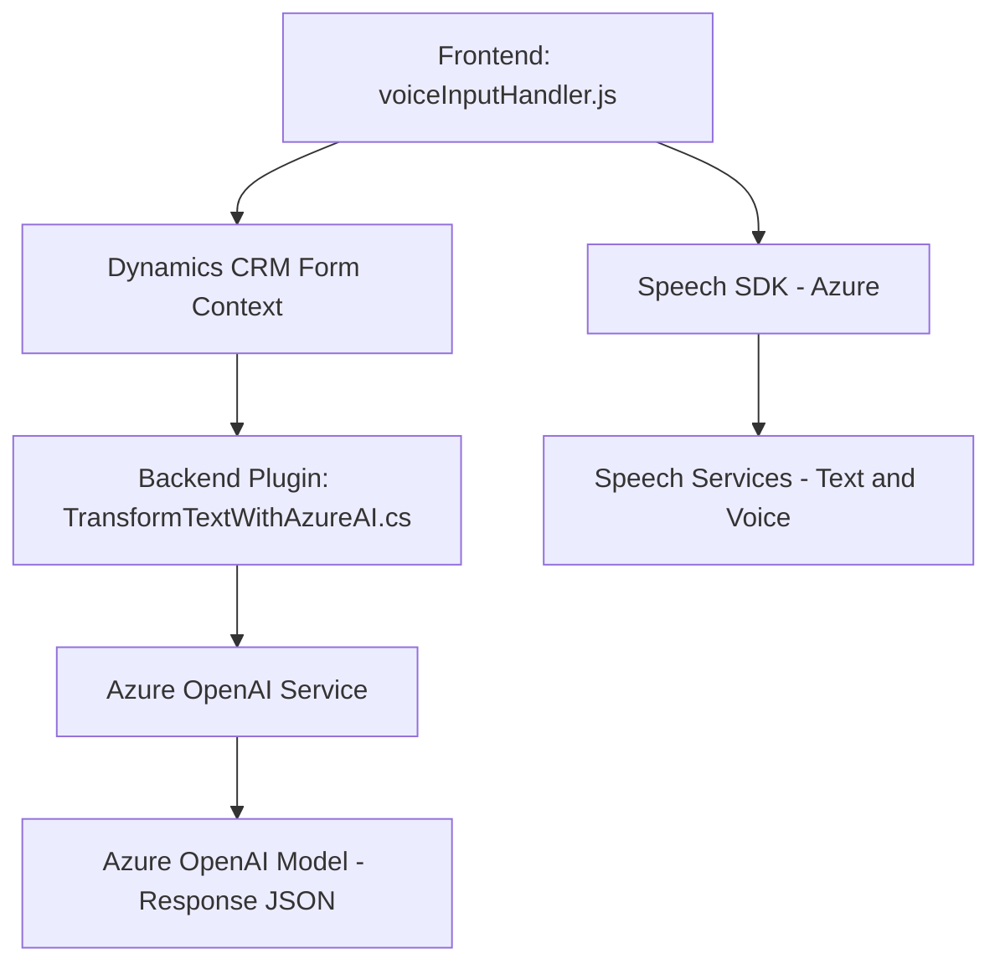

### Breve Resumen Técnico
El repositorio contiene una solución que integra funcionalidades de reconocimiento y síntesis de voz con inteligencia artificial en un entorno empresarial basado en Microsoft Dynamics CRM. Utiliza tecnologías de Azure para interactuar con datos de formularios dinámicos y ofrece extensiones mediante un plugin que utiliza Azure OpenAI para transformar texto según reglas específicas. Se implementa una solución híbrida que mezcla frontend para interacción de usuario, APIs externas de terceros y la plataforma CRM de Microsoft.

---

### Descripción de la Arquitectura
La arquitectura del sistema es una **n-capas** basada en la separación de frontend, lógica backend y servicios externos. Las capas identificadas son:
1. **Frontend (capas de presentación)**: Consiste en archivos JavaScript diseñados para interactuar con formularios dinámicos en Dynamics CRM. Implementan funcionalidades como generación de síntesis de voz y reconocimiento de voz para ingresar datos en los campos de los formularios de manera dinámica.
2. **Backend (capas de negocio)**: Se implementa mediante un plugin de Dynamics CRM (`TransformTextWithAzureAI.cs`) que extiende las capacidades del sistema mediante solicitudes HTTP a servicios de Azure OpenAI para procesamiento avanzado de datos.
3. **Servicios externos**: Integración con Azure Speech SDK y Azure OpenAI.

La arquitectura combina el enfoque de n-capas con la **service-oriented architecture (SOA)** al interactuar con servicios externos como Azure Speech SDK y Azure OpenAI, mientras se mantiene la lógica específica del negocio en el plugin y el frontend.

---

### Tecnologías Usadas
1. **Frontend**:
   - **JavaScript**:
     - Para implementar el reconocimiento y generación de texto a voz, y la interacción dinámica con formularios.
   - **Azure Speech SDK**:
     - Utilizado para la generación de síntesis de voz (text-to-speech) y transcripción de datos de formularios.
     - Usando las APIs como `SpeechConfig`, `SpeechRecognizer`, `AudioConfig`, etc.

2. **Backend plugins**:
   - **C#**:
     - Implementación del plugin en Dynamics CRM.
   - **Microsoft.Xrm.Sdk**:
     - Framework para desarrollar y extender Dynamics CRM.
   - **Azure OpenAI**:
     - Framework para procesamiento de texto utilizando inteligencia artificial.
   - **Newtonsoft.Json**:
     - Para manipulación de JSON en C#.

3. **Servicios de API externas**:
   - **Azure Speech Services**:
     - Reconocimiento de voz (speech-to-text) y generación de síntesis de voz.
   - **Azure OpenAI Models**:
     - Transformación avanzada basada en las reglas del usuario en texto JSON.

### Patrones Utilizados
1. **Carga Dinámica**:
   - El SDK de Azure Speech se carga dinámicamente desde un CDN cuando sea requerido, optimizando el rendimiento inicial.
2. **Encapsulación por Función**:
   - Cada función está diseñada con responsabilidad única y manejo modular en el frontend.
3. **Service-Oriented Architecture (SOA)**:
   - La integración con servicios externos de Azure (Speech y OpenAI) representa adopción clara del patrón SOA.
4. **Plugin Architecture**:
   - El plugin escrito en C# actúa como extensión modular de Dynamics CRM siguiendo las directrices de plugin-based architecture.

---

### Diagrama **Mermaid**

A continuación se presenta un diagrama de la arquitectura de la solución:

---

### Conclusión Final
El repositorio se centra en una solución híbrida de procesamiento de texto, voz y datos en un contexto CRM empresarial, utilizando servicios avanzados de inteligencia artificial y tecnología habilitada para la interacción con usuarios finales. La solución implementada sigue la arquitectura **n-capas** con patrones de **modularidad**, **encapsulación** y **integración de servicios externos**. Aunque diseñada para un sistema CRM (Dynamics CRM), las herramientas utilizadas (Azure Speech SDK y OpenAI) permiten su extensión a otros contextos similares. El diagrama presentado sintetiza la interacción general entre las capas y los servicios.