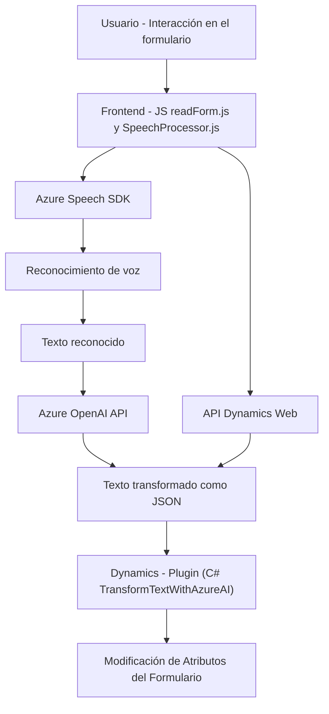

### **Breve resumen técnico**

El repositorio contiene varios componentes que están desarrollados para una solución de integración entre un sistema de formularios basado en Dynamics CRM y servicios de Azure (Azure Speech API y Azure OpenAI API). Combina funciones frontend (JavaScript), un plugin para Dynamics CRM en C#, y servicios de Azure que proporcionan capacidades de inteligencia y voz.

---

### **Descripción de arquitectura**

La arquitectura del sistema parece orientada a un modelo **híbrido**: consiste en un frontend que interactúa con un formulario en Dynamics CRM y emplea una estructura de capas para procesar datos localmente. La lógica del backend en forma de plugins de Dynamics se conecta con APIs externas de Azure (Azure Speech y OpenAI) para extender la capacidad de procesamiento, reconocimiento de habla y generación de texto basado en IA.

Se siguen patrones clave como separación de responsabilidades (cada archivo realiza tareas específicas), delegación (para la carga de SDK de Azure), y un patrón orientado a eventos (mediante `executionContext` y procesamiento en plugins).

---

### **Tecnologías usadas**

1. **Frontend (JavaScript):**
   - Lenguaje: JavaScript (compatible con entornos de navegador).
   - Frameworks/SDKs externos:
     - **Azure Speech SDK**: Para reconocimiento de voz y síntesis de voz.
     - API de Dynamics CRM (`executionContext`).

2. **Backend (C#):**
   - Lenguaje: C# .NET (Plugin de Dynamics CRM).
   - Librerías:
     - `Microsoft.Xrm.Sdk`: Administración de Dynamics CRM.
     - `Newtonsoft.Json` / `System.Text.Json`: JSON operations.
   - Framework: Dynamics CRM.

3. **Servicios externos:**
   - **Azure Speech SDK para reconocimiento y síntesis de voz.**
   - **Azure OpenAI** para transformación de texto basada en IA.

---

### **Diagrama Mermaid**

A continuación, se muestra el diagrama de flujo de la interacción y arquitectura con la sintaxis Mermaid:

---

### **Conclusión final**

Este repositorio representa una solución híbrida que integra el procesamiento de voz y texto mediante tecnologías de Azure con la funcionalidad de Dynamics CRM. Está diseñado para interactuar con formularios en tiempo real, utilizando un backend basado en plugins de Dynamics y funciones frontend en JavaScript, que se apoyan en SDKs y APIs externos.

La arquitectura indicada facilita una **integración modular** con servicios cloud (Azure Speech y OpenAI), permitiendo procesos avanzados como reconocimiento de voz, transformación de texto y asignación de valores en un escenario de CRM.