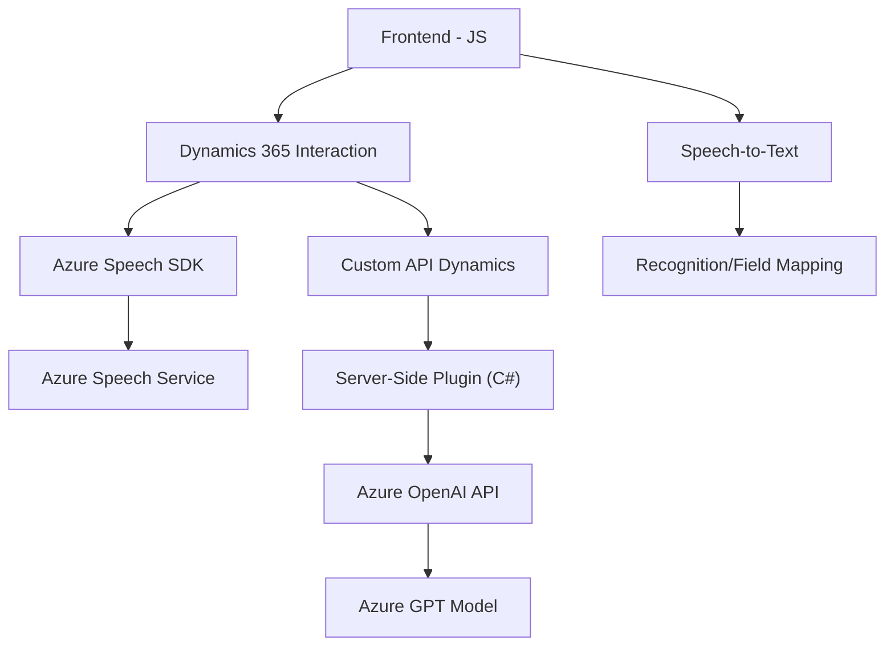

# Breve Resumen Técnico
Este repositorio está enfocado principalmente en la integración entre formularios de Dynamics 365 y los servicios de Azure Speech y Azure OpenAI. Incluye archivos JavaScript para la interfaz de usuario (frontend) y un plugin en C# compatible con Dynamics CRM para procesamiento de texto con IA.

---

# Descripción de Arquitectura
La arquitectura empleada en este proyecto es **n-capas** con una clara separación entre:
1. **Capa de presentación**: Archivos JavaScript utilizados en el frontend para interacción directa con el usuario y formularios (Dynamics 365).
2. **Capa lógica/aplicación**:
   - Plugins en C# para procesamiento de datos mediante Azure OpenAI (backend).
   - Servicios externos como Azure Speech SDK y Azure OpenAI API.

Destaca el uso de servicios externos para habilitar funcionalidades avanzadas como síntesis y reconocimiento de voz, transformación de texto y búsqueda en formularios. El sistema utiliza **patrones modulares** y organiza integración con APIs de manera explícita en funciones encapsuladas para reducir el acoplamiento.

---

# Tecnologías Usadas
1. **Frontend (JavaScript)**:
   - SDK de **Dynamics 365** para formularios.
   - **Azure Speech SDK** para lectura/síntesis de voz.
   - Dinámico carga de dependencias desde URLs externas.
  
2. **Backend (C#)**:
   - **Microsoft.Xrm.Sdk** para integración con Dynamics CRM.
   - **Azure OpenAI (GPT)** para transformación de texto y procesamiento avanzado.
   - Dependencias .NET estándar:
     - `System.Net.Http` para solicitudes HTTP.
     - `System.Text.Json` y `Newtonsoft.Json.Linq` para manejo de JSON.

---

# Diagrama Mermaid
Este diagrama representa la interacción de los componentes principales:
1. Frontend -> Código JavaScript para UI/formularios.
2. Backend -> Plugin en C# ejecutado en Dynamics 365.
3. Servicios externos -> Azure Speech SDK y Azure OpenAI.

---

# Conclusión Final
La solución presentada emplea **n-capas** con separación del frontend (en JavaScript) y un backend orientado a **Dynamics CRM plugins**. Está diseñada para interactuar de manera eficiente con servicios externos como Azure Speech y Azure OpenAI API. Los patrones de arquitectura (como modularidad y encapsulamiento de dependencias externas) hacen que el código sea reusable y adaptable para futuros cambios. Sin embargo, podrían mejorarse aspectos de optimización (por ejemplo, manejar sincronicidad en las APIs) para entornos de alta carga.