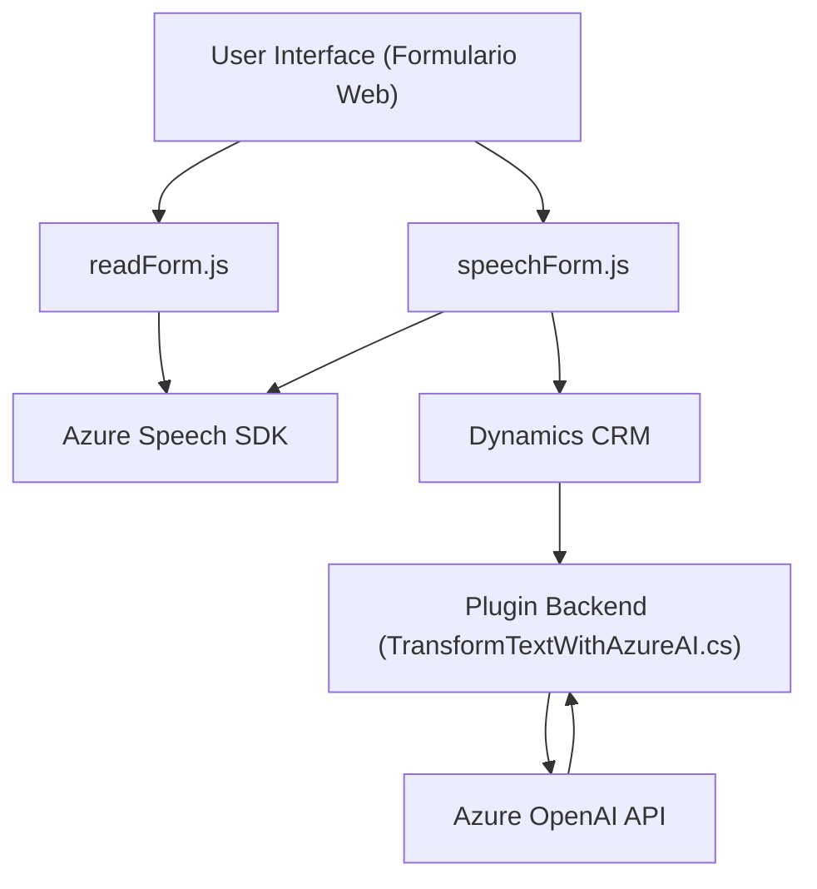

### Breve resumen técnico

El repositorio contiene tres tipos de archivos:  
1. **Frontend (JavaScript)**: `readForm.js` y `speechForm.js` son responsables de funcionalidades relacionadas con la síntesis y procesamiento de voz integrando Azure Speech SDK. Procesan formularios y entradas contextuales dinámicas, optimizando accesibilidad y manejo por voz en Dynamics 365.  
2. **Backend (C# Plugin)**: `TransformTextWithAzureAI.cs` agrega capacidad de transformación avanzada en Dynamics CRM con Azure OpenAI para procesar y estructurar texto mediante normas predefinidas.

Estos componentes abordan funciones de accesibilidad, integración con IA y comunicación con APIs externas.

---

### Descripción de arquitectura

La solución combina:
1. **Frontend basado en eventos**: Código modular con servicios auxiliares como SDK y funcionalidades de voz con modularidad basada en funciones reutilizables.
2. **Plugin backend orientado al modelo de Dynamics CRM**: Utiliza una arquitectura basada en complementos (plugin-based architecture) como capa de integración en entornos de Dynamics CRM.
3. **Capacidad de procesamiento de API externas**: Integración de servicios externos como Azure Speech SDK y Azure OpenAI para proporcionar functionalities tanto en procesamiento de formularios accesibles como en procesamiento textual.

La arquitectura global del sistema puede clasificarse como **n-capas**, con separación explícita entre presentación (Frontend), lógica empresarial (Backend Plugin de Dynamics) y acceso externo (Azure SDK/API).

---

### Tecnologías usadas

1. **Lenguajes y plataformas**:  
   - **JavaScript**: Para el frontend orientado a accesibilidad con Azure Speech.  
   - **C#**: Para plugins de Dynamics CRM que integran procesamiento avanzado con Azure OpenAI.  
   
2. **SDK y servicios externos**:  
   - **Azure Speech SDK**: Reconocimiento y síntesis de voz en el frontend.  
   - **Azure OpenAI (GPT)**: Procesamiento avanzado de texto en el plugin C#.  
   
3. **Web APIs**:  
   - Uso intensivo de manipulación de DOM para el frontend (formularios).  
   - **Dynamics CRM SDK**: Integración directa del backend con estructuras CRM como entidades y servicios.  

4. **Patrones arquitectónicos**:  
   - **Patrón modular y desacoplamiento**: Modularización de funciones en frontend y backend, con puntos bien definidos para entrada y salida.  
   - **Patrón plugin**: Implementado en C# como parte de Dynamics CRM extensible.  
   - **External API Integration**: Uso central de servicios como OpenAI y Azure Speech.  

---

### Diagrama Mermaid válido para GitHub

Con base en los puntos descritos, el siguiente diagrama representa las interacciones y dependencias:

---

### Conclusión final

La solución tiene una arquitectura orientada a n-capas con un énfasis claro en accesibilidad y computación cognitiva. El frontend proporciona una interfaz interactiva que comunica mediante voz y procesos automáticos con Azure Speech SDK. Por otro lado, el backend, mediante el plugin en C# y Azure OpenAI, realiza procesamiento avanzado del texto dentro del entorno de Dynamics CRM.  

Este diseño permite la integración de servicios externos para mejorar la experiencia automatizada del usuario y la personalización en entornos empresariales. Aunque la solución tiene una estructura desacoplada, su dependencia de Dynamics CRM y Azure muestra una arquitectura vinculada a plataformas específicas pero fácilmente extensible.